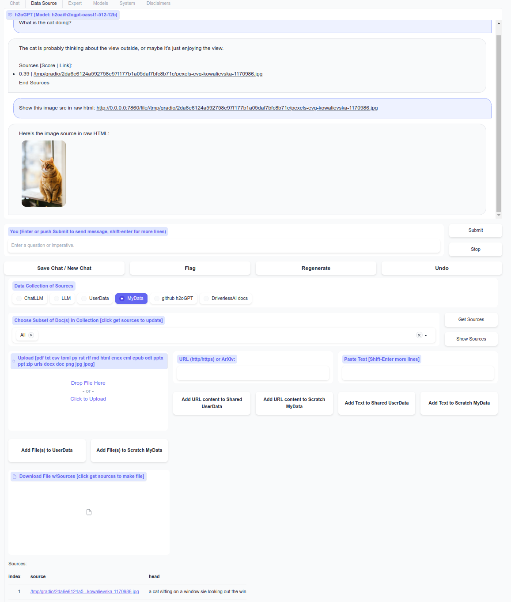
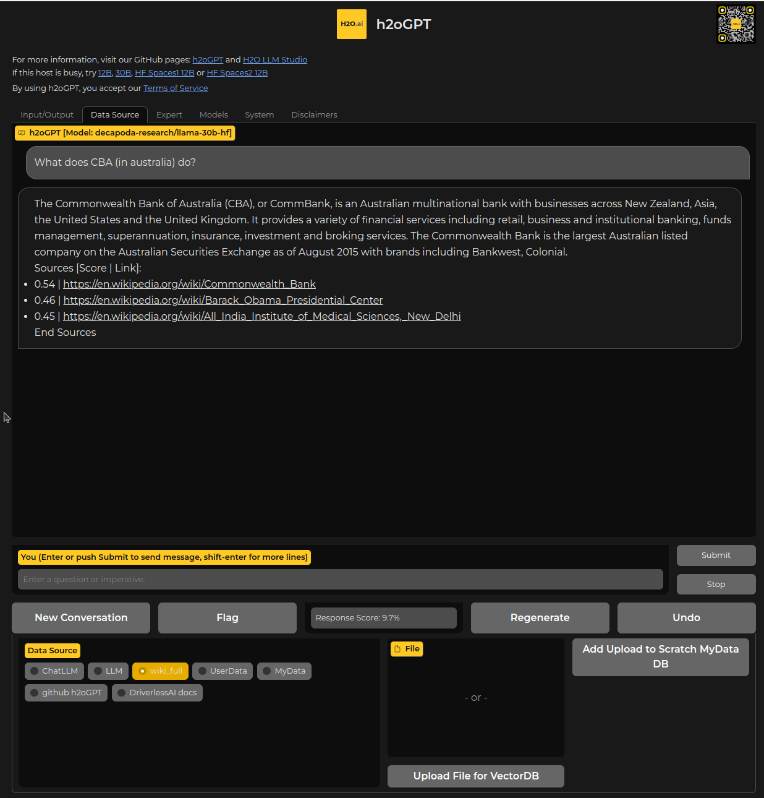

## h2oGPT

[ Live h2oGPT Demo](https://gpt.h2o.ai/)

For questions, discussing, or just hanging out, come and join our <a href="https://discord.gg/WKhYMWcVbq"><b>Discord</b></a>!

Technical Paper: [https://arxiv.org/pdf/2306.08161.pdf](https://arxiv.org/pdf/2306.08161.pdf)

h2oGPT is a large language model (LLM) fine-tuning framework and chatbot UI with document(s) question-answer capabilities.  Documents help to **ground** LLMs against hallucinations by providing them context relevant to the instruction.  h2oGPT is fully permissive Apache V2 open-source project for 100% private and secure use of LLMs and document embeddings for document question-answer.

Welcome!  Join us and make an issue or a PR, and contribute to making the best fine-tuned LLMs, chatbot UI, and document question-answer framework!

Turn ★ into ⭐ (top-right corner) if you like the project!

<!--  cat README.md | ./gh-md-toc  -  But Help is heavily processed -->
* [Supported OS and Hardware](#supported-os-and-hardware)
* [Apache V2 ChatBot with LangChain Integration](#apache-v2-chatbot-with-langchain-integration)
* [Apache V2 Data Preparation code, Training code, and Models](#apache-v2-data-preparation-code-training-code-and-models)
* [Roadmap](#roadmap)
* [Getting Started](#getting-started)
   * [TLDR Install & Run](#tldr)
   * [GPU (CUDA)](#gpu-cuda)
   * [CPU](#cpu)
   * [MACOS](#macos)
   * [Windows 10/11](#windows-1011)
   * [CLI chat](#cli-chat)
   * [Gradio UI](#gradio-ui)
   * [Client API](#client-api)
   * [Connect to Inference Servers](#connect-to-inference-servers)
   * [Python Wheel](#python-wheel)
* [Development](#development)
* [Help](#help)
   * [LangChain file types supported](docs/README_LangChain.md#supported-datatypes)
   * [CLI Database control](docs/README_LangChain.md#database-creation)
   * [Why h2oGPT for Doc Q&A](docs/README_LangChain.md#what-is-h2ogpts-langchain-integration-like)
   * [FAQ](docs/FAQ.md)
   * [Useful Links](docs/LINKS.md)
   * [Fine-Tuning](docs/FINETUNE.md)
   * [Docker](docs/INSTALL-DOCKER.md)
   * [Triton](docs/TRITON.md)
* [Acknowledgements](#acknowledgements)
* [Why H2O.ai?](#why-h2oai)
* [Disclaimer](#disclaimer)

### Supported OS and Hardware

[](https://raw.githubusercontent.com/h2oai/h2ogpt/main/LICENSE)


**GPU** mode requires CUDA support via torch and transformers.  A 6.9B (or 12GB) model in 8-bit uses 8GB (or 13GB) of GPU memory. 8-bit or 4-bit precision can further reduce memory requirements down no more than about 6.5GB when asking a question about your documents (see [low-memory mode](docs/FAQ.md#low-memory-mode)).

**CPU** mode uses GPT4ALL and LLaMa.cpp, e.g. gpt4all-j, requiring about 14GB of system RAM in typical use.

GPU and CPU mode tested on variety of NVIDIA GPUs in Ubuntu 18-22, but any modern Linux variant should work.  MACOS support tested on Macbook Pro running Monterey v12.3.1 using CPU mode.

### Apache V2 ChatBot with LangChain Integration

- [**LangChain**](docs/README_LangChain.md) equipped Chatbot integration and streaming responses
- **Persistent** database using Chroma or in-memory with FAISS
- **Original** content url links and scores to rank content against query
- **Private** offline database of any documents ([PDFs, Images, and many more](docs/README_LangChain.md#supported-datatypes))
- **Upload** documents via chatbot into shared space or only allow scratch space
- **Control** data sources and the context provided to LLM
- **Efficient** use of context using instruct-tuned LLMs (no need for many examples)
- **API** for client-server control
- **CPU and GPU** support from variety of HF models, and CPU support using GPT4ALL and LLaMa cpp
- **Linux, MAC, and Windows** support

Light mode with soft colors talking to cat image:



Dark mode with H2O.ai colors:


### Apache V2 Data Preparation code, Training code, and Models

- **Variety** of models (h2oGPT, WizardLM, Vicuna, OpenAssistant, etc.) supported
- **Fully Commercially** Apache V2 code, data and models
- **High-Quality** data cleaning of large open-source instruction datasets
- **LoRA** and **QLoRA** (low-rank approximation) efficient 4-bit, 8-bit and 16-bit fine-tuning and generation
- **Large** (up to 65B parameters) models built on commodity or enterprise GPUs (single or multi node)
- **Evaluate** performance using RLHF-based reward models

https://user-images.githubusercontent.com/6147661/232924684-6c0e2dfb-2f24-4098-848a-c3e4396f29f6.mov

All open-source datasets and models are posted on [🤗 H2O.ai's Hugging Face page](https://huggingface.co/h2oai/).

Also check out [H2O LLM Studio](https://github.com/h2oai/h2o-llmstudio) for our no-code LLM fine-tuning framework!

### Roadmap

- Integration of code and resulting LLMs with downstream applications and low/no-code platforms
- Complement h2oGPT chatbot with search and other APIs
- High-performance distributed training of larger models on trillion tokens
- Enhance the model's code completion, reasoning, and mathematical capabilities, ensure factual correctness, minimize hallucinations, and avoid repetitive output
- Add other tools like search
- Add agents for SQL and CSV question/answer

### Getting Started

First one needs a Python 3.10 environment.  For help installing a Python 3.10 environment, see [Install Python 3.10 Environment](docs/INSTALL.md#install-python-environment).  On newer Ubuntu systems and environment may be installed by just doing:
```bash
sudo apt-get install -y build-essential gcc python3.10-dev
virtualenv -p python3 h2ogpt
source h2ogpt/bin/activate
```
Check your installation by doing:
```bash
python --version # should say 3.10.xx
pip --version  # should say pip 23.x.y ... (python 3.10)
```
On some systems, `pip` still refers back to the system one, then one can use `python -m pip` or `pip3` instead of `pip` or try `python3` instead of `python`.

#### TLDR

After Python 3.10 environment installed:
```bash
git clone https://github.com/h2oai/h2ogpt.git
cd h2ogpt
# fix any bad env
pip uninstall -y pandoc pypandoc pypandoc-binary
# broad support, but no training-time or data creation dependencies
for fil in requirements.txt reqs_optional/requirements_optional_langchain.txt reqs_optional/requirements_optional_gpt4all.txt reqs_optional/requirements_optional_langchain.gpllike.txt reqs_optional/requirements_optional_langchain.urls.txt ; do pip install -r $fil ; done
# Optional: support docx, pptx, ArXiv, etc.
sudo apt-get install -y libmagic-dev poppler-utils tesseract-ocr libreoffice
# Optional: for supporting unstructured package
python -m nltk.downloader all
````

Place all documents in `user_path` or upload in UI.

UI using GPU with at least 24GB with streaming:
```bash
python generate.py --base_model=h2oai/h2ogpt-oasst1-512-12b --load_8bit=True  --score_model=None --langchain_mode='UserData' --user_path=user_path
```
UI using CPU (streaming not yet supported in UI):
```bash
python generate.py --base_model='llama' --prompt_type=wizard2 --score_model=None --langchain_mode='UserData' --user_path=user_path
```

#### GPU (CUDA)

For help installing cuda toolkit, see [CUDA Toolkit](docs/INSTALL.md#installing-cuda-toolkit)

```bash
git clone https://github.com/h2oai/h2ogpt.git
cd h2ogpt
pip install -r requirements.txt --extra-index-url https://download.pytorch.org/whl/cu117
python generate.py --base_model=h2oai/h2ogpt-oig-oasst1-512-6_9b --load_8bit=True
```
Then point browser at http://0.0.0.0:7860 (linux) or http://localhost:7860 (windows/mac) or the public live URL printed by the server (disable shared link with `--share=False`).  For 4-bit or 8-bit support, older GPUs may require older bitsandbytes installed as `pip uninstall bitsandbytes -y ; pip install bitsandbytes==0.38.1`.  For production uses, we recommend at least the 12B model, ran as:
```
python generate.py --base_model=h2oai/h2ogpt-oasst1-512-12b --load_8bit=True
```
and one can use `--h2ocolors=False` to get soft blue-gray colors instead of H2O.ai colors.  [Here](docs/FAQ.md#what-envs-can-i-pass-to-control-h2ogpt) is a list of environment variables that can control some things in `generate.py`.

Note if you download the model yourself and point `--base_model` to that location, you'll need to specify the prompt_type as well by running:
```
python generate.py --base_model=<user path> --load_8bit=True --prompt_type=human_bot
```
for some user path `<user path>` and the `prompt_type` must match the model or a new version created in `prompter.py` or added in UI/CLI via `prompt_dict`.

For quickly using a private document collection for Q/A, place documents (PDFs, text, etc.) into a folder called `user_path` and run
```bash
pip install -r reqs_optional/requirements_optional_langchain.txt
python -m nltk.downloader all  # for supporting unstructured package
python generate.py --base_model=h2oai/h2ogpt-oig-oasst1-512-6_9b  --load_8bit=True --langchain_mode=UserData --user_path=user_path
```
For more ways to ingest on CLI and control see [LangChain Readme](docs/README_LangChain.md).  For example, for improved pdf handling via pymupdf (GPL) and support for docx, ppt, OCR, and ArXiV run:
```bash
sudo apt-get install -y libmagic-dev poppler-utils tesseract-ocr tesseract-ocr libreoffice
pip install -r reqs_optional/requirements_optional_langchain.gpllike.txt
```

For 4-bit support, the latest dev versions of transformers, accelerate, and peft are required, which can be installed by running:
```bash
pip uninstall peft transformers accelerate -y
pip install -r reqs_optional/requirements_optional_4bit.txt
```
where uninstall is required in case, e.g., peft was installed from GitHub previously.  Then when running generate pass `--load_4bit=True`, which is only supported for certain [architectures](https://github.com/huggingface/peft#models-support-matrix) like GPT-NeoX-20B, GPT-J, LLaMa, etc.

Any other instruct-tuned base models can be used, including non-h2oGPT ones.  [Larger models require more GPU memory](docs/FAQ.md#larger-models-require-more-gpu-memory).

#### CPU

CPU support is obtained after installing two optional requirements.txt files.  This does not preclude GPU support, just adds CPU support:

* Install base, langchain, and GPT4All, and python LLaMa dependencies:
```bash
git clone https://github.com/h2oai/h2ogpt.git
cd h2ogpt
pip install -r requirements.txt  # only do if didn't already do for GPU support, since windows needs --extra-index-url line
pip install -r reqs_optional/requirements_optional_langchain.txt
python -m nltk.downloader all  # for supporting unstructured package
pip install -r reqs_optional/requirements_optional_gpt4all.txt
```
See [GPT4All](https://github.com/nomic-ai/gpt4all) for details on installation instructions if any issues encountered.

* Change `.env_gpt4all` model name if desired.
```.env_gpt4all
model_path_llama=WizardLM-7B-uncensored.ggmlv3.q8_0.bin
model_path_gptj=ggml-gpt4all-j-v1.3-groovy.bin
model_name_gpt4all_llama=ggml-wizardLM-7B.q4_2.bin
```
For `gptj` and `gpt4all_llama`, you can choose a different model than our default choice by going to GPT4All Model explorer [GPT4All-J compatible model](https://gpt4all.io/index.html). One does not need to download manually, the gp4all package will download at runtime and put it into `.cache` like Hugging Face would.  However, `gpjt` model often gives [no output](docs/FAQ.md#gpt4all-not-producing-output), even outside h2oGPT.

So, for chatting, a better instruct fine-tuned LLaMa-based model for llama.cpp can be downloaded from [TheBloke](https://huggingface.co/TheBloke).  For example, [13B WizardLM Quantized](https://huggingface.co/TheBloke/wizardLM-13B-1.0-GGML) or [7B WizardLM Quantized](https://huggingface.co/TheBloke/WizardLM-7B-uncensored-GGML).  TheBloke has a variety of model types, quantization bit depths, and memory consumption.  Choose what is best for your system's specs.  However, be aware that LLaMa-based models are not [commercially viable](docs/FAQ.md#commercial-viability).

For 7B case, download [WizardLM-7B-uncensored.ggmlv3.q8_0.bin](https://huggingface.co/TheBloke/WizardLM-7B-uncensored-GGML/blob/main/WizardLM-7B-uncensored.ggmlv3.q8_0.bin) into local path.  Then one sets `model_path_llama` in `.env_gpt4all`, which is currently the default.

* Run generate.py

For LangChain support using documents in `user_path` folder, run h2oGPT like:
```bash
python generate.py --base_model='llama' --prompt_type=wizard2 --score_model=None --langchain_mode='UserData' --user_path=user_path
```
See [LangChain Readme](docs/README_LangChain.md) for more details.
For no langchain support (still uses LangChain package as model wrapper), run as:
```bash
python generate.py --base_model='llama' --prompt_type=wizard2 --score_model=None
```

No streaming is currently supported for these CPU models in UI, but that will be fixed soon.

When using `llama.cpp` based CPU models, for computers with low system RAM or slow CPUs, we recommend adding to `.env_gpt4all`:
```.env_gpt4all
use_mlock=False
n_ctx=1024
```
where `use_mlock=True` is default to avoid slowness and `n_ctx=2048` is default for large context handling.  For computers with plenty of system RAM, we recommend adding to `.env_gpt4all`:
```.env_gpt4all
n_batch=1024
```
for faster handling.  On some systems this has no strong effect, but on others may increase speed quite a bit.

Also, for slow and low-memory systems, we recommend using a smaller embedding by using with `generrate.py`:
```bash
python generate.py ... --hf_embedding_model=sentence-transformers/all-MiniLM-L6-v2
```
where `...` means any other options one should add like `--base_model` etc.  This simpler embedding is about half the size as default `instruct-large` and so uses less disk, CPU memory, and GPU memory if using GPUs.

See also [Low Memory](docs/FAQ.md#low-memory-mode) for more information about low-memory recommendations.

#### MACOS

First install [Rust](https://www.geeksforgeeks.org/how-to-install-rust-in-macos/):
```bash
curl –proto ‘=https’ –tlsv1.2 -sSf https://sh.rustup.rs | sh
```
Enter new shell and test: `rustc --version`

When running a Mac with Intel hardware (not M1), you may run into `_clang: error: the clang compiler does not support '-march=native'_` during pip install.
If so, set your archflags during pip install. eg: `ARCHFLAGS="-arch x86_64" pip3 install -r requirements.txt`

If you encounter an error while building a wheel during the `pip install` process, you may need to install a C++ compiler on your computer.

Now go back to normal [CPU](README.md#cpu) installation.

#### Windows 10/11

Follow these steps, which includes the above GPU or CPU install step at one point:

1. Install Visual Studio 2022 (requires newer windows versions of 10/11) with following selected:
   * Windows 11 SDK
   * C++ Universal Windows Platform support for development
   * MSVC VS 2022 C++ x64/x86 build tools
   * C++ CMake tools for Windows
2. Download the MinGW installer from the [MinGW website](https://sourceforge.net/projects/mingw/) and select, go to installation tab, then apply changes:
   * minigw32-base
   * mingw32-gcc-g++
3. [Setup Environment](docs/INSTALL.md#install-python-environment) for Windows
4. Run Miniconda shell (not power shell) as administrator
5. Run: `set path=%path%;c:\MinGW\msys\1.0\bin\` to get C++ in path
6. Download latest nvidia driver for windows
7. Confirm can run nvidia-smi and see driver version
8. Install cuda toolkit from conda: `conda install cudatoolkit -c conda-forge` as required easily make bitsandbytes work
9. Run: `wsl --install`
8. Now go back to normal [GPU](README.md#gpu-cuda) or [CPU](README.md#cpu) (most general) installation
   * IMPORTANT: Run `pip install` with `--extra-index-url https://download.pytorch.org/whl/cu117` as in GPU section
9. Upgrade to windows GPU version of bitsandbytes if using GPU:

For GPU support of 4-bit and 8-bit, run:
```bash
pip uninstall bitsandbytes
pip install https://github.com/jllllll/bitsandbytes-windows-webui/raw/main/bitsandbytes-0.39.0-py3-none-any.whl
```
unless you have compute capability <7.0, then your GPU only supports 8-bit (not 4-bit) and you should install older bitsandbytes:
```bash
pip uninstall bitsandbytes
pip install https://github.com/jllllll/bitsandbytes-windows-webui/raw/main/bitsandbytes-0.38.1-py3-none-any.whl
```

When running windows on GPUs with bitsandbytes you should see something like:
```bash
(h2ogpt) c:\Users\pseud\h2ogpt>python generate.py --base_model=h2oai/h2ogpt-oig-oasst1-512-6_9b --load_8bit=True
bin C:\Users\pseud\.conda\envs\h2ogpt\lib\site-packages\bitsandbytes\libbitsandbytes_cuda118.dll
Using Model h2oai/h2ogpt-oig-oasst1-512-6_9b
device_map: {'': 0}
Loading checkpoint shards: 100%|████████████████████████████████████████████████████████████████████████████████████████████████████████████████████████████████████████████████████████████████████████████████████████████████████████████████████████████████████| 3/3 [00:06<00:00,  2.16s/it]
device_map: {'': 1}
Running on local URL:  http://0.0.0.0:7860
Running on public URL: https://f8fa95f123416c72dc.gradio.live

This share link expires in 72 hours. For free permanent hosting and GPU upgrades (NEW!), check out Spaces: https://huggingface.co/spaces
```
where bitsandbytes cuda118 was used because conda cuda toolkit is cuda 11.8.  You can confirm GPU use via `nvidia-smi` showing GPU memory consumed.

Note 8-bit inference is about twice slower than 16-bit inference, and the only use of 8-bit is to keep memory profile low.

Bitsandbytes can be uninstalled (`pip uninstall bitsandbytes`) and still h2oGPT can be used if one does not pass `--load_8bit=True`.

#### CLI chat

The CLI can be used instead of gradio by running for some base model, e.g.:
```bash
python generate.py --base_model=gptj --cli=True
```
and for LangChain run:
```bash
python make_db.py --user_path=user_path --collection_name=UserData
python generate.py --base_model=gptj --cli=True --langchain_mode=UserData
```
with documents in `user_path` folder, or directly run:
```bash
python generate.py --base_model=gptj --cli=True --langchain_mode=UserData --user_path=user_path
```
which will build the database first time.  One can also use any other models, like:
```bash
python generate.py --base_model=h2oai/h2ogpt-oig-oasst1-512-6_9b --cli=True --langchain_mode=UserData --user_path=user_path
```
or for WizardLM:
```bash
python generate.py --base_model='llama' --prompt_type=wizard2 --cli=True --langchain_mode=UserData --user_path=user_path
```
No streaming is currently supported for llama in CLI chat, but that will be fixed soon.

#### Gradio UI

`generate.py` by default runs a gradio server with a [UI (click for help with UI)](docs/FAQ.md#explain-things-in-ui).  Key benefits of the UI include:
* Save, export, import chat histories and undo or regenerate last query-response pair
* Upload and control documents of various kinds for document Q/A
* Choose which specific collection to query, or just chat with LLM
* Choose specific documents out of collection for asking questions
* Side-by-side 2-model comparison view
* RLHF response score evaluation for every query-response

See how we compare to other tools like PrivateGPT, see our comparisons at [h2oGPT's LangChain Integration FAQ](docs/README_LangChain.md#what-is-h2ogpts-langchain-integration-like).

We disable background uploads by disabling telemetry for Hugging Face, gradio, and chroma, and one can additionally avoid downloads (of fonts) by running `generate.py` with `--gradio_offline_level=2`.  See [Offline Documentation](docs/FAQ.md#offline-mode) for details.

#### Client API

A Gradio API and an OpenAI-compliant API are supported.

##### Gradio Client API

`generate.py` by default runs a gradio server, which also gives access to client API using gradio client.  One can use it with h2oGPT, or independently of h2oGPT repository by installing an env:
```bash
conda create -n gradioclient -y
conda activate gradioclient
conda install python=3.10 -y
pip install gradio_client
python checkclient.py
```
then running client code:
```python
from gradio_client import Client
import ast

HOST_URL = "http://localhost:7860"
client = Client(HOST_URL)

# string of dict for input
kwargs = dict(instruction_nochat='Who are you?')
res = client.predict(str(dict(kwargs)), api_name='/submit_nochat_api')

# string of dict for output
response = ast.literal_eval(res)['response']
print(response)
```
For other ways to use gradio client, see example [test code](client_test.py) or other tests in our [tests](https://github.com/h2oai/h2ogpt/blob/main/tests/test_client_calls.py).

Any element in [gradio_runner.py](gradio_runner.py) with `api_name` defined can be accessed via the gradio client.

##### OpenAI Python Client Library

An OpenAI compliant client is available. Refer the [README](client/README.md)  for more details.

#### Connect to Inference Servers

One can connect to Hugging Face text generation inference server, gradio servers running h2oGPT, or OpenAI servers.  See [README](docs/README_InferenceServers.md).

#### Python Wheel

The wheel adds all dependencies including optional dependencies like 4-bit and flash-attention. To build do:
```bash
python setup.py sdist bdist_wheel
```
To install the default dependencies do:
```bash
pip install dist/h2ogpt-0.1.0-py3-none-any.whl
```
replace `0.1.0` with actual version built if more than one.
To install additional dependencies, for instance for faiss on GPU, do:
```bash
pip install dist/h2ogpt-0.1.0-py3-none-any.whl
pip install dist/h2ogpt-0.1.0-py3-none-any.whl[FAISS]
```
once `whl` file is installed, two new scripts will be added to the current environment: `h2ogpt_finetune`, and `h2ogpt_generate`.

The wheel is not required to use h2oGPT locally from repo, but makes it portable with all required dependencies.

See [setup.py](setup.py) for controlling other options via `extras_require`.

### Development

- To create a development environment for training and generation, follow the [installation instructions](docs/INSTALL.md).
- To fine-tune any LLM models on your data, follow the [fine-tuning instructions](docs/FINETUNE.md).
- To create a container for deployment, follow the [Docker instructions](docs/INSTALL-DOCKER.md).

### Help

- Flash attention support, see [Flash Attention](docs/INSTALL.md#flash-attention)

- [Docker](docs/INSTALL-DOCKER.md#containerized-installation-for-inference-on-linux-gpu-servers) for inference.

- [FAQs](docs/FAQ.md)

- [README for LangChain](docs/README_LangChain.md)

- More [Links](docs/LINKS.md), context, competitors, models, datasets

### Acknowledgements

* Some training code was based upon March 24 version of [Alpaca-LoRA](https://github.com/tloen/alpaca-lora/).
* Used high-quality created data by [OpenAssistant](https://open-assistant.io/).
* Used base models by [EleutherAI](https://www.eleuther.ai/).
* Used OIG data created by [LAION](https://laion.ai/blog/oig-dataset/).

### Why H2O.ai?

Our [Makers](https://h2o.ai/company/team/) at [H2O.ai](https://h2o.ai) have built several world-class Machine Learning, Deep Learning and AI platforms:
- #1 open-source machine learning platform for the enterprise [H2O-3](https://github.com/h2oai/h2o-3)
- The world's best AutoML (Automatic Machine Learning) with [H2O Driverless AI](https://h2o.ai/platform/ai-cloud/make/h2o-driverless-ai/)
- No-Code Deep Learning with [H2O Hydrogen Torch](https://h2o.ai/platform/ai-cloud/make/hydrogen-torch/)
- Document Processing with Deep Learning in [Document AI](https://h2o.ai/platform/ai-cloud/make/document-ai/)

We also built platforms for deployment and monitoring, and for data wrangling and governance:
- [H2O MLOps](https://h2o.ai/platform/ai-cloud/operate/h2o-mlops/) to deploy and monitor models at scale
- [H2O Feature Store](https://h2o.ai/platform/ai-cloud/make/feature-store/) in collaboration with AT&T
- Open-source Low-Code AI App Development Frameworks [Wave](https://wave.h2o.ai/) and [Nitro](https://nitro.h2o.ai/)
- Open-source Python [datatable](https://github.com/h2oai/datatable/) (the engine for H2O Driverless AI feature engineering)

Many of our customers are creating models and deploying them enterprise-wide and at scale in the [H2O AI Cloud](https://h2o.ai/platform/ai-cloud/):
- Multi-Cloud or on Premises
- [Managed Cloud (SaaS)](https://h2o.ai/platform/ai-cloud/managed)
- [Hybrid Cloud](https://h2o.ai/platform/ai-cloud/hybrid)
- [AI Appstore](https://docs.h2o.ai/h2o-ai-cloud/)

We are proud to have over 25 (of the world's 280) [Kaggle Grandmasters](https://h2o.ai/company/team/kaggle-grandmasters/) call H2O home, including three Kaggle Grandmasters who have made it to world #1.

### Disclaimer

Please read this disclaimer carefully before using the large language model provided in this repository. Your use of the model signifies your agreement to the following terms and conditions.

- Biases and Offensiveness: The large language model is trained on a diverse range of internet text data, which may contain biased, racist, offensive, or otherwise inappropriate content. By using this model, you acknowledge and accept that the generated content may sometimes exhibit biases or produce content that is offensive or inappropriate. The developers of this repository do not endorse, support, or promote any such content or viewpoints.
- Limitations: The large language model is an AI-based tool and not a human. It may produce incorrect, nonsensical, or irrelevant responses. It is the user's responsibility to critically evaluate the generated content and use it at their discretion.
- Use at Your Own Risk: Users of this large language model must assume full responsibility for any consequences that may arise from their use of the tool. The developers and contributors of this repository shall not be held liable for any damages, losses, or harm resulting from the use or misuse of the provided model.
- Ethical Considerations: Users are encouraged to use the large language model responsibly and ethically. By using this model, you agree not to use it for purposes that promote hate speech, discrimination, harassment, or any form of illegal or harmful activities.
- Reporting Issues: If you encounter any biased, offensive, or otherwise inappropriate content generated by the large language model, please report it to the repository maintainers through the provided channels. Your feedback will help improve the model and mitigate potential issues.
- Changes to this Disclaimer: The developers of this repository reserve the right to modify or update this disclaimer at any time without prior notice. It is the user's responsibility to periodically review the disclaimer to stay informed about any changes.

By using the large language model provided in this repository, you agree to accept and comply with the terms and conditions outlined in this disclaimer. If you do not agree with any part of this disclaimer, you should refrain from using the model and any content generated by it.

## Star History

[](https://star-history.com/#h2oai/h2ogpt&Timeline)

