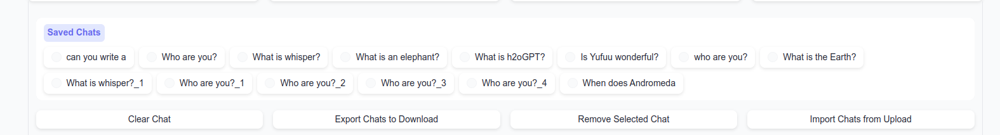
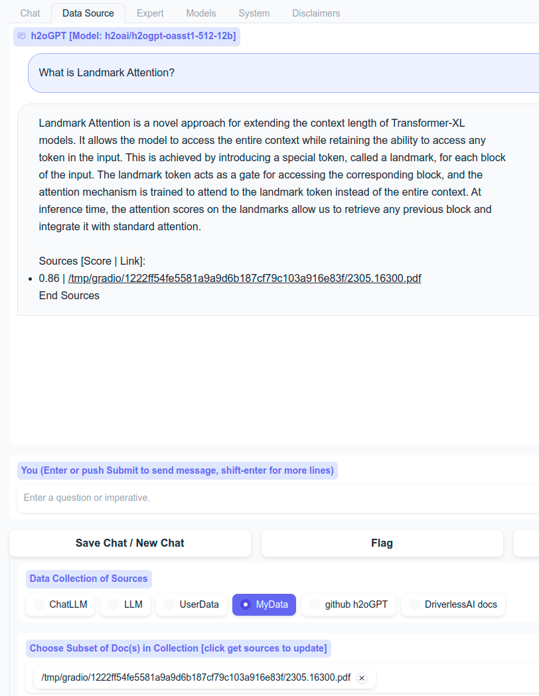
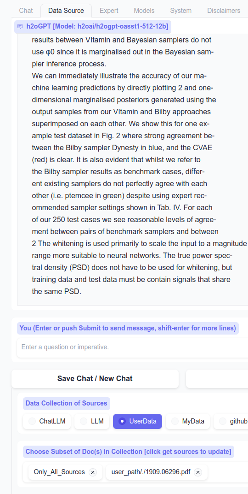

### Other models

One can choose any huggingface model, just pass the name after `--base_model=`, but a `prompt_type` is required if we don't already have support.
E.g. for vicuna models, a typical prompt_type is used and we support that already automatically for specific models,
but if you pass `--prompt_type=instruct_vicuna` with any other Vicuna model, we'll use it assuming that is the correct prompt type.
See models that are currently supported in this automatic way, and the same dictionary shows which prompt types are supported: [prompter](prompter.py).

### Low-memory mode

For GPU case, a reasonable model for low memory is to run:
```bash
python generate.py --base_model=h2oai/h2ogpt-gm-oasst1-en-2048-falcon-7b-v3 --hf_embedding_model=sentence-transformers/all-MiniLM-L6-v2 --score_model=None --load_8bit=True --langchain_mode='MyData'
```
which uses good but smaller base model, embedding model, and no response score model to save GPU memory.  If you can do 4-bit, then do:
```bash
python generate.py --base_model=h2oai/h2ogpt-gm-oasst1-en-2048-falcon-7b-v3 --hf_embedding_model=sentence-transformers/all-MiniLM-L6-v2 --score_model=None --load_4bit=True --langchain_mode='MyData'
```
This uses 5800MB to startup, then soon drops to 5075MB after torch cache is cleared. Asking a simple question uses up to 6050MB. Adding a document uses no more new GPU memory.  Asking a question uses up to 6312MB for a few chunks (default), then drops back down to 5600MB.

On CPU case, a good model that's still low memory is to run:
```bash
python generate.py --base_model='llama' --prompt_type=wizard2 --hf_embedding_model=sentence-transformers/all-MiniLM-L6-v2 --langchain_mode=MyData --user_path=user_path
```

### Offline Mode:

Note, when running `generate.py` and asking your first question, it will download the model(s), which for the 6.9B model takes about 15 minutes per 3 pytorch bin files if have 10MB/s download.

If all data has been put into `~/.cache` by HF transformers, then these following steps (those related to downloading HF models) are not required.

1) Download model and tokenizer of choice

```python
from transformers import AutoTokenizer, AutoModelForCausalLM
model_name = 'h2oai/h2ogpt-oasst1-512-12b'
model = AutoModelForCausalLM.from_pretrained(model_name)
model.save_pretrained(model_name)
tokenizer = AutoTokenizer.from_pretrained(model_name)
tokenizer.save_pretrained(model_name)
```

2) Download reward model, unless pass `--score_model='None'` to `generate.py`
```python
# and reward model
reward_model = 'OpenAssistant/reward-model-deberta-v3-large-v2'
from transformers import AutoModelForSequenceClassification, AutoTokenizer
model = AutoModelForSequenceClassification.from_pretrained(reward_model)
model.save_pretrained(reward_model)
tokenizer = AutoTokenizer.from_pretrained(reward_model)
tokenizer.save_pretrained(reward_model)
```

3) For LangChain support, download embedding model:
```python
hf_embedding_model = "sentence-transformers/all-MiniLM-L6-v2"
model_kwargs = 'cpu'
from langchain.embeddings import HuggingFaceEmbeddings
embedding = HuggingFaceEmbeddings(model_name=hf_embedding_model, model_kwargs=model_kwargs)
```

4) For HF inference server and OpenAI, this downloads the tokenizers used for Hugging Face text generation inference server and gpt-3.5-turbo:
```python
import tiktoken
encoding = tiktoken.get_encoding("cl100k_base")
encoding = tiktoken.encoding_for_model("gpt-3.5-turbo")
```

5) Run generate with transformers in [Offline Mode](https://huggingface.co/docs/transformers/installation#offline-mode)

```bash
HF_DATASETS_OFFLINE=1 TRANSFORMERS_OFFLINE=1 python generate.py --base_model='h2oai/h2ogpt-oasst1-512-12b' --gradio_offline_level=2 --share=False
```

Some code is always disabled that involves uploads out of user control: Huggingface telemetry, gradio telemetry, chromadb posthog.

The additional option `--gradio_offline_level=2` changes fonts to avoid download of google fonts. This option disables google fonts for downloading, which is less intrusive than uploading, but still required in air-gapped case.  The fonts don't look as nice as google fonts, but ensure full offline behavior.

If the front-end can still access internet, but just backend should not, then one can use `--gradio_offline_level=1` for slightly better-looking fonts.

Note that gradio attempts to download [iframeResizer.contentWindow.min.js](https://cdnjs.cloudflare.com/ajax/libs/iframe-resizer/4.3.1/iframeResizer.contentWindow.min.js),
but nothing prevents gradio from working without this.  So a simple firewall block is sufficient.  For more details, see: https://github.com/AUTOMATIC1111/stable-diffusion-webui/pull/10324.

### Isolated LangChain Usage:

See [tests/test_langchain_simple.py](tests/test_langchain_simple.py)

### ValueError: ...offload....

```
The current `device_map` had weights offloaded to the disk. Please provide an `offload_folder` for them. Alternatively, make sure you have `safetensors` installed if the model you are using offers
the weights in this format.
```

If you see this error, then you either have insufficient GPU memory or insufficient CPU memory.  E.g. for 6.9B model one needs minimum of 27GB free memory.

### Larger models require more GPU memory

Depending on available GPU memory, you can load differently sized models. For multiple GPUs, automatic sharding can be enabled with `--infer_devices=False`, but this is disabled by default since cuda:x cuda:y mismatches can occur.

For GPUs with at least 24GB of memory, we recommend:
```bash
python generate.py --base_model=h2oai/h2ogpt-oasst1-512-12b --load_8bit=True
```
or
```bash
python generate.py --base_model=h2oai/h2ogpt-oasst1-512-20b --load_8bit=True
```
For GPUs with at least 48GB of memory, we recommend:
```bash
python generate.py --base_model=h2oai/h2ogpt-oasst1-512-20b --load_8bit=True
```
etc.

### CPU with no AVX2 or using LLaMa.cpp

For GPT4All based models, require AVX2, unless one recompiles that project on your system.  Until then, use llama.cpp models instead.

So we recommend downloading models from [TheBloke](https://huggingface.co/TheBloke) that are version 3 quantized ggml files to work with latest llama.cpp.  See main [README.md](README.md#cpu).

The below example is for base LLaMa model, not instruct-tuned, so is not recommended for chatting.  It just gives an example of how to quantize if you are an expert.

Compile the llama model on your system by following the [instructions](https://github.com/ggerganov/llama.cpp#build) and [llama-cpp-python](https://github.com/abetlen/llama-cpp-python), e.g. for Linux:
```bash
git clone https://github.com/ggerganov/llama.cpp
cd llama.cpp
make clean
make LLAMA_OPENBLAS=1
```
on CPU, or for GPU:
```bash
git clone https://github.com/ggerganov/llama.cpp
cd llama.cpp
make clean
make LLAMA_CUBLAS=1
```
etc. following different [scenarios](https://github.com/ggerganov/llama.cpp#build).

Then:
```bash
# obtain the original LLaMA model weights and place them in ./models, i.e. models should contain:
# 65B 30B 13B 7B tokenizer_checklist.chk tokenizer.model

# install Python dependencies
conda create -n llamacpp -y
conda activate llamacpp
conda install python=3.10 -y
pip install -r requirements.txt

# convert the 7B model to ggml FP16 format
python convert.py models/7B/

# quantize the model to 4-bits (using q4_0 method)
./quantize ./models/7B/ggml-model-f16.bin ./models/7B/ggml-model-q4_0.bin q4_0

# test by running the inference
./main -m ./models/7B/ggml-model-q4_0.bin -n 128
```
then adding an entry in the `.env_gpt4all` file like (assumes version 3 quantization)
```.env_gpt4all
# model path and model_kwargs
model_path_llama=./models/7B/ggml-model-q4_0.bin
```
or wherever you placed the model with the path pointing to wherever the files are located (e.g. link from h2oGPT repo to llama.cpp repo folder), e.g.
```bash
cd ~/h2ogpt/
ln -s ~/llama.cpp/models/* .
```
then run h2oGPT like:
```bash
python generate.py --base_model='llama' --langchain_mode=UserData --user_path=user_path
```

### is this really a GGML file? Or Using version 2 quantization files from GPT4All that are LLaMa based

If hit error:
```text
Found model file.
llama.cpp: loading model from ./models/7B/ggml-model-q4_0.bin
error loading model: unknown (magic, version) combination: 67676a74, 00000003; is this really a GGML file?
llama_init_from_file: failed to load model
LLAMA ERROR: failed to load model from ./models/7B/ggml-model-q4_0.bin
```
then note that llama.cpp upgraded to version 3, and we use llama-cpp-python version that supports only that latest version 3.  GPT4All does not support version 3 yet.  If you want to support older version 2 llama quantized models, then do:
```bash
pip install --force-reinstall --ignore-installed --no-cache-dir llama-cpp-python==0.1.48
```
to go back to the prior version.  Or specify the model using GPT4All as `--base_model='gpt4all_llama` and ensure entry exists like:
```.env_gpt4all
model_path_gpt4all_llama=./models/7B/ggml-model-q4_0.bin
```
assuming that file is from version 2 quantization.

### I get the error: `The model 'OptimizedModule' is not supported for . Supported models are ...`

Ignore this warning.

### What ENVs can I pass to control h2oGPT?

   - `SAVE_DIR`: Local directory to save logs to,
   - `ADMIN_PASS`: Password to acces system info, logs, or push to aws s3 bucket,
   - `AWS_BUCKET`: AWS bucket name to push logs to when have admin access,
   - `AWS_SERVER_PUBLIC_KEY`: AWS public key for pushing logs to when have admin access,
   - `AWS_SERVER_SECRET_KEY`: AWS secret key for pushing logs to when have admin access,
   - `HUGGINGFACE_API_TOKEN`: Read or write HF token for accessing private models,
   - `LANGCHAIN_MODE`: LangChain mode, overrides CLI,
   - `SCORE_MODEL`: HF model to use for scoring prompt-response pairs, `None` for no scoring of responses,
   - `HEIGHT`: Height of Chat window,
   - `allow_upload_to_user_data`: Whether to allow uploading to Shared UserData,
   - `allow_upload_to_my_data`: Whether to allow uploading to Scratch MyData,
   - `HEIGHT`: Height of Chat window,
   - `HUGGINGFACE_SPACES`: Whether on public A10G 24GB HF spaces, sets some low-GPU-memory defaults for public access to avoid GPU memory abuse by model switching, etc.
   - `HF_HOSTNAME`: Name of HF spaces for purpose of naming log files,
   - `GPT_H2O_AI`: Whether on public 48GB+ GPU instance, sets some defaults for public access to avoid GPU memory abuse by model switching, etc.,
   - `CONCURRENCY_COUNT`: Number of concurrency users to gradio server (1 is fastest since LLMs tend to consume all GPU cores, but 2-4 is best to avoid any single user waiting too long to get response)
   - `API_OPEN`: Whether API access is visible,
   - `ALLOW_API`: Whether to allow API access,
   - `CUDA_VISIBLE_DEVICES`: Standard list of CUDA devices to make visible.

These can be usful on HuggingFace spaces, where one sets secret tokens because CLI options cannot be used.

### h2oGPT LLM not producing output.

To be fixed soon: https://github.com/h2oai/h2ogpt/issues/192

### GPT4All not producing output.

Please contact GPT4All team.  Even a basic test can give empty result.
```python
>>> from gpt4all import GPT4All as GPT4AllModel
>>> m = GPT4AllModel('ggml-gpt4all-j-v1.3-groovy.bin')
Found model file.
gptj_model_load: loading model from '/home/jon/.cache/gpt4all/ggml-gpt4all-j-v1.3-groovy.bin' - please wait ...
gptj_model_load: n_vocab = 50400
gptj_model_load: n_ctx   = 2048
gptj_model_load: n_embd  = 4096
gptj_model_load: n_head  = 16
gptj_model_load: n_layer = 28
gptj_model_load: n_rot   = 64
gptj_model_load: f16     = 2
gptj_model_load: ggml ctx size = 5401.45 MB
gptj_model_load: kv self size  =  896.00 MB
gptj_model_load: ................................... done
gptj_model_load: model size =  3609.38 MB / num tensors = 285
>>> m.generate('Was Avogadro a  professor at the University of Turin?')

''
>>>
```
Also, the model tends to not do well when input has new lines, spaces or `<br>` work better.
This does not seem to be an issue with h2oGPT.

### Commercial viability

Open-source means the models are not proprietary and are available to download.  In addition, the license for all of our non-research models is Apache V2, which is a fully permissive license.  Some licenses for other open-source models are not fully permissive, such as StabilityAI's models that are CC-BY-SA that require derivatives to be shared too.

We post models and license and data origin details on our huggingface page: https://huggingface.co/h2oai (all models, except research ones, are fully permissive).  The foundational models we fine-tuned on, e.g. Pythia 6.9B, Pythia 12B, NeoX 20B, or Open-LLaMa checkpoints are fully commercially viable.  These foundational models are also listed on the huggingface page for each fine-tuned model.  Full training logs, source data, etc. are all provided for all models.  [GPT4All](https://github.com/nomic-ai/gpt4all) GPT_J is commercially viable, but other models may not be.  Any Meta based [LLaMa](https://github.com/facebookresearch/llama) based models are not commercially viable.

Data used to fine-tune are provided on the huggingface pages for each model.  Data for foundational models are provided on their huggingface pages.  Any models trained on GPT3.5 data like ShareGPT, Vicuna, Alpaca, etc. are not commercially viable due to ToS violations w.r.t. building competitive models.  Any research-based h2oGPT models based upon Meta's weights for LLaMa are not commercially viable.

Overall, we have done a significant amount of due diligence regarding data and model licenses to carefully select only fully permissive data and models for our models we license as Apache V2.  Outside our models, some "open-source" models like Vicuna, Koala, WizardLM, etc. are based upon Meta's weights for LLaMa, which is not commercially usable due to ToS violations w.r.t. non-competitive clauses well as research-only clauses.  Such models tend to also use data from GPT3.5 (ChatGPT), which is also not commercially usable due to ToS violations w.r.t. non-competitive clauses.  E.g. Alpaca data, ShareGPT data, WizardLM data, etc. all fall under that category. All open-source foundational models consume data from the internet, including the Pile or C4 (web crawl) that may contain objectionable material.  Future licenses w.r.t. new web crawls may change, but it is our understanding that existing data crawls would not be affected by any new licenses.  However, some web crawl data may contain pirated books.

### Explain things in UI

All the buttons are also accessible via gradio client API.

#### All Tabs

| Button               | Purpose                                                                                                                       |
----------------------|-------------------------------------------------------------------------------------------------------------------------------|
| Save Chat / New Chat | Save the chat into "Saved Chats" and clear the chat history                                                                   |
| Flag                 | Tell owner of app (you if you ran locally) something is odd by logging chat history to disk                                   |
| Regenerate           | Re-run the query with (potentially) new settings or re-sample if sampling is enabled.  Turn on sampling if want new sampling. |
| Undo                 | Remove last query-reponse pair                                                                                                |
| Submit               | Same as hitting enter (in chat mode) so submit question or imperitive                                                         |
| Stop                 | Stop generation, although LLM may continue in background until completed even if chat view stopped                            |
| Dark Mode            | Enable/Disable Dark Mode                                                                                                      |
| Chat Exceptions      | Any exceptions during chatting go here, due to gradio bug that does not handle them well                                      |

#### Chat Tab

| Button                   | Purpose                                                                                      |
---------------------------|----------------------------------------------------------------------------------------------|
| Saved Chats              | When saved, will show radio button for selectable restoring of that specific chat history    |
| Clear Chat               | Clear current (not saved) chat history without saving                                        |
| Export Chats to Download | Export chats as file for downloading in Download Exported Chats box                          |
| Remove Selected Chats    | Remove the saved chat that is currently selected (if any)                                    |
| Import Chats from Upload | After selecting Upload Chat Files box and selecting files or drag-n-drop, import those files |



#### Data Source Tab

##### Data Collection of Sources
Defaults to value set by `--langchain_mode=` and visible items set by `--visible_langchain_modes`.
* LLM: Single query-response, no chat context or docs used
* ChatLLM: Chat context used (if any) but no docs used
* UserData: Shared and persistent. Writable if `--allow_upload_to_user_data=True`. Rebuilt from path `--user_path` if set.
* MyData: Private and non-persistent.  Writable if `--allow_upload_to_my_data=True`
* ... Other collections can be added via code, but not currently addable from UI

To Chat with your docs, choose, e.g. UserData.  To avoid including docs, and just chat with LLM, choose ChatLLM.

If you add document to, e.g., MyData, if you want to query that document, ensure to select collection MyData before submitting the query.

##### Choose Subset of Doc(s) in Collection (click to get sources to update)
Commands:
* All_Relevant: Choose to include all docs in chosen collection when chatting
* All_Relevant_Only_Sources: Ignore the LLM, just return sources the vector database similarity search
* Only_All_Sources: Ignore LLM and similarity search, just show top_k_docs sources from selected (or all) documents
* Just_LLM: Similar to choosing ChatLLM instead of the chosen collection

The most normal task is keep it on `All_Relevant` and just make a query, which will query all documents in the chosen collection.  Another normal task is to subset on just 1-2 documents, and make a query on those:



If one selects nothing, the default of `All_Relevant` is chosen.  Can choose any command with any number of user documents to chat with.

E.g. one can click `get sources` to ensure subset list is up to date, choose `Only_All_Sources`, pick a single PDF, click submit, and one will get back `top_k_docs` first entries in collection for that PDF.



| Button                       | Purpose                                                                                            |
-------------------------------|----------------------------------------------------------------------------------------------------|
| Get Sources                  | For chosen collection, get all sources and place list into drop-down for choosing subset           |
| Show Sources                 | For chosen collection, get and show (in HTML with links to source docs) at bottom of page          |
| Refresh Sources              | For chosen collection, updaet any changed or new files and show new sources at bottom of page      |
| Upload Box                   | Drag-n-drop or select from user's system one or more files                                         |
| Add File(s) to UserData      | After using Upload box and seeing files listed there, add those files to UserData collection       |
| Add File(s) to MyData        | After using Upload box and seeing files listed there, add those files to MyData collection         |
| Download File w/Sources      | After clicking Get Sources, downloadable file will appear here that lists all sources in text file |
| URL                          | Enter text URL link or arxiv:<paper id> to download text content of web page or download           |
| Add URL Content to UserData  | After entering text into URL box, download into UserData collection                                |
| Add URL Content to MyData    | After entering text into URL box, download into MyData collection                                  |
| Paste Text                   | Enter raw text for adding to collection                                                            |
| Add Text Content to UserData | After entering text Text box, add into UserData collection                                         |
| Add Text Content to MyData   | After entering text Text box, add into MyData collection                                           |

#### Expert Tab

Control various LLM options.

* Stream output: Whether to stream output.  Not currently supported for GPT4All/llama.cpp models except via CLI.
* Prompt Type: Prompt format to use, see prompter.py for list of models we automatically choose prompt type for
* Sample: Whether to enable sampling (required for use of temperature, top_p, top_k, beams)
  * Temperature, top_p, top_k: See [HF](https://huggingface.co/docs/transformers/main_classes/text_generation#transformers.GenerationConfig)
  * Beams: Number of beams for beam search.  Currently disabled for HF version of streaming to work.
* Max output length: Maximum number of new tokens in LLM response
* Min output length: Minimum number of new tokens in LLM response
* Early stopping: When doing beam search, whether to stop early
* Max. Time: Maximum number of seconds to run LLM
* Repetition Penalty: See [HF](https://huggingface.co/docs/transformers/main_classes/text_generation#transformers.GenerationConfig)
* Number Returns: Only relevant for non-chat case to see multiple drafts if sampling
* Input: Additional input to LLM, in order of prompt, new line, then input
* System Pre-Context: Additional input to LLM, without any prompt format, pre-appended before prompt or input.
* Chat Mode: Whether to use chat mode or simple single query-response format
  * Count Chat Tokens: Button, to count all tokens in chat, useful for issues regarding long context
  * Chat Token Count: number of tokens after clicking count button
* Number of document chunks: How many chunks of data to pass to LLM when doing chat with docs


#### Models Tab

To unload a model, use "Choose Model" and select "[None/Remove]".

**Important**: Unloading only works properly if did not pre-load model with `--base_model` and only selected model and clicked load.

Note: Compare Mode uses memory for both models, and currently streaming is done for each instead of simultaneously.

* Compare Mode: Select to have 2 models in same window for simultaneous comparison of two LLMs.
* Choose Model: Drop-down to select model.
* Choose LORA: Drop-down to select LORA.  Only applicable if trained chosen base model using PEFT LORA
  * Load-Unload Model/LORA: Button to load model (and LORA if selected)
  * Load 8-bit: For some [HF models](https://github.com/huggingface/peft#causal-language-modeling), whether to use bitsandbytes and 8-bit mode.
* Choose Devices: Whether to use GPU ID and place LLM on that GPU, or if not selected try to place LLM on all devices.
  * GPU ID: GPU ID to load LLM onto
* Current Model: Which model is currently loaded
* Current LORA: Which LORA is currently loaded
* New Model HF name/path: Enter text, e.g. HF model name like h2oai/h2ogpt-oig-oasst1-512-6_9b, or local path to model
  * Add new model name: Click to add the new model to list in "Choose Model"
* New LORA name/path
  * Add new LORA name: Click to add the new LORA to list in "Choose LORA"

#### System Tab

Requires admin password if in public mode (i.e. env HUGGINGFACE_SPACES=1 or GPT_H2O_AI=1)

* Get System Info: Show GPU memory usage, etc. in System Info text box.
* Zip: Zip logs and show file name in Zip file name box.  Can download in Zip file to Download box.
* S3UP: If bucket, public, and private keys set up via ENV, then can push button to send logs to S3.  Show result in S3UP result text box.

#### Disclaimers

Disclaimers and ToS link to show to protect creator of app.

### What are the different prompt types? How does prompt engineering work for h2oGPT?

In general, all LLMs use strings as inputs for training/fine-tuning and generation/inference.
To manage a variety of possible language task types, we divide any such string into three parts:

- Instruction
- Input
- Response

Each of these three parts can be empty or non-empty strings, such as titles or newlines. In the end, all
these prompt parts are concatenated into one string. The magic is in the content of those sub-strings. This is called **prompt engineering**.

#### Summarization

For training a summarization task, we concatenate these three parts together:

- Instruction = `<INSTRUCTION>`
- Input = `'## Main Text\n\n'` + `<INPUT>`
- Response = `'\n\n## Summary\n\n'` + `<OUTPUT>`

For each training record, we take `<INPUT>` and `<OUTPUT>` from the summarization dataset (typically two fields/columns), place them into the appropriate position, and turn that record into
one long string that the model can be trained with: `'## Main Text\n\nLarge Language Models are Useful.\n\n## Summary\n\nLLMs rock.'`

At inference time, we will take the `<INPUT>` only and stop right after `'\n\n## Summary\n\n'` and the model will generate the summary
as the continuation of the prompt.


#### ChatBot

For a conversational chatbot use case, we use the following 3 parts:

- Instruction = `<INSTRUCTION>`
- Input = `'<human>: '` + `<INPUT>`
- Response = `'<bot>: '` + `<OUTPUT>`

And a training string could look like this: `'<human>: hi, how are you?<bot>: Hi, I am doing great. How can I help you?'`.
At inference time, the model input would be like this: `'<human>: Tell me a joke about snow flakes.<bot>: '`, and the model would generate the bot part.


### How to prepare training data?

Training data (in `JSON` format) must contain at least one column that maps to `instruction`, `input` or `output`.
Their content will be placed into the `<INSTRUCTION>`, `<INPUT>` and `<OUTPUT>` placeholders mentioned above.
The chosen `prompt_type` will fill in the strings in between to form the actual input into the model.
Any missing columns will lead to empty strings. Optional `--data_col_dict={'A': 'input', 'B': 'output'}` argument can
be used to map different column names into the required ones.

#### Examples

Below are examples of training records in `JSON` format.

- `human_bot` prompt type
```json
{
  "input": "Who are you?",
  "output": "My name is h2oGPT.",
  "prompt_type": "human_bot"
}
```

- `plain` version of `human_bot`, useful for longer conversations
```json
{
  "input": "<human>: Who are you?\n<bot>: My name is h2oGPT.\n<human>: Can you write a poem about horses?\n<bot>: Yes, of course. Here it goes...",
  "prompt_type": "plain"
}
```

- `summarize` prompt type
```json
{
  "instruction": "",
  "input": "Long long long text.",
  "output": "text.",
  "prompt_type": "summarize"
}
```

### Context length

Note that the total length of the text (i.e., input and output) the LLM can handle is limited by the so-called *context length*. For our current models, the context length is 2048 tokens. Longer context lengths are computationally more expensive due to the interactions between all tokens in the sequence.
A context length of 2048 means that for an input of, for example, 1900 tokens, the model will be able to create no more than 148 new tokens as part of the output.

For fine-tuning, if the average length of inputs is less than the context length, one can provide a `cutoff_len` of less than the context length to truncate inputs to this amount of tokens. For most instruction-type datasets, a cutoff length of 512 seems reasonable and provides nice memory and time savings.
For example, the `h2oai/h2ogpt-oasst1-512-20b` model was trained with a cutoff length of 512.

### Tokens

Here are some example tokens (from a total of ~50k), each of which is assigned a number:
```text
"osed": 1700,
"ised": 1701,
"================": 1702,
"ED": 1703,
"sec": 1704,
"Ġcome": 1705,
"34": 1706,
"ĠThere": 1707,
"Ġlight": 1708,
"Ġassoci": 1709,
"gram": 1710,
"Ġold": 1711,
"Ġ{#": 1712,
```
The model is trained with these specific numbers, so the tokenizer must be kept the same for training and inference/generation.
The input format doesn't change whether the model is in pretraining, fine-tuning or inference mode, but the text itself can change slightly for better results, and that's called prompt engineering.

### Is h2oGPT multi-lingual?

Yes. Try it in your preferred language.

### What does 512 mean in model name?

The number `512` in the model names indicates the cutoff lengths (in tokens) used for fine-tuning. Shorter values generally result in faster training and more focus on the last part of the provided input text (consisting of prompt and answer).

### Throttle GPUs in case of reset/reboot

```bash
(h2ogpt) jon@gpu:~$ sudo nvidia-smi -pl 250
Power limit for GPU 00000000:3B:00.0 was set to 250.00 W from 300.00 W.
Power limit for GPU 00000000:5E:00.0 was set to 250.00 W from 300.00 W.
Power limit for GPU 00000000:86:00.0 was set to 250.00 W from 300.00 W.
Power limit for GPU 00000000:AF:00.0 was set to 250.00 W from 300.00 W.
All done.
```


### Heterogeneous GPU systems

In case you get peer to peer related errors on non-homogeneous GPU systems, set this env var:
```
export NCCL_P2P_LEVEL=LOC
```


### Use Wiki Data

```python
>>> from datasets import load_dataset
>>> wk = load_dataset("wikipedia", "20220301.en")
>>> wk
DatasetDict({
    train: Dataset({
        features: ['id', 'url', 'title', 'text'],
        num_rows: 6458670
    })
})
>>> sentences = ".".join(wk['train'][0]['text'].split('.')[0:2])
'Anarchism is a political philosophy and movement that is sceptical of authority and rejects all involuntary, coercive forms of hierarchy. Anarchism calls for the abolition of the state, which it holds to be unnecessary, undesirable, and harmful'
>>>
```

### Centos with llama-cpp-python

This may help to get llama-cpp-python to install

```bash
# remove old gcc
yum remove gcc yum remove gdb
# install scl-utils
sudo yum install scl-utils sudo yum install centos-release-scl
# find devtoolset-11
yum list all --enablerepo='centos-sclo-rh' | grep "devtoolset"
# install devtoolset-11-toolchain
yum install -y devtoolset-11-toolchain
# add gcc 11 to PATH by adding following script to /etc/profile
PATH=$PATH::/opt/rh/devtoolset-11/root/usr/bin export PATH sudo scl enable devtoolset-11 bash
# show gcc version and gcc11 is installed successfully.
gcc --version
export FORCE_CMAKE=1
export CMAKE_ARGS=-DLLAMA_OPENBLAS=on
pip install llama-cpp-python --no-cache-dir
```
