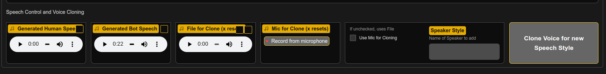

## Frequently asked questions

### Control location of files

* HUGGINGFACE_HUB_CACHE : else set by HF transformers package to be `~/.cache/huggingface/hub` in linux or in windows `C:\Users\username\.cache\huggingface\hub`.
* TRANSFORMERS_CACHE : else set by HF transformers package to be `~/.cache/huggingface/transformers` in linux or in windows `C:\Users\username\.cache\huggingface\transformers`.
* HF_HOME: More broad location for any HF objects
* XDG_CACHE_HOME: Broadly any `~/.cache` items.  Some [other packages](README_offline.md) use this folder.
* `--llamacpp_path=<location>` : Location for llama.cpp models, like GGUF models.

### Video Extraction

Ways to get Audio (ASR) and Video extraction:
* Add YouTube link to Ask Anything and click Ingest
* Upload video file clicking Upload and selecting your video

By default, image frames are extracted as a separate document, so when viewed in document viewer, the images are shown.  If you prefer them under the same document, set env `FRAMES_AS_SAME_DOC=1`.

If you prefer to disable video extraction, choose `--extract_frames=0` with CLI or pick 0 in Document Control in expert settings in UI.

### Image Generation

For image generation, then run:
```bash
python --base_model=HuggingFaceH4/zephyr-7b-beta --score_model=None --enable_imagegen=True
```
or for high-resolution run use `--enable_imagegen_high=True` (can add both).

### LLaVa Vision Models

https://github.com/haotian-liu/LLaVA

Use separate env for workers and server
```bash
export CUDA_HOME=/usr/local/cuda-11.8
export PIP_EXTRA_INDEX_URL="https://download.pytorch.org/whl/cu118"

conda create -n llava python=3.10 -y
conda activate llava
pip install --upgrade pip  # enable PEP 660 support

# git clone https://github.com/haotian-liu/LLaVA.git
git clone https://github.com/h2oai/LLaVA.git h2oai_llava
cd h2oai_llava

pip install -e .
pip install -e ".[train]"
pip install flash-attn --no-build-isolation
```

Run controller:
```bash
export server_port=10000
python -m llava.serve.controller --host 0.0.0.0 --port $server_port
```

Run a worker
```bash
worker_port=40000
python -m llava.serve.model_worker --host 0.0.0.0 --controller http://localhost:$server_port --port $worker_port --worker http://localhost:$worker_port --model-path liuhaotian/llava-v1.5-13b
```

Can run multiple workers if put on different ports, e.g. for  more verbose output (but not necessarily technically better), run:
```bash
git clone https://github.com/qnguyen3/hermes-llava.git
cd hermes-llava
conda create -n llava_hermes python=3.10 -y
conda activate llava_hermes
pip install --upgrade pip  # enable PEP 660 support
pip install -e .
pip install -e ".[train]"
pip install flash-attn --no-build-isolation
pip install transformers==4.34.1

worker_port=40001
python -m llava.serve.model_worker --host 0.0.0.0 --controller http://localhost:$server_port --port $worker_port --worker http://localhost:$worker_port --model-path NousResearch/Nous-Hermes-2-Vision
````

Run server:
```bash
pip install gradio==3.50.2
python -m llava.serve.gradio_web_server --controller http://localhost:$server_port --model-list-mode reload
```

Run h2oGPT with LLaVa and image (normal and high-quality) generation:
```bash
python --base_model=HuggingFaceH4/zephyr-7b-beta --score_model=None --llava_model=<IP:port:model_name> --enable_imagegen=True --enable_imagegen_high=True
```
e.g. `--llava_model=http://192.168.1.46:7861:llava-v1.5-13b`.

### Speech-to-Text (STT) and Text-to_Speech (TTS)

To disable STT and TTS, pass `--enable_tts=False --enable_stt=False` to `generate.py`.  Note that STT and TTS models are always preloaded if not disabled, so GPU memory is used if do not disable them.

For basic STT and TTS, nothing is required to pass, but you should select `Speech Style` under Chats in left sidebar, since not speaking by default.

To make h2oGPT speak by default, run instead something like:
```bash
python generate.py --base_model=llama \
                   --chatbot_role="Female AI Assistant" \
                   --speaker="SLT (female)"
```
By default, we effectively set `--chatbot_role="None" --speaker"None"` so you otherwise have to always choose speaker once UI is started.

For the most advanced setup, one can use Coqui.ai models like xtts_v2.  If deepspeed was installed, then ensure `CUDA_HOME` env is set to same version as torch installation, and that the CUDA installation has full dev installation with `nvcc`, so that cuda kernels can be compiled.

Then, suppose one has 4 GPUs and one wants accurate document Q/A and STT and TTS with the best quality, then one can run:
```bash
python generate.py --base_model=llama \
                   --pre_load_image_audio_models=True \
                   --score_model=None \
                   --embedding_gpu_id=0 \
                   --caption_gpu_id=1 \
                   --captions_model=Salesforce/blip2-flan-t5-xl \
                   --enable_pdf_doctr=on \
                   --doctr_gpu_id=2 \
                   --asr_gpu_id=3 \
                   --asr_model=openai/whisper-large-v3 \
                   --sst_model=openai/whisper-large-v3 \
                   --tts_model=tts_models/multilingual/multi-dataset/xtts_v2 \
                   --tts_gpu_id=2 \
                   --chatbot_role="Female AI Assistant" \
                   --speaker="SLT (female)" \
                   --system_prompt="You are a helpful assistant named Jennifer who can hear and speak."
```
So then the SST and ASR models are the same model and all GPU related models are preloaded for fast document handling. Use of `--enable_pdf_doctr=on` will be slower for long PDFs, but generally converts pages to images then OCRs the full image, so more generally handles PDF content.  Note that STT and TTS models are always preloaded if not disabled.

Or all on single GPU focused on high-quality speech components:
```bash
python generate.py --base_model=llama \
                   --pre_load_image_audio_models=True \
                   --asr_model=openai/whisper-large-v3 \
                   --sst_model=openai/whisper-large-v3 \
                   --tts_model=tts_models/multilingual/multi-dataset/xtts_v2 \
                   --chatbot_role="Female AI Assistant",
                   --speaker="SLT (female)",
                   --system_prompt="You are a helpful assistant named Jennifer who can hear and speak."
```
The system prompt is helpful to let LLM know it can actually listen and speak, but the prompt is not too specific about details, else LLMs tend to add extra parenthetical gesturing that is not appropriate for TTS.

In order to activate AI Voice Assistant mode, add:
```bash
--tts_action_phrases="['Nimbus']"
--tts_stop_phrases="['Yonder']"
```
One can use this action word, or some extension of it like `Nimbus Clouds` so the ASR is ensured to get what is said.

NOTE: Action/Stop voice control over assistant is **experimental**, so disabled by default by passing an empty list. It works well if only want voice control, but currently typing lots of text leads to text box blinking too much, so it is disabled by default.

There is currently no TTS for CLI.

In the expert panel you can replay any h2oGPT generation or speak instruction generation.

If you want to stop generation of speech, click "Stop" in top-right to stop generation of text and speech, or click "Stop/Clear Speak" to stop speech when having clicked on "Speak Instruction" and "Speak Response".

### Client TTS

From [Client Call Test Code](../tests/test_client_calls.py) eee function `play_audio` to play (or write) audio one gets using the `playsound` pypi package, and see test `test_client1_tts_stream` for how to stream audio along with LLM call for Microsoft or Coqui models, skipping main() call for pure client case.  See `test_client1_tts` test for non-streaming case.

To just get a single one-off conversion of text to audio via API using gradio client, one can follow test `test_client1_tts_api`, self-contained and reduced here for pure client case:
```python
def play_audio_str(audio_str1, n):
    import ast
    import io
    from pydub import AudioSegment

    print(n)
    n += 1
    audio_dict = ast.literal_eval(audio_str1)
    audio = audio_dict['audio']
    sr = audio_dict['sr']
    s = io.BytesIO(audio)
    channels = 1
    sample_width = 2

    make_file = True  # WIP: can't choose yet
    if make_file:
        import uuid
        # NOTE: pip install playsound
        from playsound import playsound
        filename = '/tmp/audio_%s.wav' % str(uuid.uuid4())
        audio = AudioSegment.from_raw(s, sample_width=sample_width, frame_rate=sr, channels=channels)
        audio.export(filename, format='wav')
        playsound(filename)
    else:
        from pydub import AudioSegment
        from pydub.playback import play
        song = AudioSegment.from_file(s, format="wav")
        play(song)
    return n

from gradio_client import Client
client = Client('http://localhost:7860')

# string of dict for input
prompt = 'I am a robot.  I like to eat cookies, cakes, and donuts.  Please feed me every day.'
inputs = dict(chatbot_role="Female AI Assistant",
              speaker="SLT (female)",
              tts_language='autodetect',
              tts_speed=1.0,
              prompt=prompt,
              stream_output=True,
              h2ogpt_key='',  # set if required, else leave as empty string.  Always needs to be passed
              )
job = client.submit(*tuple(list(inputs.values())), api_name='/speak_text_api')

from gradio_client.utils import Status
import time

do_play = True
n = 0
t0 = time.time()
# work-around https://github.com/gradio-app/gradio/issues/7136
while True:
    if not job.communicator:
        break
    time.sleep(0.001)

    if len(job.outputs()) - 1 >= n:
        audio_str = job.outputs()[n]
        print("n=%s/%s dt=%s" % (n, len(job.outputs()) - 1, (time.time() - t0)))
        t0 = time.time()
        n += 1
        if do_play:
            play_audio_str(audio_str)

    n_outputs = len(job.outputs())  # must be outside lock below
    with job.communicator.lock:
        if job.communicator.job.latest_status.code == Status.FINISHED and n >= n_outputs:
            break
```
or via curlable endpoint:
```bash
curl 127.0.0.1:7860/api/speak_text_plain_api -X POST -d '{"data": ["{\"chatbot_role\": \"Female AI Assistant\", \"speaker\": \"SLT (female)\", \"tts_language\": \"autodetect\", \"tts_speed\": 1.0, \"prompt\": \"Say cheese.\", \"stream_output\": \"False\", \"h2ogpt_key\": \"foodoo\"}"]}' -H 'Content-Type: application/json'
```
for h2oGPT key `foodoo`.

### Automatic Speech Recognition (ASR)

ASR is handled with whisper type models for ingesting YouTube videos or other videos.

For Twitter, one can right-click on Twitter video, copy video address, then paste into [TwitterVideoDownloader.com](https://twitter.com/i/status/1732448989336006826) and download the video, right-click on that video and click save as, then upload to h2oGPT.

### Faster ASR

For fast performance, one can use `distil-whisper/distil-large-v2` as the model, which is about 10x faster for similar accuracy.

In addition, faster_whisper package can be used if using large v2 or v3, which is about 4x faster and 2x less memory for similar accuracy.

### Voice Cloning

Follow these steps:
* Ensure passing `--tts_model=tts_models/multilingual/multi-dataset/xtts_v2` as only it supports cloning
* Go to expert panel as shown below
* Select File or Mic
  * Select either File for Cloning (Some wave, mp4a, etc. file).  It will be uploaded and reduced to at most 30 seconds automatically.
    * If one already present, as is default, then click x and select or drop file.
  * Or select Mic for Clone and record your voice.  Use no more than around 30 seconds.
    * Click Use Mic for Cloning if that is what is intended, so we know whether to use the file or mic.
* Select Speaker Style name, which will appear in drop-down under chats after done.  If logged in, this is saved to the user state for next login.
* Click Clone Voice button, and within second the speaker is an option in the sidebar under chats as another style.




### Non-English languages

There are a few changes that may be required for other languages:
* LLM -- e.g. LLaMa-2-chat
* Embedding Model -- e.g. instructor-large
* LLM Prompts -- e.g. `system_prompt`
* Document Q/A Prompts -- e.g. `pre_prompt_query`

E.g. for Chinese, the LLaMa-2 model is not good, while the `zephyr-7b` type model is reasonable.

E.g. one can do:
```bash
python generate.py --cut_distance=10000 --hf_embedding_model=BAAI/bge-base-zh-v1.5 --save_dir=save_china --base_model=HuggingFaceH4/zephyr-7b-beta --model_lock_columns=3 --gradio_size=small --height=400 --score_model=None --pre_prompt_query="注意并记住下面的信息，这将有助于在上下文结束后回答问题或祈使句。" --prompt_query="仅根据上述上下文中提供的文档来源中的信息，" --pre_prompt_summary="为了撰写简洁的单段落或项目符号列表摘要，请注意以下文本\n" --prompt_summary="仅使用上述文档来源中的信息，编写关键结果的简明摘要（最好作为要点）：\n" --system_prompt="你是一个有用的纯中文语言助手，绝对只使用中文。"
```
or from Docker:
```bash
docker run \
      --gpus '"device=0"' \
      --runtime=nvidia \
      --shm-size=2g \
      -p 7860:7860 \
      --rm --init \
      --network host \
      -v /etc/passwd:/etc/passwd:ro \
      -v /etc/group:/etc/group:ro \
      -u `id -u`:`id -g` \
      -v "${HOME}"/.cache:/workspace/.cache \
      -v "${HOME}"/save:/workspace/save \
      gcr.io/vorvan/h2oai/h2ogpt-runtime:0.1.0 /workspace/generate.py \
         --base_model=HuggingFaceH4/zephyr-7b-beta \
         --use_safetensors=True \
         --prompt_type=zephyr \
         --save_dir='/workspace/save/' \
         --use_gpu_id=False \
         --score_model=None \
         --max_max_new_tokens=2048 \
         --max_new_tokens=1024 \
         --cut_distance=10000 \
         --hf_embedding_model=BAAI/bge-base-zh-v1.5 \
         --pre_prompt_query="注意并记住下面的信息，这将有助于在上下文结束后回答问题或祈使句。" \
         --prompt_query="仅根据上述上下文中提供的文档来源中的信息，" \
         --pre_prompt_summary="为了撰写简洁的单段落或项目符号列表摘要，请注意以下文本" \
         --prompt_summary="仅使用上述文档来源中的信息，编写关键结果的简明摘要（最好作为要点" \
         --system_prompt="你是一个有用的纯中文语言助手，绝对只使用中文。"
```

Even better [Chinese model](https://huggingface.co/BAAI/AquilaChat2-34B) can be used with `--prompt_type=aquila`, including [with quantization](https://huggingface.co/TheBloke/AquilaChat2-34B-16K-AWQ). that can fit on single A100 40GB.

One can also run such models in vLLM and have h2oGPT use `--inference_server` to connect to the vLLM endpoint for good concurrency, then you can pass also `--concurrency_count=64`.

In some cases LLaMa-2 or other chat models do ok on some languages, but others have been fine-tuned that are probably better:
* Mistral-based [German](https://huggingface.co/LeoLM/leo-mistral-hessianai-7b-chat) or bilingual LLaMa-2 based [German](https://huggingface.co/LeoLM/leo-hessianai-13b-chat-bilingual)
* LLaMa-2-7B-based [Spanish](https://huggingface.co/clibrain/Llama-2-7b-ft-instruct-es) or 13B-based [Spanish](https://huggingface.co/marianbasti/Llama-2-13b-fp16-alpaca-spanish)

In some cases more language boosting can be done by adding not just a system prompt but also a `--chat_conversation` that is a list of tuples of strings like `--chat_conversation=[(human, bot),(human, bot)]` (can also be passed to UI in expert panel for exploration of what works best).  Adding some reasonable but generic native language pre convsersation gets the model more into the mood of maintaining that language if it is a multilingual model or one that was heavily English based like LLaMa-2.


### Controlling Quality and Speed of Parsing

h2oGPT has certain defaults for speed and quality, but one may require faster processing or higher quality.

For URLs, we use unstructured (`--use_unstructured=True`) and others are disabled (`--use_playwright=False` and `use_selenium=False`) unless unstructured fails, then we try the others.  But quality of parsing may be higher if all 3 are used.  However, then there may be redundant pages in database, which cannot easily be removed, but they will waste context space in the LLM.

For PDFs, h2oGPT uses PyMuPDF by default, but others are used if that fails. In addition, because PyMuPDF does not handle images in PDFs well, we use DocTR for PDFs if there are less than 100 pages or other PDF parsers failed.  We also use unstructured in auto mode if less than 2 pages or other PDF parsers failed.  CLI can control these via:
* use_unstructured_pdf='auto'
* use_pypdf='auto'
* enable_pdf_ocr='auto'
* enable_pdf_doctr='auto'
* try_pdf_as_html='auto'

Where one sets 'off' to always disable, and 'on' to always enable.  When choosing a parser as "forced" on in the UI in expert settings, that is like setting 'on' in CLI.

In some cases as PDF may not really be a PDF but be HTML, so we try that by default if other parsers fail.

For images, there are these options with defaults
* enable_ocr=False
* enable_doctr=True
* enable_pix2struct=False
* enable_captions=True
* captions_model="Salesforce/blip-image-captioning-base",

So for images we always use caption model (BLIP) but one can use BLIP2 or others for more accuracy.  BLIP describes an image, while DocTR does OCR on the image.  "enable_ocr" uses Tesseract via Unstructured wrapper and is less capable than DocTR.  If these are forced on in UI, that is like choosing `True`.

To enable all options on, choose `--max_quality=True` or select in side panel->Upload->Maximum Ingest Quality.  However, this can lead to a few redundant pages in database.  So only good idea if have >4k context.

The value `--top_k_docs` sets how many chunks (for query action) or parts of document (for summarization/extraction actions) to put into context.  If that is too much data, it gets truncated by the `get_limited_prompt()` function.  To improve quality of retrieval, one can set `--top_k_docs=-1` to autofill context with documents.  Or choose a fixed value like `10`, especially if chose redundant parsers that will end up putting similar parts of documents into context.

To improve speed of parsing for captioning images and DocTR for images and PDFs, set `--pre_load_image_audio_models=True`.  Note `--pre_load_embedding_model=True` is already the default.  This preloads the models, especially useful when using GPUs.  Choose GPU IDs for each model to help distribute the load, e.g. if have 3 GPUs, the embedding model will be on GPU=0, then use `--caption_gpu_id=1` and `--doctr_gpu_id=2` and `--asr_gpu_id=3`.  This is also useful for multi-user case, else the models are loaded and unloaded for each user doing parsing, which is wasteful of GPU memory.  E.g., for maximum speed and accuracy on 4 GPUs, one could run:
```bash
python generate.py --pre_load_embedding_model=True --embedding_gpu_id=0 --hf_embedding_model=BAAI/bge-large-en --cut_distance=10000 --pre_load_caption_model=True --caption_gpu_id=1 --caption_model=Salesforce/blip2-flan-t5-xl --doctr_gpu_id=2 --asr_gpu_id=3 --asr_model=openai/whisper-large-v3 --max_quality=True
```
where the BLIP2 model needs 16GB and the whisper-large-v3 needs 10GB.

### Controlling Quality and Speed of Context-Filling

By default, `--top_k_docs=3`.  A query action uses `chunk_size=512` character chunks, while summarization/extraction actions do not use those "query/embedding" chunks but use raw parser result (e.g. pages for PDFs).

An optimal quality choice is `--top_k_docs=-1`, because then h2oGPT will figure out how to autofill the context.  If that leads to too slow behavior, a good balance might be `top_k_docs=10`, but for summarization/extraction that may be too limiting.

In any case, we will manage things in any case to reduce the count to not exceed the context of the LLM in the `get_limited_prompt()` function.

If one sets `top_k_docs=-1`, one can also set `max_input_tokens` to limit tokens per LLM call, and `max_total_input_tokens` to limit tokens across all LLM calls. This requires more knowledge of the LLM used (e.g. set to `max_input_tokens=3000` if have 4096 LLM context.  `max_input_tokens` acts as an effective context size limit for all inputs to the context.

### API key access

h2oGPT API key access for API and UI and persistence of state via login (auth enabled or not)

```bash
python generate.py --base_model=h2oai/h2ogpt-4096-llama2-70b-chat --auth_filename=auth.json --enforce_h2ogpt_api_key=True --enforce_h2ogpt_ui_key=True --h2ogpt_api_keys="['<API_KEY>']"
```
for some API key `<API_KEY>` and some auth file `auth.json` where h2oGPT will store login and persistence information.  This enforces keyed access for both API and UI, and one can choose any.  For public cases (Hugging Face or GPT_H2O_AI env set), enforce of API is default.

One can also use a json key file:
```bash
python generate.py --base_model=h2oai/h2ogpt-4096-llama2-70b-chat --auth_filename=auth.json --enforce_h2ogpt_api_key=True --enforce_h2ogpt_ui_key=True --h2ogpt_api_keys="h2ogpt_api_keys.json"
```
for some file `h2ogpt_api_keys.json` which is a JSON file that is a list of strings of keys allowed.

If UI keyed access is enabled, one has to enter the key in the UI in Login tab before accessing LLMs or upload of files.

If API keyed access is enabled, one has to pass the API key along with other arguments to access LLm or upload of files.

See `src/gen.py` file for details:
*    :param enforce_h2ogpt_api_key: Whether to enforce h2oGPT token usage for API
*    :param enforce_h2ogpt_ui_key: Whether to enforce h2oGPT token usage for UI (same keys as API assumed)
*    :param h2ogpt_api_keys: list of tokens allowed for API access or file accessed on demand for json of list of keys
*    :param h2ogpt_key: E.g. can be set when accessing gradio h2oGPT server from local gradio h2oGPT server that acts as client to that inference server

As with any option, one can set the environment variable `H2OGPT_x` for an upper-case main() argument to control the above.

### Auth Access

As listed in the `src/gen.py` file, there are many ways to control authorization:
*  :param auth: gradio auth for launcher in form [(user1, pass1), (user2, pass2), ...]
    * e.g. --auth=[('jon','password')] with no spaces
    * e.g. --auth="[('jon', 'password)())(')]" so any special characters can be used
    * e.g. --auth=auth.json to specify persisted state file with name auth.json (auth_filename then not required),
    * e.g. --auth='' will use default auth.json as file name for persisted state file (auth_filename then not required)
    * e.g. --auth=None will use no auth, but still keep track of auth state, just not from logins
*    :param auth_filename:
    * Set auth filename, used only if --auth= was passed list of user/passwords
*   :param auth_access:
    * 'open': Allow new users to be added
    * 'closed': Stick to existing users
*   :param auth_freeze: whether freeze authentication based upon current file, no longer update file
*   :param auth_message: Message to show if having users login, fixed if passed, else dynamic internally
*   :param guest_name: guess name if using auth and have open access.
    * If '', then no guest allowed even if open access, then all databases for each user always persisted

The file format for `auth.json` in basic form is:
```json
{
  "user1": {
    "userid": "any_unique_value",
    "password": "login_password",
  },
  "user2": {
    "userid": "any_unique_value",
    "password": "login_password",
  },
}
```
while more generally it is updated by h2oGPT to contain other entries, for example for single user `username`:
```json
  "username": {
    "password": "username",
    "userid": "9078ac9c-8ccf-481a-8de3-d6ccd21fd1c3",
    "selection_docs_state": {
      "langchain_modes": [
        "UserData",
        "MyData",
        "LLM",
        "Disabled"
      ],
      "langchain_mode_paths": {
        "UserData": null
      },
      "langchain_mode_types": {
        "UserData": "shared",
        "github h2oGPT": "shared",
        "DriverlessAI docs": "shared",
        "wiki": "shared",
        "wiki_full": "",
        "MyData": "personal",
        "LLM": "either",
        "Disabled": "either"
      }
    },
    "chat_state": {
      "Say a color": [
        [],
        [],
        [
          [
            "Say a color",
            "I do not have the ability to speak, but I can tell you that a color is a hue, tone, or shade that is perceived by the human eye and identified by a name. Some common colors include red, orange, yellow, green, blue, indigo, and violet."
          ]
        ]
      ]
    },
    "text_outputs": [
      [
        [
          [
            "Say a color",
            "I do not have the ability to speak, but I can tell you that a color is a hue, tone, or shade that is perceived by the human eye and identified by a name. Some common colors include red, orange, yellow, green, blue, indigo, and violet."
          ]
        ]
      ]
    ]
  }
```

### HTTPS access for server and client

Have files `private_key.pem` and `cert.pem` from your own SSL, or if do not have such files, generate by doing:
```bash
openssl req -x509 -newkey rsa:4096 -keyout private_key.pem -out cert.pem -days 3650 -nodes -subj '/O=H2OGPT'
```

Consider the server (not h2oGPT but gradio based) for end-to-end example:
```python
import gradio as gr
import random
import time

with gr.Blocks() as demo:
    chatbot = gr.Chatbot()
    msg = gr.Textbox()
    clear = gr.ClearButton([msg, chatbot])

    def respond(message, chat_history):
        bot_message = random.choice(["How are you?", "I love you", "I'm very hungry"])
        chat_history.append((message, bot_message))
        time.sleep(2)
        return "", chat_history

    msg.submit(respond, [msg, chatbot], [msg, chatbot], api_name='chat')

demo.launch(ssl_verify=False, ssl_keyfile='private_key.pem', ssl_certfile='cert.pem', share=False)
```
The key and cert files are passed to the server, with `ssl_verify=False` to avoid asking a known source to verify.  This is required to have https but allow the server to talk to itself and via the UI in the browser.  The browser will warn about ssl key not being verified, just proceed anyways.

Then the client needs to also not verify when talking to the server running https, which gradio client does not handle itself.  One can use a context manager as follows:
```python
import contextlib
import warnings
import requests
from urllib3.exceptions import InsecureRequestWarning

old_merge_environment_settings = requests.Session.merge_environment_settings


@contextlib.contextmanager
def no_ssl_verification():
    opened_adapters = set()

    def merge_environment_settings(self, url, proxies, stream, verify, cert):
        # Verification happens only once per connection so we need to close
        # all the opened adapters once we're done. Otherwise, the effects of
        # verify=False persist beyond the end of this context manager.
        opened_adapters.add(self.get_adapter(url))

        settings = old_merge_environment_settings(self, url, proxies, stream, verify, cert)
        settings['verify'] = False

        return settings

    requests.Session.merge_environment_settings = merge_environment_settings

    try:
        with warnings.catch_warnings():
            warnings.simplefilter('ignore', InsecureRequestWarning)
            yield
    finally:
        requests.Session.merge_environment_settings = old_merge_environment_settings

        for adapter in opened_adapters:
            try:
                adapter.close()
            except:
                pass
```
Then with this one is able to talk to the server using https:

```python
from gradio_client import Client
HOST_URL ="https://localhost:7860"

with no_ssl_verification():
    client = Client(HOST_URL, serialize=False)
    chatbot = [['foo', 'doo']]
    res = client.predict('Hello', chatbot, api_name='/chat')
    print(res)
```
which prints out something like:
```text
Loaded as API: https://localhost:7860/ ✔
('', [['foo', 'doo'], ['Hello', 'I love you']])
```

For h2oGPT, run the server as `python generate.py --ssl_verify=False --ssl_keyfile=<KEYFILE> --ssl_certfile=<CERTFILE> --share=False` for key file `<KEYFILE>` and cert file `<CERTFILE>`, then use gradio client code with context manager as above but use the gradio client endpoints as [documented in readme or test code](README_CLIENT.md).

### RoPE scaling and Long Context Models

For long context models that have been tuned for a specific size, ensure that you set the `--rope_scaling` configuration to match that exact size. For example:

```bash
python generate.py --rope_scaling="{'type':'linear','factor':4}" --base_model=lmsys/vicuna-13b-v1.5-16k --hf_embedding_model=sentence-transformers/all-MiniLM-L6-v2 --load_8bit=True --langchain_mode=UserData --user_path=user_path --prompt_type=vicuna11 --h2ocolors=False
````

If the model is Hugging Face-based and already has a `config.json` entry with `rope_scaling` in it, we will use that if you do not pass `--rope_scaling`.

### Migration from Chroma < 0.4 to > 0.4

#### Option 1: Use old Chroma for old DBs

No action is required from the user. By default, h2oGPT will not migrate for old databases. This is managed internally through requirements added in `requirements_optional_langchain.txt`, which adds special wheels for old versions of `chromadb` and `hnswlib`. This ensures smooth migration handling better than `chromadb` itself.

#### Option 2: Automatically Migrate

By default, h2oGPT does not migrate automatically with `--auto_migrate_db=False` for `generate.py`. You can set this to `True` for auto-migration, which may take some time for larger databases.  This will occur on-demand when accessing a database.  This takes about 0.03s per chunk.

#### Option 3: Manually Migrate

You can set `--auto_migrate_db=False` and manually migrate databases by doing the following.

* Install and run migration tool
  ```
  pip install chroma-migrate
  chroma-migrate
  ```
* Choose DuckDB
* Choose "Files I can use ..."
* Choose your collection path, e.g. `db_dir_UserData` for collection name `UserData`

### Model Usage Notes

* [amazon/MistralLite](https://huggingface.co/amazon/MistralLite)
  *  Use `--max_seq_len=16384` or smaller, larger fails to handle when context used like summarization
  * ```bash
    pip install flash-attn==2.3.1.post1 --no-build-isolation
    python generate.py --hf_model_dict="{'use_flash_attention_2': True}" --base_model=amazon/MistralLite --max_seq_len=16384
    ```
* [mistralai/Mistral-7B-Instruct-v0.1](https://huggingface.co/mistralai/Mistral-7B-Instruct-v0.1)
  *  Use `--max_seq_len=4096` or smaller, but does well even with 32k in some cases query with many chunks in context

Many newer models have large embedding sizes and can handle going beyond the context a bit.  However, some models like distilgpt2 critically fail, so one needs to pass
```bash
python generate.py --base_model=distilgpt2 --truncation_generation=True
```
otherwise one will hit:
```
../aten/src/ATen/native/cuda/Indexing.cu:1093: indexSelectSmallIndex: block: [4,0,0], thread: [0,0,0] Assertion `srcIndex < srcSelectDimSize` failed.
```
We take care of this for distilgpt2, but other similar models might fail in same way.

### Adding Models

You can choose any Hugging Face model or quantized GGUF model file in h2oGPT.  Hugging Face models are automatically downloaded to the Hugging Face .cache folder (in home folder).

#### Hugging Face

Hugging Face models are passed via `--base_model` in all cases, with fine-control using `hf_model_dict`.

#### TheBloke

For models by [TheBloke](https://huggingface.co/TheBloke), h2oGPT tries to automatically handle all types of models (AWQ, GGUF, GGML, GPTQ, with or without safetensors) automatically all passed with `--base_model` only (CLI or UI both).  For example, these models all can be passed just with `--base_model` without any extra model options:
```text
python generate.py --base_model=h2oai/h2ogpt-oig-oasst1-512-6_9b
python generate.py --base_model=TheBloke/Xwin-LM-13B-V0.1-GPTQ
python generate.py --base_model=TheBloke/Llama-2-7B-Chat-GGUF
python generate.py --base_model=HuggingFaceH4/zephyr-7b-beta
python generate.py --base_model=TheBloke/zephyr-7B-beta-GGUF
python generate.py --base_model=TheBloke/zephyr-7B-beta-AWQ
python generate.py --base_model=zephyr-7b-beta.Q5_K_M.gguf
python generate.py --base_model=https://huggingface.co/TheBloke/Llama-2-7b-Chat-GGUF/resolve/main/llama-2-7b-chat.Q6_K.gguf?download=true
```
Some are these are non-quantized models with links HF links, some specific files on local disk ending in `.gguf`.  Given `TheBloke` HF names, if a quantized model, h2oGPT pulls the recommended model from his repository.  You can also provide a resolved web link directly, or a file.

Watch out for typos.  h2oGPT broadly detects if the URL is valid, but Hugging Face just returns a redirect for resolved links, leading to page containing `Entry not found` if one makes a mistake in the file name, e.g. `https://huggingface.co/TheBloke/Llama-2-7B-Chat-GGUF/resolve/main/llama-2-7b-chat.Q6_K.gguffoo`.

For AWQ, GPTQ, we try the required safe tensors or other options, and by default use transformers's GPTQ unless one specifies `--use_autogptq=True`.

#### AWQ & GPTQ

For full control over AWQ, GPTQ models, one can use an extra `--load_gptq` and `gptq_dict` for GPTQ models or an extra `--load_awq` for AWQ models.

##### GPTQ

For example, for AutoGPTQ using [TheBloke](https://huggingface.co/TheBloke):
```bash
python generate.py --base_model=TheBloke/Nous-Hermes-13B-GPTQ --load_gptq=model --use_safetensors=True --prompt_type=instruct
```
and in some cases one has to disable certain features that are not automatically handled by AutoGPTQ package, e.g.
```bash
CUDA_VISIBLE_DEVICES=0 python generate.py --base_model=TheBloke/Xwin-LM-13B-v0.2-GPTQ --load_gptq=model --use_safetensors=True --prompt_type=xwin --langchain_mode=UserData --score_model=None --share=False --gradio_offline_level=1 --gptq_dict="{'disable_exllama': True}"
```

For Mixtral on 4 A6000 uses about 8-11GB per GPU:
```bash
python generate.py --base_model=TheBloke/Mixtral-8x7B-Instruct-v0.1-GPTQ --prompt_type=mistral --use_gpu_id=False --score_model=None --use_autogptq=True --load_gptq=model --use_safetensors=True
```
NOTE: After quantization report, it takes about 4 minutes on fast system to fully load for whatever reason, without any change to GPU or CPU memory usage.

For AutoGPTQ and other models, h2oGPT tries to automatically handle models needing certain exllama options.

##### AWQ

New quantized AWQ chose good quality, e.g. 70B LLaMa-2 16-bit or AWQ does comparable for many retrieval tasks.

```bash
python generate.py --base_model=TheBloke/Llama-2-13B-chat-AWQ --load_awq=model --use_safetensors=True --prompt_type=llama2
```

#### GGUF & GGML

For full control (e.g. for non-TheBloke models), use `--base_model=llama` and specify `--model_path_llama`, which can be file or URL.  Use `--llamacpp_dict` to pass options to the model for full control over llama.cpp behavior.

#### GGUF

GGUF models are supported (can run either CPU and GPU in same install), see installation instructions for installing the separate GPU and CPU packages.

GGUF using Mistral:
```bash
python generate.py --base_model=llama --prompt_type=mistral --model_path_llama=https://huggingface.co/TheBloke/Mistral-7B-Instruct-v0.1-GGUF/resolve/main/mistral-7b-instruct-v0.1.Q4_K_M.gguf --max_seq_len=4096 --score_model=None
```

GGUF using Mixtral:
```bash
python generate.py --base_model=TheBloke/Mixtral-8x7B-Instruct-v0.1-GGUF --prompt_type=mistral --max_seq_len=4096 --score_model=None
```
Also note that Mixtral GGUF has max context of 4k if allowed to auto-detect in h2oGPT.  One can try larger up to 32k with `--max_seq_len`.  But higher uses alot of GPU memory and is slow but for document QA is probably not helpful (e.g. `--top_k_docs=-1` with 32k actually hurts RAG performance, better to limit RAG to 4k, summarization can use more though).  This can be controlled per-query with `max_input_tokens` in API/UI.

Also, with `--top_k_docs=-1` or too large positive value, context-filling of the 4k leads to very slow results for GGUF Mixtral compared to vLLM FP16 performance.

Also, best to use a single GPU if possible, since multiple GPU usage is much slower with GGUF than vLLM, but context-filling issue is worse problem for llama.cpp performance.

[Similar versions of this package](https://github.com/jllllll/llama-cpp-python-cuBLAS-wheels/releases) also give support for Windows, AMD, Metal, CPU with various AVX choices, GPU, etc.

If you see:
```text
CUDA error 704 at /home/runner/work/llama-cpp-python-cuBLAS-wheels/llama-cpp-python-cuBLAS-wheels/vendor/llama.cpp/ggml-cuda.cu:6998: peer access is already enabled
current device: 0
```
This is known bug in `llama.cpp` for some multi-GPU systems.  Only work-around is to restrict to single GPU by adding `export CUDA_VISIBLE_DEVICES=0` or similar value.

#### GPT4All

GPT4All models are not recommended, but are supported, which are automatically downloaded to a GPT4All cache folder (in the home folder). For example:
```bash
python generate.py --base_model=gptj --model_name_gptj=ggml-gpt4all-j-v1.3-groovy.bin
```
for GPTJ models (also downloaded automatically):
```bash
python generate.py --base_model=gpt4all_llama --model_name_gpt4all_llama=ggml-wizardLM-7B.q4_2.bin
```
for GPT4All LLaMa models.

For more information on controlling these parameters, see [README_CPU.md](README_CPU.md) and [README_GPU.md](README_GPU.md).

#### Exllama

Exllama is supported using `load_exllama` bool, with additional control using `exllama_dict`.

#### Attention Sinks

Attention sinks is supported, like:
```bash
python generate.py --base_model=mistralai/Mistral-7B-Instruct-v0.1 --score_model=None --attention_sinks=True --max_new_tokens=100000 --max_max_new_tokens=100000 --top_k_docs=-1 --use_gpu_id=False --max_seq_len=4096 --sink_dict="{'num_sink_tokens': 4, 'window_length': 4096}"
```
where the attention sink window has to be larger than any prompt input else failures will occur.  If one sets `max_input_tokens` then this will restrict the input tokens and that can be set to same value as `window_length`.

One can increase `--max_seq_len=4096` for Mistral up to maximum of `32768` if GPU has enough memory, or reduce to lower memory needs from input itself, but still get efficient generation of new tokens "without limit".  E.g.
```bash
--base_model=mistralai/Mistral-7B-Instruct-v0.1 --score_model=None --attention_sinks=True --max_new_tokens=100000 --max_max_new_tokens=100000 --top_k_docs=-1 --use_gpu_id=False --max_seq_len=8192 --sink_dict="{'num_sink_tokens': 4, 'window_length': 8192}"
```

One can also set `--min_new_tokens` on CLI or in UI to some larger value, but this is risky as it ignores end of sentence token and may do poorly after.  Better to improve prompt, and this is most useful when already consumed context with input from documents (e.g. `top_k_docs=-1`) and still want long generation.  Attention sinks is not yet supported for llama.cpp type models or vLLM/TGI inference servers.

### Adding Prompt Templates

After specifying a model, you need to consider if an existing `prompt_type` will work or if a new one is required. For example, for Vicuna models, a well-defined `prompt_type` is used, which we support automatically for specific model names.  If the model is in `prompter.py` as associated with some `prompt_type` name, then we added it already. You can view the models that are currently supported in this automatic way in [prompter.py](../src/prompter.py) and [enums.py](../src/enums.py).

If we do not list the model in `prompter.py`, then if you find a `prompt_type` by name that works for your new model, you can pass `--prompt_type=<NAME>` for some prompt_type `<NAME>`, and we will use that for the new model.

However, in some cases, you need to add a new prompt structure because the model does not conform at all (or exactly enough) to the template given in, e.g., the Hugging Face model card or elsewhere.  In that case, you have two options:

* **Option 1**: Use custom prompt

    In CLI you can pass `--prompt_type=custom --prompt_dict="{....}"` for some dict {....}.  The dictionary doesn't need to contain all of the keys mentioned below, but should contain the primary ones.

    You can also choose `prompt_type=custom` in expert settings and change `prompt_dict` in the UI under `Models tab`.  Not all of these dictionary keys need to be set:
    ```
    promptA
    promptB
    PreInstruct
    PreInput
    PreResponse
    terminate_response
    chat_sep
    chat_turn_sep
    humanstr
    botstr
    ```
    i.e. see how consumed:  https://github.com/h2oai/h2ogpt/blob/a51576cd174e9fda61f00c3889a26888a604172c/src/prompter.py#L130-L142

    The following are the most crucial items:
    ```
    PreInstruct
    PreResponse
    humanstr
    botstr
    ```
    Note that it is often the case that `humanstr` equals `PreInstruct` and `botstr` equals `PreResponse`. If this is the case, then you only have to set two keys.

For example, suppose one did not have the `open_chat` prompt yet in h2oGPT, then one would run:
```bash
python generate.py --base_model=TheBloke/openchat_3.5-GGUF --prompt_type=custom --prompt_dict="{'promptA': '', 'promptB': '', 'PreInstruct': 'GPT4 User: ', 'PreInput': None, 'PreResponse': 'GPT4 Assistant:', 'terminate_response': ['GPT4 Assistant:', '<|end_of_turn|>'], 'chat_sep': '<|end_of_turn|>', 'chat_turn_sep': '<|end_of_turn|>', 'humanstr': 'GPT4 User: ', 'botstr': 'GPT4 Assistant:', 'generates_leading_space': False, 'system_prompt': ''}"
```
This generates the correct responses, etc.  The string added in the above is in double quotes as required when passing a dict or list with spaces.  And all internal quotes are single quotes.

If there is a similar prompt or one wants to see how a model prompt template looks like, you can run the model and then go to the UI in models and select right sidebar, then select `Current or Custom Model Prompt` then copy the text within `Current Prompt (or Custom)`.  This can be pasted directly into the double quotes like in the above run example, or edited as required for a new model.

* **Option 2**: Tweak or Edit code

   The following steps describe how you can edit the code itself if you don't want to use the CLI or UI:

   1) In `prompter.py`, add new key (`prompt_type` name) and value (model name) into `prompt_type_to_model_name`
   2) In `enums.py`, add a new name and value for the new `prompt_type`
   3) In `prompter.py`, add new block in `get_prompt()`

    A simple example to follow is vicuna11, with this block:
    ```
    elif prompt_type in [PromptType.vicuna11.value, str(PromptType.vicuna11.value),
                         PromptType.vicuna11.name]:
        preprompt = """A chat between a curious user and an artificial intelligence assistant. The assistant gives helpful, detailed, and polite answers to the user's questions. """ if not (
                chat and reduced) else ''
        start = ''
        promptB = promptA = '%s%s' % (preprompt, start)
        eos = '</s>'
        PreInstruct = """USER: """
        PreInput = None
        PreResponse = """ASSISTANT:"""
        terminate_response = [PreResponse]
        chat_sep = ' '
        chat_turn_sep = eos
        humanstr = PreInstruct
        botstr = PreResponse

        if making_context:
            # when making context, want it to appear as-if LLM generated, which starts with space after :
            PreResponse = PreResponse + ' '
        else:
            # normally LLM adds space after this, because was how trained.
            # if add space here, non-unique tokenization will often make LLM produce wrong output
            PreResponse = PreResponse
    ```
    You can start by changing each thing that appears in the model card that tells about the prompting.  You can always ask for help in a GitHub issue or Discord.

In either case, if the model card doesn't have that information, you'll need to ask around. In some cases, prompt information is included in their pipeline file or in a GitHub repository associated with the model with training of inference code. It may also be the case that the model builds upon another, and you should look at the original model card.  You can also  ask in the community section on Hugging Face for that model card.

### Add new Embedding Model

This section describes how to add a new embedding model.

- The `--use_openai_embedding` option set to `True` or `False` controls whether to use OpenAI embedding.

- `--hf_embedding_model` set to some HuggingFace model name sets that as embedding model if not using OpenAI

- The setting `--migrate_embedding_model` set to `True` or `False` specifies whether to migrate to new chosen embeddings or stick with existing/original embedding for a given database

- The option `--cut_distance` as float specifies the distance above which to avoid using document sources.  The default is 1.64, tuned for  Mini and instructor-large. You can pass `--cut_distance=100000` to avoid any filter. For example:

  ```bash
  python generate.py --base_model=h2oai/h2ogpt-4096-llama2-13b-chat  --score_model=None --langchain_mode='UserData' --user_path=user_path --use_auth_token=True --hf_embedding_model=BAAI/bge-large-en --cut_distance=1000000
  ```

To run the embedding model on the CPU, use options like:
```bash
python generate.py --base_model=llama --pre_load_embedding_model=True --embedding_gpu_id=cpu --cut_distance=10000 --hf_embedding_model=BAAI/bge-base-en-v1.5 --score_model=None
```
The change of embedding model type is optional, but recommended so the model is smaller. That's because it takes about 0.3seconds per chunk on my i9 using instructor-large. That's why you probably want to use a smaller bge model of much smaller size like above. E.g. 90 seconds for 270 chunks. But with bge base above it only takes 20 seconds, so about 4x faster.

The change of cut distance is required for other arbitrary models since the distance is not normalized for each model.

See [Embedding Leaderboard](https://huggingface.co/spaces/mteb/leaderboard) for other options for smaller size that are still quite accurate, where smaller should be faster on CPU.

Also review the low memory documentation for other low memory options.

### System Prompting

Some models explicitly take a system prompt (in the raw prompt or via some chat API).  However, some models have no system prompt, in which case by default with `--allow_chat_system_prompt=True`, we fill conversation history with a [prompt-response pair](../src/enums.py) for `user_prompt_for_fake_system_prompt` to replace the system_prompt, which often works well.

For most models, one can speak for model, i.e. `I am a chatbot who can't help but talk about cars every time I speak.`, instead of `You ...`, even if often model card's (like for `zephyr`) give example as `You ...`.

However, models vary quite a bit in whether or how they respond to system prompts even if supposedly accept.  E.g. `zephyr` with `--prompt_type=zephyr` is valid prompt, but `zephyr0` allows the system prompt to be listened to more.  So one can explore variations in the strictly correct prompt to expose more from model in some cases.

In some cases, longer system prompts help, but it may also hurt for some models.  A system prompt that works well is something reasonable that connects the model (being a chatbot it knows) to what it is, e.g. `I am a friendly chatbot who always responds in the style of a cute pixie who talks like a pixie.`.   However, some models (like Claude) will always respond a certain way for some questions, like `Who are you?` regardless of any system prompting (for Claude done via chat history, since raw no-prefix prompting used by LangChain is strongly ignored).

### In-Context learning via Prompt Engineering

For arbitrary tasks, using uncensored models like [Falcon 40 GM](https://huggingface.co/h2oai/h2ogpt-gm-oasst1-en-2048-falcon-40b-v2) is recommended. If censored is ok, then [LLama-2 Chat](https://huggingface.co/h2oai/h2ogpt-4096-llama2-70b-chat) are ok. Choose model size according to your system specs.

For the UI, CLI, or EVAL, this means editing the `System Pre-Context` text box in expert settings.  When starting h2oGPT, you can pass `--system_prompt` to give a model a system prompt if it supports that, `--context` to pre-append some raw context, `--chat_conversation` to pre-append a conversation for instruct/chat models, `--text_context_list` to fill context up to possible allowed `max_seq_len` with strings, with first most relevant to appear near prompt, or `--iinput` for a default input (to instruction for pure instruct models) choice.

Or for API, you can pass the `context` variable. This can be filled with arbitrary things, including actual conversations to prime the model, although if a conversation then you need to put in prompts as follows:
```python
from gradio_client import Client
import ast

HOST_URL = "http://localhost:7860"
client = Client(HOST_URL)

# string of dict for input
prompt = 'Who are you?'
# falcon, but falcon7B is not good at this:
#context = """<|answer|>I am a pixie filled with fairy dust<|endoftext|><|prompt|>What kind of pixie are you?<|endoftext|><|answer|>Magical<|endoftext|>"""
# LLama2 7B handles this well:
context = """[/INST] I am a pixie filled with fairy dust </s><s>[INST] What kind of pixie are you? [/INST] Magical"""
kwargs = dict(instruction_nochat=prompt, context=context)
res = client.predict(str(dict(kwargs)), api_name='/submit_nochat_api')

# string of dict for output
response = ast.literal_eval(res)['response']
print(response)
```
For example, see: https://github.com/h2oai/h2ogpt/blob/d3334233ca6de6a778707feadcadfef4249240ad/tests/test_prompter.py#L47 .

Note that even if the prompting is not perfect or matches the model, smarter models will still do quite well, as long as you give their answers as part of context.

If you just want to pre-append a conversation, then use `chat_conversation` instead and h2oGPT will generate the context for the given instruct/chat model:
```python
from gradio_client import Client
import ast

HOST_URL = "http://localhost:7860"
client = Client(HOST_URL)

# string of dict for input
prompt = 'Who are you?'
chat_conversation = [("Who are you?", "I am a pixie filled with fairy dust"), ("What kind of pixie are you?", "Magical")]
kwargs = dict(instruction_nochat=prompt, chat_conversation=chat_conversation)
res = client.predict(str(dict(kwargs)), api_name='/submit_nochat_api')

# string of dict for output
response = ast.literal_eval(res)['response']
print(response)
```

Note that when providing `context`, `chat_conversation`, and `text_context_list`, the order in which they are integrated into the document Q/A prompting is: `context` first, followed by `chat_conversation`, and finally `text_context_list`. A `system_prompt` can also be passed, which can overpower any `context` or `chat_conversation` depending upon details.

### Token access to Hugging Face models:

Related to transformers.  There are two independent ways to do this (choose one):
* Use ENV:
    ```
    export HUGGING_FACE_HUB_TOKEN=<token goes here>
    ```
    token starts with `hf_` usually.  Then start h2oGPT like normal.
  See [Hugging Face ENV documentation](https://huggingface.co/docs/huggingface_hub/package_reference/environment_variables) for other environment variables.
* Use cli tool:
    ```bash
    huggingface-cli login
    ```
    in repo.  Then add to generate.py:
    ```
    python generate.py --use_auth_token=True ...
    ```
  See [Hugging Face Access Tokens](https://huggingface.co/docs/hub/security-tokens) for more details.

### Low-memory mode

For GPU case, a reasonable model for low memory is to run:
```bash
python generate.py --base_model=h2oai/h2ogpt-gm-oasst1-en-2048-falcon-7b-v3 --hf_embedding_model=sentence-transformers/all-MiniLM-L6-v2 --score_model=None --load_8bit=True --langchain_mode='UserData'
```
which uses good but smaller base model, embedding model, and no response score model to save GPU memory.  If you can do 4-bit, then do:
```bash
python generate.py --base_model=h2oai/h2ogpt-gm-oasst1-en-2048-falcon-7b-v3 --hf_embedding_model=sentence-transformers/all-MiniLM-L6-v2 --score_model=None --load_4bit=True --langchain_mode='UserData'
```
This uses 5800MB to startup, then soon drops to 5075MB after torch cache is cleared. Asking a simple question uses up to 6050MB. Adding a document uses no more new GPU memory.  Asking a question uses up to 6312MB for a few chunks (default), then drops back down to 5600MB.

For some models, you can restrict the use of context to use less memory.  This does not work for long context models trained with static/linear RoPE scaling, for which the full static scaling should be used.  Otherwise, e.g. for LLaMa-2 you can use
```bash
python generate.py --base_model='llama' --prompt_type=llama2 --score_model=None --langchain_mode='UserData' --user_path=user_path --model_path_llama=https://huggingface.co/TheBloke/Llama-2-7b-Chat-GGUF/resolve/main/llama-2-7b-chat.Q6_K.gguf --max_seq_len=2048
```
even though normal value is `--max_seq_len=4096` if the option is not passed as inferred from the model `config.json`.

Also try smaller GGUF models for GPU, e.g.:
```bash
python generate.py --base_model=https://huggingface.co/TheBloke/zephyr-7B-beta-GGUF/resolve/main/zephyr-7b-beta.Q2_K.gguf --prompt_type=zephyr --hf_embedding_model=sentence-transformers/all-MiniLM-L6-v2 --score_model=None --llamacpp_dict="{'n_gpu_layers':10}" --max_seq_len=1024 --enable_tts=False --enable_stt=False
```
This only uses 2GB of GPU even during usage.  You can vary the model size from [TheBloke](https://huggingface.co/TheBloke/zephyr-7B-beta-GGUF/tree/main) and offloading to optimize your experience.

On CPU case, a good model that's still low memory is to run:
```bash
python generate.py --base_model='llama' --prompt_type=llama2 --hf_embedding_model=sentence-transformers/all-MiniLM-L6-v2 --langchain_mode=UserData --user_path=user_path
```

Ensure to vary `n_gpu_layers` at CLI or in UI to smaller values to reduce offloading for smaller GPU memory boards.

### ValueError: ...offload....

```
The current `device_map` had weights offloaded to the disk. Please provide an `offload_folder` for them. Alternatively, make sure you have `safetensors` installed if the model you are using offers
the weights in this format.
```

If you see this error, then you either have insufficient GPU memory or insufficient CPU memory.  E.g. for 6.9B model one needs minimum of 27GB free memory.

### TypeError: Chroma.init() got an unexpected keyword argument 'anonymized_telemetry'

Please check your version of langchain vs. the one in requirements.txt.  Somehow the wrong version is installed.  Try to install the correct one.

### bitsandbytes CUDA error
  ```text
  CUDA Setup failed despite GPU being available. Please run the following command to get more information:
  E               
  E                       python -m bitsandbytes
  E               
  E                       Inspect the output of the command and see if you can locate CUDA libraries. You might need to add them
  E                       to your LD_LIBRARY_PATH. If you suspect a bug, please take the information from python -m bitsandbytes
  E                       and open an issue at: https://github.com/TimDettmers/bitsandbytes/issues
  ```

Ensure you have cuda version supported by bitsandbytes, e.g. in Ubuntu:
```text
sudo update-alternatives --display cuda
sudo update-alternatives --config cuda
```
and ensure you choose CUDA 12.1 if using bitsandbytes 0.39.0 since that is last version it supports.  Or upgrade bitsandbytes if that works.  Or uninstall bitsandbytes to remove 4-bit and 8-bit support, but that will also avoid the error. 

### Multiple GPUs

Automatic sharding can be enabled with `--use_gpu_id=False`.  This is disabled by default, as in rare cases torch hits a bug with `cuda:x cuda:y mismatch`.  E.g. to use GPU IDs 0 and 3, one can run:
```bash
export HUGGING_FACE_HUB_TOKEN=<hf_...>
export CUDA_VISIBLE_DEVICES="0,3"
export GRADIO_SERVER_PORT=7860
python generate.py \
          --base_model=meta-llama/Llama-2-7b-chat-hf \
          --prompt_type=llama2 \
          --max_max_new_tokens=4096 \
          --max_new_tokens=1024 \
          --use_gpu_id=False \
          --save_dir=save7b \
          --score_model=None \
          --use_auth_token="$HUGGING_FACE_HUB_TOKEN"
```
where `use_auth_token` has been set as required for LLaMa2.

### Larger models require more GPU memory

Depending on available GPU memory, you can load differently sized models. For multiple GPUs, automatic sharding can be enabled with `--use_gpu_id=False`, but this is disabled by default since cuda:x cuda:y mismatches can occur.

For GPUs with at least 9GB of memory, one can do 4-bit quantization like:
```bash
python generate.py --base_model=HuggingFaceH4/zephyr-7b-beta --load_4bit=True
```

### CPU with no AVX2 or using LLaMa.cpp

For GPT4All based models, require AVX2, unless one recompiles that project on your system.  Until then, use llama.cpp models instead.

So we recommend downloading models from [TheBloke](https://huggingface.co/TheBloke) that are version 3 quantized ggml files to work with latest llama.cpp.  See main [README.md](README_CPU.md).

The following example is for the base LLaMa model, not instruct-tuned, so it is not recommended for chatting.  It just gives an example of how to quantize if you are an expert.

Compile the llama model on your system by following the [instructions](https://github.com/ggerganov/llama.cpp#build) and [llama-cpp-python](https://github.com/abetlen/llama-cpp-python), e.g. for Linux:
```bash
git clone https://github.com/ggerganov/llama.cpp
cd llama.cpp
make clean
make LLAMA_OPENBLAS=1
```
on CPU, or for GPU:
```bash
git clone https://github.com/ggerganov/llama.cpp
cd llama.cpp
make clean
make LLAMA_CUBLAS=1
```
etc. following different [scenarios](https://github.com/ggerganov/llama.cpp#build).

Then:
```bash
# obtain the original LLaMA model weights and place them in ./models, i.e. models should contain:
# 65B 30B 13B 7B tokenizer_checklist.chk tokenizer.model

# install Python dependencies
conda create -n llamacpp -y
conda activate llamacpp
conda install python=3.10 -y
pip install -r requirements.txt

# convert the 7B model to ggml FP16 format
python convert.py models/7B/

# quantize the model to 4-bits (using q4_0 method)
./quantize ./models/7B/ggml-model-f16.bin ./models/7B/ggml-model-q4_0.bin q4_0

# test by running the inference
./main -m ./models/7B/ggml-model-q4_0.bin -n 128
```
then pass run like (assumes version 3 quantization):
```bash
python generate.py --base_model=llama --model_path_llama=./models/7B/ggml-model-q4_0.bin
```
or wherever you placed the model with the path pointing to wherever the files are located (e.g. link from h2oGPT repo to llama.cpp repo folder), e.g.
```bash
cd ~/h2ogpt/
ln -s ~/llama.cpp/models/* .
```
then run h2oGPT like:
```bash
python generate.py --base_model='llama' --langchain_mode=UserData --user_path=user_path
```

### Is this really a GGML file? Or Using version 2 quantization files from GPT4All that are LLaMa based

If hit error:
```text
Found model file.
llama.cpp: loading model from ./models/7B/ggml-model-q4_0.bin
error loading model: unknown (magic, version) combination: 67676a74, 00000003; is this really a GGML file?
llama_init_from_file: failed to load model
LLAMA ERROR: failed to load model from ./models/7B/ggml-model-q4_0.bin
```
then note that llama.cpp upgraded to version 3, and we use llama-cpp-python version that supports only that latest version 3.  GPT4All does not support version 3 yet.  If you want to support older version 2 llama quantized models, then do:
```bash
pip install --force-reinstall --ignore-installed --no-cache-dir llama-cpp-python==0.1.73
```
to go back to the prior version.  Or specify the model using GPT4All, run:
```bash
python generate.py --base_model=gpt4all_llama  --model_path_gpt4all_llama=./models/7B/ggml-model-q4_0.bin
```
assuming that file is from version 2 quantization.

### not enough memory: you tried to allocate 590938112 bytes.

    If one sees: 
    ```
    RuntimeError: [enforce fail at ..\c10\core\impl\alloc_cpu.cpp:72] data. DefaultCPUAllocator: not enough memory: you tried to allocate 590938112 bytes.
    ```
    then probably CPU has insufficient memory to handle the model.  Try GGUF/GGML.

### WARNING: failed to allocate 258.00 MB of pinned memory: out of memory

    If you see:
    ```
    Warning: failed to VirtualLock 17825792-byte buffer (after previously locking 1407303680 bytes): The paging file is too small for this operation to complete.
    
    WARNING: failed to allocate 258.00 MB of pinned memory: out of memory
    Traceback (most recent call last):
    ```
    then you have insufficient pinned memory on your GPU.  You can disable pinning by setting this env before launching h2oGPT:
* Linux:
    ```
    export GGML_CUDA_NO_PINNED=1
    ```
* Windows:
    ```
    setenv GGML_CUDA_NO_PINNED=1
    ```


### I get the error: `The model 'OptimizedModule' is not supported for . Supported models are ...`

This warning can be safely ignored.

### What ENVs can I pass to control h2oGPT?

   - `SAVE_DIR`: Local directory to save logs to,
   - `ADMIN_PASS`: Password to access system info, logs, or push to aws s3 bucket,
   - `AWS_BUCKET`: AWS bucket name to push logs to when have admin access,
   - `AWS_SERVER_PUBLIC_KEY`: AWS public key for pushing logs to when have admin access,
   - `AWS_SERVER_SECRET_KEY`: AWS secret key for pushing logs to when have admin access,
   - `HUGGING_FACE_HUB_TOKEN`: Read or write HF token for accessing private models,
   - `LANGCHAIN_MODE`: LangChain mode, overrides CLI,
   - `SCORE_MODEL`: HF model to use for scoring prompt-response pairs, `None` for no scoring of responses,
   - `HEIGHT`: Height of Chat window,
   - `allow_upload_to_user_data`: Whether to allow uploading to Shared UserData,
   - `allow_upload_to_my_data`: Whether to allow uploading to Personal MyData,
   - `HEIGHT`: Height of Chat window,
   - `HUGGINGFACE_SPACES`: Whether on public A10G 24GB HF spaces, sets some low-GPU-memory defaults for public access to avoid GPU memory abuse by model switching, etc.
   - `HF_HOSTNAME`: Name of HF spaces for purpose of naming log files,
   - `GPT_H2O_AI`: Whether on public 48GB+ GPU instance, sets some defaults for public access to avoid GPU memory abuse by model switching, etc.,
   - `CONCURRENCY_COUNT`: Number of concurrency users to gradio server (1 is fastest since LLMs tend to consume all GPU cores, but 2-4 is best to avoid any single user waiting too long to get response)
   - `API_OPEN`: Whether API access is visible,
   - `ALLOW_API`: Whether to allow API access,
   - `CUDA_VISIBLE_DEVICES`: Standard list of CUDA devices to make visible.
   - `PING_GPU`: ping GPU every few minutes for full GPU memory usage by torch, useful for debugging OOMs or memory leaks
   - `H2OGPT_BASE_PATH`: Choose base folder for all files except personal/scratch files
   - `LLAMACPP_PATH`: Choose directory where url downloads for llama models are kept.
These can be useful on HuggingFace spaces, where one sets secret tokens because CLI options cannot be used.

> **_NOTE:_**  Scripts can accept different environment variables to control query arguments. For instance, if a Python script takes an argument like `--load_8bit=True`, the corresponding ENV variable would follow this format: `H2OGPT_LOAD_8BIT=True` (regardless of capitalization). It is important to ensure that the environment variable is assigned the exact value that would have been used for the script's query argument.

### How to run functions in src from Python interpreter

E.g.
```python
import sys
sys.path.append('src')
from src.gpt_langchain import get_supported_types
non_image_types, image_types, video_types = get_supported_types()
print(non_image_types)
print(image_types)
for x in image_types:
    print('   - `.%s` : %s Image (optional),' % (x.lower(), x.upper()))
# unused in h2oGPT:
print(video_types)
```

### GPT4All not producing output.

Please contact GPT4All team.  Even a basic test can give empty result.
```python
>>> from gpt4all import GPT4All as GPT4AllModel
>>> m = GPT4AllModel('ggml-gpt4all-j-v1.3-groovy.bin')
Found model file.
gptj_model_load: loading model from '/home/jon/.cache/gpt4all/ggml-gpt4all-j-v1.3-groovy.bin' - please wait ...
gptj_model_load: n_vocab = 50400
gptj_model_load: n_ctx   = 2048
gptj_model_load: n_embd  = 4096
gptj_model_load: n_head  = 16
gptj_model_load: n_layer = 28
gptj_model_load: n_rot   = 64
gptj_model_load: f16     = 2
gptj_model_load: ggml ctx size = 5401.45 MB
gptj_model_load: kv self size  =  896.00 MB
gptj_model_load: ................................... done
gptj_model_load: model size =  3609.38 MB / num tensors = 285
>>> m.generate('Was Avogadro a  professor at the University of Turin?')

''
>>>
```
Also, the model tends to not do well when input has new lines, spaces or `<br>` work better.
This does not seem to be an issue with h2oGPT.

### Commercial viability

Open-source means the models are not proprietary and are available to download.  In addition, the license for all of our non-research models is Apache V2, which is a fully permissive license.  Some licenses for other open-source models are not fully permissive, such as StabilityAI's models that are CC-BY-SA that require derivatives to be shared too.

We post models and license and data origin details on our huggingface page: https://huggingface.co/h2oai (all models, except research ones, are fully permissive).  The foundational models we fine-tuned on, e.g. Pythia 6.9B, Pythia 12B, NeoX 20B, or Open-LLaMa checkpoints are fully commercially viable.  These foundational models are also listed on the huggingface page for each fine-tuned model.  Full training logs, source data, etc. are all provided for all models.  [GPT4All](https://github.com/nomic-ai/gpt4all) GPT_J is commercially viable, but other models may not be.  Any Meta based [LLaMa](https://github.com/facebookresearch/llama) based models are not commercially viable.

Data used to fine-tune are provided on the huggingface pages for each model.  Data for foundational models are provided on their huggingface pages.  Any models trained on GPT3.5 data like ShareGPT, Vicuna, Alpaca, etc. are not commercially viable due to ToS violations w.r.t. building competitive models.  Any research-based h2oGPT models based upon Meta's weights for LLaMa are not commercially viable.

Overall, we have done a significant amount of due diligence regarding data and model licenses to carefully select only fully permissive data and models for our models we license as Apache V2.  Outside our models, some "open-source" models like Vicuna, Koala, WizardLM, etc. are based upon Meta's weights for LLaMa, which is not commercially usable due to ToS violations w.r.t. non-competitive clauses well as research-only clauses.  Such models tend to also use data from GPT3.5 (ChatGPT), which is also not commercially usable due to ToS violations w.r.t. non-competitive clauses.  E.g. Alpaca data, ShareGPT data, WizardLM data, etc. all fall under that category. All open-source foundational models consume data from the internet, including the Pile or C4 (web crawl) that may contain objectionable material.  Future licenses w.r.t. new web crawls may change, but it is our understanding that existing data crawls would not be affected by any new licenses.  However, some web crawl data may contain pirated books.

### AMD support

Untested AMD support: Download and install [bitsandbytes on AMD](https://github.com/arlo-phoenix/bitsandbytes-rocm-5.6)

#### Disclaimers

Disclaimers and a ToS link are displayed to protect the app creators.

### What are the different prompt types? How does prompt engineering work for h2oGPT?

In general, all LLMs use strings as inputs for training/fine-tuning and generation/inference.
To manage a variety of possible language task types, we divide any such string into the following three parts:

- Instruction
- Input
- Response

Each of these three parts can be empty or non-empty strings, such as titles or newlines. In the end, all of these prompt parts are concatenated into one string. The magic is in the content of those substrings. This is called **prompt engineering**.

#### Summarization

For training a summarization task, we concatenate these three parts together:

- Instruction = `<INSTRUCTION>`
- Input = `'## Main Text\n\n'` + `<INPUT>`
- Response = `'\n\n## Summary\n\n'` + `<OUTPUT>`

For each training record, we take `<INPUT>` and `<OUTPUT>` from the summarization dataset (typically two fields/columns), place them into the appropriate position, and turn that record into
one long string that the model can be trained with: `'## Main Text\n\nLarge Language Models are Useful.\n\n## Summary\n\nLLMs rock.'`

At inference time, we will take the `<INPUT>` only and stop right after `'\n\n## Summary\n\n'` and the model will generate the summary
as the continuation of the prompt.


#### ChatBot

For a conversational chatbot use case, we use the following three parts:

- Instruction = `<INSTRUCTION>`
- Input = `'<human>: '` + `<INPUT>`
- Response = `'<bot>: '` + `<OUTPUT>`

And a training string could look like this: `'<human>: hi, how are you?<bot>: Hi, I am doing great. How can I help you?'`.
At inference time, the model input would be like this: `'<human>: Tell me a joke about snow flakes.<bot>: '`, and the model would generate the bot part.


### How should training data be prepared?

Training data (in `JSON` format) must contain at least one column that maps to `instruction`, `input` or `output`.
Their content will be placed into the `<INSTRUCTION>`, `<INPUT>`, and `<OUTPUT>` placeholders mentioned above.
The chosen `prompt_type` will fill in the strings in between to form the actual input into the model.
Any missing columns will lead to empty strings. Optional `--data_col_dict={'A': 'input', 'B': 'output'}` argument can
be used to map different column names into the required ones.

#### Examples

The following are examples of training records in `JSON` format.

- `human_bot` prompt type
```json
{
  "input": "Who are you?",
  "output": "My name is h2oGPT.",
  "prompt_type": "human_bot"
}
```

- `plain` version of `human_bot`, useful for longer conversations
```json
{
  "input": "<human>: Who are you?\n<bot>: My name is h2oGPT.\n<human>: Can you write a poem about horses?\n<bot>: Yes, of course. Here it goes...",
  "prompt_type": "plain"
}
```

- `summarize` prompt type
```json
{
  "instruction": "",
  "input": "Long long long text.",
  "output": "text.",
  "prompt_type": "summarize"
}
```

### Context length

Note that the total length of the text (that is, the input and output) the LLM can handle is limited by the so-called *context length*. For our current models, the context length is 2048 tokens. Longer context lengths are computationally more expensive due to the interactions between all tokens in the sequence.
A context length of 2048 means that for an input of, for example, 1900 tokens, the model will be able to create no more than 148 new tokens as part of the output.

For fine-tuning, if the average length of inputs is less than the context length, one can provide a `cutoff_len` of less than the context length to truncate inputs to this amount of tokens. For most instruction-type datasets, a cutoff length of 512 seems reasonable and provides nice memory and time savings.
For example, the `h2oai/h2ogpt-oasst1-512-20b` model was trained with a cutoff length of 512.

### Tokens

The following are some example tokens (from a total of ~50k), each of which is assigned a number:
```text
"osed": 1700,
"ised": 1701,
"================": 1702,
"ED": 1703,
"sec": 1704,
"Ġcome": 1705,
"34": 1706,
"ĠThere": 1707,
"Ġlight": 1708,
"Ġassoci": 1709,
"gram": 1710,
"Ġold": 1711,
"Ġ{#": 1712,
```
The model is trained with these specific numbers, so the tokenizer must be kept the same for training and inference/generation.
The input format doesn't change whether the model is in pretraining, fine-tuning, or inference mode, but the text itself can change slightly for better results, and that's called prompt engineering.

### Is h2oGPT multilingual?

Yes. Try it in your preferred language.

### What does 512 mean in the model name?

The number `512` in the model names indicates the cutoff lengths (in tokens) used for fine-tuning. Shorter values generally result in faster training and more focus on the last part of the provided input text (consisting of prompt and answer).

### Throttle GPUs in case of reset/reboot

```bash
(h2ogpt) jon@gpu:~$ sudo nvidia-smi -pl 250
Power limit for GPU 00000000:3B:00.0 was set to 250.00 W from 300.00 W.
Power limit for GPU 00000000:5E:00.0 was set to 250.00 W from 300.00 W.
Power limit for GPU 00000000:86:00.0 was set to 250.00 W from 300.00 W.
Power limit for GPU 00000000:AF:00.0 was set to 250.00 W from 300.00 W.
All done.
```


### Heterogeneous GPU systems

In case you get peer-to-peer related errors on non-homogeneous GPU systems, set this env var:
```
export NCCL_P2P_LEVEL=LOC
```


### Use Wiki data

The following example demonstrates how to use Wiki data:

```python
>>> from datasets import load_dataset
>>> wk = load_dataset("wikipedia", "20220301.en")
>>> wk
DatasetDict({
    train: Dataset({
        features: ['id', 'url', 'title', 'text'],
        num_rows: 6458670
    })
})
>>> sentences = ".".join(wk['train'][0]['text'].split('.')[0:2])
'Anarchism is a political philosophy and movement that is sceptical of authority and rejects all involuntary, coercive forms of hierarchy. Anarchism calls for the abolition of the state, which it holds to be unnecessary, undesirable, and harmful'
>>>
```

### Centos with llama-cpp-python

This may help to get llama-cpp-python to install

```bash
# remove old gcc
yum remove gcc yum remove gdb
# install scl-utils
sudo yum install scl-utils sudo yum install centos-release-scl
# find devtoolset-11
yum list all --enablerepo='centos-sclo-rh' | grep "devtoolset"
# install devtoolset-11-toolchain
yum install -y devtoolset-11-toolchain
# add gcc 11 to PATH by adding following script to /etc/profile
PATH=$PATH::/opt/rh/devtoolset-11/root/usr/bin export PATH sudo scl enable devtoolset-11 bash
# show gcc version and gcc11 is installed successfully.
gcc --version
export FORCE_CMAKE=1
export CMAKE_ARGS=-DLLAMA_OPENBLAS=on
pip install llama-cpp-python --no-cache-dir
```
