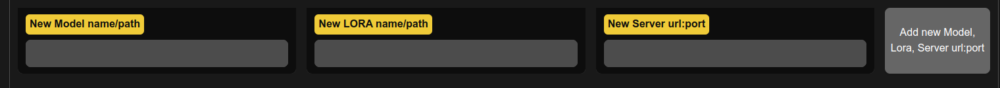
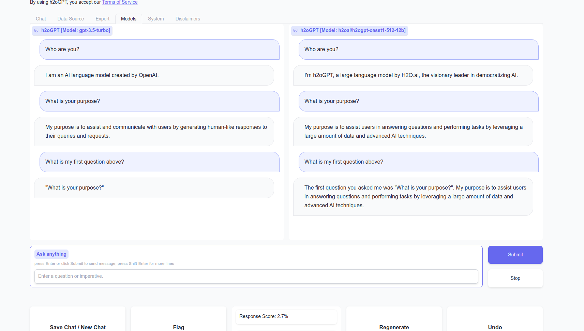
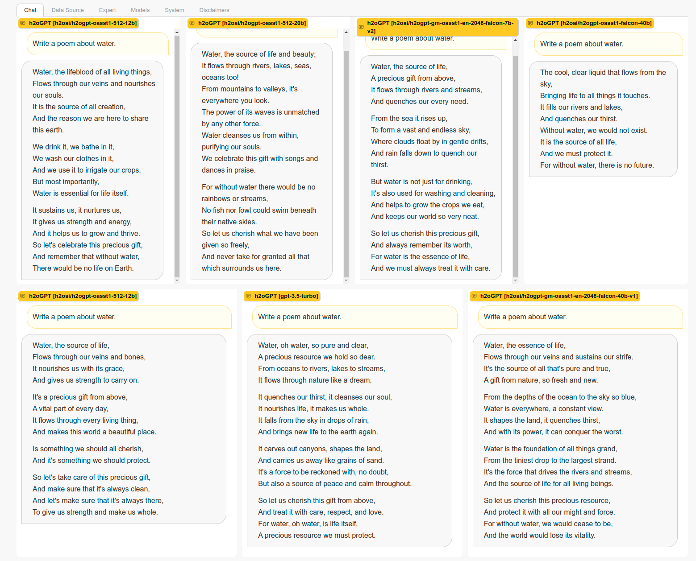

# Inference Servers

One can connect to Hugging Face text generation inference server, gradio servers running h2oGPT, OpenAI, or Azure OpenAI servers.  

## Hugging Face Text Generation Inference Server-Client

### Local Install

#### **Not Recommended**

This is just following the same [local-install](https://github.com/huggingface/text-generation-inference).
```bash
curl --proto '=https' --tlsv1.2 -sSf https://sh.rustup.rs | sh
source "$HOME/.cargo/env"
```

```bash
PROTOC_ZIP=protoc-21.12-linux-x86_64.zip
curl -OL https://github.com/protocolbuffers/protobuf/releases/download/v21.12/$PROTOC_ZIP
sudo unzip -o $PROTOC_ZIP -d /usr/local bin/protoc
sudo unzip -o $PROTOC_ZIP -d /usr/local 'include/*'
rm -f $PROTOC_ZIP
```

```bash
git clone https://github.com/huggingface/text-generation-inference.git
cd text-generation-inference
```

Needed to compile on Ubuntu:
```bash
sudo apt-get install libssl-dev gcc -y
```

Use `BUILD_EXTENSIONS=False` instead of have GPUs below A100.
```bash
conda create -n textgen -y
conda activate textgen
conda install python=3.10 -y
export CUDA_HOME=/usr/local/cuda-11.7
BUILD_EXTENSIONS=True make install # Install repository and HF/transformer fork with CUDA kernels
cd server && make install install-flash-attention
```

```bash
NCCL_SHM_DISABLE=1 CUDA_VISIBLE_DEVICES=0 text-generation-launcher --model-id h2oai/h2ogpt-oig-oasst1-512-6_9b --port 8080  --sharded false --trust-remote-code --max-stop-sequences=6
```

### Docker Install

#### **Recommended**

```bash
# https://docs.docker.com/engine/install/ubuntu/
sudo snap remove --purge docker
sudo apt-get update
sudo apt-get install ca-certificates curl gnupg
sudo install -m 0755 -d /etc/apt/keyrings
curl -fsSL https://download.docker.com/linux/ubuntu/gpg | sudo gpg --dearmor -o /etc/apt/keyrings/docker.gpg
sudo chmod a+r /etc/apt/keyrings/docker.gpg
echo   "deb [arch="$(dpkg --print-architecture)" signed-by=/etc/apt/keyrings/docker.gpg] https://download.docker.com/linux/ubuntu \
"$(. /etc/os-release && echo "$VERSION_CODENAME")" stable" |   sudo tee /etc/apt/sources.list.d/docker.list > /dev/null
sudo apt-get update
sudo apt-get install docker-ce docker-ce-cli containerd.io docker-buildx-plugin docker-compose-plugin
sudo apt-get install -y nvidia-container-toolkit
sudo docker run hello-world
# https://docs.docker.com/engine/install/linux-postinstall/
sudo groupadd docker
sudo usermod -aG docker $USER
newgrp docker
docker run hello-world

sudo nvidia-ctk runtime configure
sudo systemctl stop docker
sudo systemctl start docker
```

Reboot or run:
```bash
newgrp docker
```
in order to log in to this user.

Then for falcon 7b run on GPU 0:
```bash
docker run --gpus device=0 --shm-size 2g -p 6112:80 -v $HOME/.cache/huggingface/hub/:/data  ghcr.io/huggingface/text-generation-inference:latest --model-id h2oai/h2ogpt-gm-oasst1-en-2048-falcon-7b-v2 --max-input-length 2048 --max-total-tokens 4096 --sharded=false --disable-custom-kernels --trust-remote-code --max-stop-sequences=6
```
or Pythia 12b on all GPUs:
```bash
docker run --gpus all --shm-size 2g -p 6112:80 -v $HOME/.cache/huggingface/hub/:/data  ghcr.io/huggingface/text-generation-inference:latest --model-id h2oai/h2ogpt-oasst1-512-12b --max-input-length 2048 --max-total-tokens 4096 --sharded=true --num-shard=4 --disable-custom-kernels --trust-remote-code --max-stop-sequences=6
```
or for 20B NeoX on 4 GPUs:
```bash
docker run --gpus '"device=0,1,2,3"' --shm-size 2g -p 6112:80 -v $HOME/.cache/huggingface/hub/:/data  ghcr.io/huggingface/text-generation-inference:latest --model-id h2oai/h2ogpt-oasst1-512-20b --max-input-length 2048 --max-total-tokens 4096 --sharded=true --num-shard=4 --disable-custom-kernels --trust-remote-code --max-stop-sequences=6
```
or for Falcon 40B on 2 GPUs and some HF token `$HUGGING_FACE_HUB_TOKEN`:
```bash
sudo docker run --gpus '"device=0,1"' --shm-size 1g -e HUGGING_FACE_HUB_TOKEN=$HUGGING_FACE_HUB_TOKEN -p 6112:80 -v $HOME/.cache/huggingface/hub/:/data ghcr.io/huggingface/text-generation-inference:latest --model-id h2oai/h2ogpt-gm-oasst1-en-2048-falcon-40b-v2 --max-input-length 2048 --max-total-tokens 4096 --max-stop-sequences 6 --sharded true --num-shard 2
```
Or for MosaicML Chat 30b (careful with docker GPU and TGI version, and one can increase the token counts since has 8k input context):
```bash
docker run -d --gpus '"device=0,1"' --shm-size 2g -e HUGGING_FACE_HUB_TOKEN=$HUGGING_FACE_HUB_TOKEN -p 6112:80 -v $HOME/.cache/huggingface/hub/:/data ghcr.io/huggingface/text-generation-inference:0.9.1 --model-id mosaicml/mpt-30b-chat --max-batch-prefill-tokens=2048 --max-input-length 2048 --max-total-tokens 4096 --max-stop-sequences 6 --trust-remote-code
```
or for Falcon 40B instruct:
```bash
docker run -d --gpus '"device=0,1"' --shm-size 1g -e HUGGING_FACE_HUB_TOKEN=$HUGGING_FACE_HUB_TOKEN -p 6112:80 -v $HOME/.cache/huggingface/hub/:/data ghcr.io/huggingface/text-generation-inference:latest --model-id tiiuae/falcon-40b-instruct --max-input-length 2048 --max-total-tokens 4096 --max-stop-sequences 6 --sharded true --num-shard 2
```
or for Vicuna33b on 2 GPUs:
```bash
docker run -d --gpus '"device=0,1"' --shm-size 2g -p 6112:80 -v $HOME/.cache/huggingface/hub/:/data ghcr.io/huggingface/text-generation-inference:latest --model-id lmsys/vicuna-33b-v1.3 --max-input-length 2048 --max-total-tokens 4096 --sharded true --num-shard 2
```
or for LLaMa 70B on 4 A*100 GPUs (using about 40GB each GPU, but sometimes more):
```bash
export MODEL=meta-llama/Llama-2-70b-chat-hf
export GRADIO_SERVER_PORT=7860
docker run -d --gpus '"device=0,1,2,3"' --shm-size 1g -e HUGGING_FACE_HUB_TOKEN=$HUGGING_FACE_HUB_TOKEN -p 6112:80 -v $HOME/.cache/huggingface/hub/:/data ghcr.io/huggingface/text-generation-inference:0.9.3 --model-id $MODEL --max-input-length 4096 --max-total-tokens 8192 --max-stop-sequences 6 --sharded true --num-shard 4 &>> logs.infserver.txt
SAVE_DIR=./save.70b python generate.py --inference_server=http://127.0.0.1:6112 --base_model=$MODEL --height=500 --score_model=None --max_max_new_tokens=4096 --max_new_tokens=512 &>> logs.$MODEL_NAME.gradio_chat.txt
```
If one changes the port `6112` or `GRADIO_SERVER_PORT` for each docker/gradio run command, any number of inference servers with any models can be added.

On isolated system, one might want to script start-up, and start with a kill sequence like this if one is using ngrok to map a local system to some domain name:
```bash
pkill -f generate --signal 9
pkill -f gradio --signal 9
pkill -f ngrok --signal 9
pkill -f text-generation-server --signal 9
sudo killall -9 generate
sudo killall -9 ngrok
sudo killall -9 text-generation-server
docker kill $(docker ps -q)
```
then create a run script to launch all dockers or other gradio servers, sleep a bit, and then launch all generates to connect to any TGI or other servers.

### Testing

Python test:
```python
from text_generation import Client

client = Client("http://127.0.0.1:6112")
print(client.generate("What is Deep Learning?", max_new_tokens=17).generated_text)

text = ""
for response in client.generate_stream("What is Deep Learning?", max_new_tokens=17):
    if not response.token.special:
        text += response.token.text
print(text)
```

Curl Test:
```bash
curl 127.0.0.1:6112/generate     -X POST     -d '{"inputs":"<|prompt|>What is Deep Learning?<|endoftext|><|answer|>","parameters":{"max_new_tokens": 512, "truncate": 1024, "do_sample": true, "temperature": 0.1, "repetition_penalty": 1.2}}'     -H 'Content-Type: application/json' --user "user:bhx5xmu6UVX4"
```

### Integration with h2oGPT

For example, server at IP `192.168.1.46` on docker for 4 GPU system running 12B model sharded across all 4 GPUs:
```bash
docker run --gpus '"device=0,1,2,3"' --shm-size 2g -e -p 6112:80 -v $HOME/.cache/huggingface/hub/:/data  ghcr.io/huggingface/text-generation-inference:latest --model-id h2oai/h2ogpt-oasst1-512-12b --max-input-length 2048 --max-total-tokens 4096 --sharded=true --num-shard=4 --disable-custom-kernels --trust-remote-code --max-stop-sequences=6
```
then generate in h2oGPT environment:
```bash
SAVE_DIR=./save/ python generate.py --inference_server="http://192.168.1.46:6112" --base_model=h2oai/h2ogpt-oasst1-512-12b
```
One can pass, e.g., `--max_max_new_tokens=2048 --max_new_tokens=512` to generate.py to control tokens, along with `--max-batch-prefill-tokens=2048 --max-input-length 2048 --max-total-tokens 4096 --max-stop-sequences 6 --trust-remote-code` for TGI server to match.

For efficient parallel summarization with 13B LLaMa2 on single A100:
```bash
python --inference_server=http://192.168.1.46:6112 --base_model=h2oai/h2ogpt-4096-llama2-13b-chat --score_model=None --save_dir=save_gpt13 --max_max_new_tokens=2048 --max_new_tokens=1024 --langchain_mode=LLM --langchain_modes="['LLM', 'UserData', 'MyData']" --captions_model=Salesforce/blip2-flan-t5-xl --num_async=10 --top_k_docs=-1
```
which achieves about 80 output tokens/second, using 10 simultaneous streams and all document pages/parts.  In about 2 minutes, it can handle summarization of a complete 30 page ArXiV paper using LangChain map-reduce with asyncio bugs fixed: https://github.com/langchain-ai/langchain/issues/8391 .  In UI or API calls, one should disable streaming since the threading used by streaming does not mix well with asyncio. 

## Gradio Inference Server-Client

You can use your own server for some model supported by the server's system specs, e.g.:
```bash
SAVE_DIR=./save/ python generate.py --base_model=h2oai/h2ogpt-oasst1-512-12b
```

In any case, for your own server or some other server using h2oGPT gradio server, the client should specify the gradio endpoint as inference server.  E.g. if server is at `http://192.168.0.10:7680`, then
```bash
python generate.py --inference_server="http://192.168.0.10:7680" --base_model=h2oai/h2ogpt-oasst1-falcon-40b
```
One can also use gradio live link like `https://6a8d4035f1c8858731.gradio.live` or some ngrok or other mapping/redirect to `https://` address.
One must specify the model used at the endpoint so the prompt type is handled.  This assumes that base model is specified in `prompter.py::prompt_type_to_model_name`.  Otherwise, one should pass `--prompt_type` as well, like:
```bash
python generate.py --inference_server="http://192.168.0.10:7680" --base_model=foo_model --prompt_type=llama2
```
If even `prompt_type` is not listed in `enums.py::PromptType` then one can pass `--prompt_dict` like:
```bash
python generate.py --inference_server="http://192.168.0.10:7680" --base_model=foo_model --prompt_type=custom --prompt_dict="{'PreInput': None,'PreInstruct': '',    'PreResponse': '<bot>:',    'botstr': '<bot>:',    'chat_sep': '\n',    'humanstr': '<human>:',    'promptA': '<human>: ',    'promptB': '<human>: ',    'terminate_response': ['<human>:', '<bot>:']}"
```
which is just an example for the `human_bot` prompt type.

## OpenAI Proxy Inference Server-Client

Run with `--openai_server=True` (default) to run OpenAI Proxy Server to connect to h2oGPT server via openai python package.  E.g. the LLM can be on a remote inference server:
```bash
CUDA_VISIBLE_DEVICES=0 python generate.py --verbose=True --score_model=None --pre_load_embedding_model=False --gradio_offline_level=2 --base_model=openchat/openchat-3.5-1210 --inference_server=vllm:<ip>:<port> --max_seq_len=4096 --save_dir=duder1 --verbose --openai_server=True --concurrency_count=64
````
for some `<ip>` and `<port>`.  Or the model can be local torch/llama.cpp/GPT4All model (then set `--concurrency_count=1 to avoid multi-threading issues).

Then as client, h2oGPT currently supports `.chat.completions` and `.completions` for streaming and non-streaming, as well as `.models.retrieve()` and `.models.list()`.  See tests [test_openai_server.py](../openai_server/test_openai_server.py) for Python API examples.

Curl also works like one would do for OpenAI endpoint.

In both Python API and curl case, one should use a `base_url` the same as chosen for the API, e.g. `http://localhost:5000/v1`.

This mode is disabled when `--auth=closed` or `--allow_api=False`, because gradio 3 does not support API calls.

However, keyed access still works, e.g.
```bash
python generate.py --score_model=None --base_model=openchat/openchat-3.5-1210 --h2ogpt_api_keys=h2ogpt_api_keys.json --auth_filename=auth.json --enforce_h2ogpt_api_key=True --enforce_h2ogpt_ui_key=True --add_disk_models_to_ui=False
```
and OpenAI server can still communicate via Gradio API to Gradio server via the first key.  In addition, the OpenAI server will be keyed with the same key unless otherwise set using env `H2OGPT_OPENAI_API_KEY`, in which case the OpenAI key and h2oGPT key can be different.

For completeness, an example is as follows for non-streaming chat case is as follows:
```python
import os
from openai import OpenAI
base_url = 'http://<IP>:5000/v1'
client_args = dict(base_url=base_url, api_key='<API_KEY>')
openai_client = OpenAI(**client_args)

messages = [{'role': 'user', 'content': 'Who are you?'}]
client_kwargs = dict(model='h2oai/h2ogpt-4096-llama2-70b-chat', max_tokens=200, stream=False, messages=messages)
client = openai_client.chat.completions

responses = client.create(**client_kwargs)
text = responses.choices[0].message.content
print(text)
```
for some IP `<IP>`, which could be the local IP and some key `<API_KEY>`. If OpenAI server was run from h2oGPT using `--openai_server=True` (default), then `api_key` is from ENV `H2OGPT_OPENAI_API_KEY` on same host as Gradio server OpenAI.  If ENV `H2OGPT_OPENAI_API_KEY` is not defined, then h2oGPT will use the first key in the `h2ogpt_api_keys` (file or CLI list) as the OpenAI API key.  If no key is at all set, the OpenAI server is "open" with key `EMPTY` as long as `--allow_api=True`.  If h2oGPT was started with `--model_lock` with multiple inference servers, use `model` to choose which model to select, like done with `--visible_models` from h2oGPT CLI.

## OpenAI Inference Server-Client

If you have an OpenAI key and set an ENV `OPENAI_API_KEY`, then you can access OpenAI models via gradio by running:
```bash
OPENAI_API_KEY=<key> python generate.py --inference_server="openai_chat" --base_model=gpt-3.5-turbo --h2ocolors=False --langchain_mode=UserData
```
where `<key>` should be replaced by your OpenAI key that probably starts with `sk-`.  OpenAI is **not** recommended for private document question-answer, but it can be a good reference for testing purposes or when privacy is not required.

## Azure OpenAI Inference Server-Client

If you have an Azure OpenAI subscription with OpenAI key and set an ENV `OPENAI_API_KEY`, then you can access Azure OpenAI models via gradio by running:
```bash
OPENAI_API_KEY=<key> python generate.py --inference_server="openai_azure_chat:<deployment_name>:<base_url>:<api_version>" --base_model=gpt-3.5-turbo --h2ocolors=False --langchain_mode=UserData
```
where `<key>` should be replaced by your OpenAI key that probably starts with `sk-`.  OpenAI is **not** recommended for private document question-answer, but it can be a good reference for testing purposes or when privacy is not required.  The entry `<deployment_name>` is required for Azure, others are optional and can be filled with None or have empty input between `:`.

## vLLM Inference Server-Client

Create separate environment
```bash
conda create -n vllm -y
conda activate vllm
conda install python=3.10 -y
```
Assuming torch was installed with CUDA 12.1, and you have installed cuda locally in `/usr/local/cuda-12.1`:
```bash
export CUDA_HOME=/usr/local/cuda-12.1
export PIP_EXTRA_INDEX_URL="https://download.pytorch.org/whl/cu123"
pip install mosaicml-turbo megablocks==0.5.1 --upgrade  # see docker_build_script_ubuntu.sh for x86 prebuilt wheel on s3
pip install fschat==0.2.34 ray pandas gputil==1.4.0 uvicorn[standard]
# optional:
pip install flash-attn==2.4.2
# optional:
pip install autoawq==0.1.8
# CHOOSE VLLM:
# for latest vllm:
# pip install git+https://github.com/vllm-project/vllm.git
# for h2oai vllm with reversion of memory changes on 0.3.0:
pip install git+https://github.com/h2oai/vllm.git@v0.3.0h2oai  # see docker_build_script_ubuntu.sh for x86 prebuilt wheel on s3
# standard 0.3.0:
# pip install vllm==0.3.0
```
Then can start in OpenAI compliant mode, e.g. for LLaMa 65B on 2*A100 GPUs:
```
export NCCL_IGNORE_DISABLED_P2P=1
export CUDA_VISIBLE_DEVICESs=0,1
python -m vllm.entrypoints.openai.api_server --port=5000 --host=0.0.0.0 --model h2oai/h2ogpt-research-oasst1-llama-65b --tokenizer=hf-internal-testing/llama-tokenizer --tensor-parallel-size=2 --seed 1234 --max-num-batched-tokens=2048
```
or for LLaMa-2 70b on 4 GPUs:
```bash
export NCCL_IGNORE_DISABLED_P2P=1
export CUDA_VISIBLE_DEVICESs=0,1,2,3
python -m vllm.entrypoints.openai.api_server --port=5000 --host=0.0.0.0 --model h2oai/h2ogpt-4096-llama2-70b-chat --tokenizer=hf-internal-testing/llama-tokenizer --tensor-parallel-size=4 --seed 1234 --max-num-batched-tokens=8192
```

For Mixtral 8*7B need newer cuda 12 toolkit and vllm build, then run:
```bash
export CUDA_VISIBLE_DEVICES=0,1
python -m vllm.entrypoints.openai.api_server --port=5002 --host=0.0.0.0 --model mistralai/Mixtral-8x7B-Instruct-v0.1 --seed 1234 --max-num-batched-tokens=65536 --tensor-parallel-size=2
```
Once vLLM etc. have Mixtral support built-in, these special package installs may not be required.  It appears Mixtral does not run on single 80GB board in FP16 with default max sequence length.  CUDA 11.8 is also allowed, 12.x just has minor improvements.

The startup may take few minutes until Uvicorn starts entirely so endpoint is fully ready, when one sees:
```text
INFO 07-15 02:56:41 llm_engine.py:131] # GPU blocks: 496, # CPU blocks: 204
INFO 07-15 02:56:43 tokenizer.py:28] For some LLaMA-based models, initializing the fast tokenizer may take a long time. To eliminate the initialization time, consider using 'hf-internal-testing/llama-tokenizer' instead of the original tokenizer.
INFO:     Started server process [2442339]
INFO:     Waiting for application startup.
INFO:     Application startup complete.
INFO:     Uvicorn running on http://0.0.0.0:5000 (Press CTRL+C to quit)
```
Open port if want to allow access outside the server:
```bash
sudo ufw allow 5000
```

To run in interactive mode, if don't have P2P (check `nvidia-smi topo -m`) then set this env:
```bash
export NCCL_IGNORE_DISABLED_P2P=1
```
Then in python
```python
from vllm import LLM
llm = LLM(model='h2oai/h2ogpt-research-oasst1-llama-65b', tokenizer='hf-internal-testing/llama-tokenizer', tensor_parallel_size=2)
output = llm.generate("San Franciso is a")
```
See [vLLM docs](https://vllm.readthedocs.io/en/latest/getting_started/quickstart.html).
```text
(h2ollm) ubuntu@cloudvm:~/h2ogpt$ python -m vllm.entrypoints.openai.api_server --help
usage: api_server.py [-h] [--host HOST] [--port PORT] [--allow-credentials] [--allowed-origins ALLOWED_ORIGINS] [--allowed-methods ALLOWED_METHODS] [--allowed-headers ALLOWED_HEADERS] [--served-model-name SERVED_MODEL_NAME] [--model MODEL]
                     [--tokenizer TOKENIZER] [--revision REVISION] [--tokenizer-mode {auto,slow}] [--trust-remote-code] [--download-dir DOWNLOAD_DIR] [--load-format {auto,pt,safetensors,npcache,dummy}]
                     [--dtype {auto,half,float16,bfloat16,float,float32}] [--max-model-len MAX_MODEL_LEN] [--worker-use-ray] [--pipeline-parallel-size PIPELINE_PARALLEL_SIZE] [--tensor-parallel-size TENSOR_PARALLEL_SIZE] [--block-size {8,16,32}]
                     [--seed SEED] [--swap-space SWAP_SPACE] [--gpu-memory-utilization GPU_MEMORY_UTILIZATION] [--max-num-batched-tokens MAX_NUM_BATCHED_TOKENS] [--max-num-seqs MAX_NUM_SEQS] [--disable-log-stats] [--quantization {awq,None}]
                     [--engine-use-ray] [--disable-log-requests] [--max-log-len MAX_LOG_LEN]

vLLM OpenAI-Compatible RESTful API server.

options:
  -h, --help            show this help message and exit
  --host HOST           host name
  --port PORT           port number
  --allow-credentials   allow credentials
  --allowed-origins ALLOWED_ORIGINS
                        allowed origins
  --allowed-methods ALLOWED_METHODS
                        allowed methods
  --allowed-headers ALLOWED_HEADERS
                        allowed headers
  --served-model-name SERVED_MODEL_NAME
                        The model name used in the API. If not specified, the model name will be the same as the huggingface name.
  --model MODEL         name or path of the huggingface model to use
  --tokenizer TOKENIZER
                        name or path of the huggingface tokenizer to use
  --revision REVISION   the specific model version to use. It can be a branch name, a tag name, or a commit id. If unspecified, will use the default version.
  --tokenizer-mode {auto,slow}
                        tokenizer mode. "auto" will use the fast tokenizer if available, and "slow" will always use the slow tokenizer.
  --trust-remote-code   trust remote code from huggingface
  --download-dir DOWNLOAD_DIR
                        directory to download and load the weights, default to the default cache dir of huggingface
  --load-format {auto,pt,safetensors,npcache,dummy}
                        The format of the model weights to load. "auto" will try to load the weights in the safetensors format and fall back to the pytorch bin format if safetensors format is not available. "pt" will load the weights in the pytorch
                        bin format. "safetensors" will load the weights in the safetensors format. "npcache" will load the weights in pytorch format and store a numpy cache to speed up the loading. "dummy" will initialize the weights with random
                        values, which is mainly for profiling.
  --dtype {auto,half,float16,bfloat16,float,float32}
                        data type for model weights and activations. The "auto" option will use FP16 precision for FP32 and FP16 models, and BF16 precision for BF16 models.
  --max-model-len MAX_MODEL_LEN
                        model context length. If unspecified, will be automatically derived from the model.
  --worker-use-ray      use Ray for distributed serving, will be automatically set when using more than 1 GPU
  --pipeline-parallel-size PIPELINE_PARALLEL_SIZE, -pp PIPELINE_PARALLEL_SIZE
                        number of pipeline stages
  --tensor-parallel-size TENSOR_PARALLEL_SIZE, -tp TENSOR_PARALLEL_SIZE
                        number of tensor parallel replicas
  --block-size {8,16,32}
                        token block size
  --seed SEED           random seed
  --swap-space SWAP_SPACE
                        CPU swap space size (GiB) per GPU
  --gpu-memory-utilization GPU_MEMORY_UTILIZATION
                        the percentage of GPU memory to be used forthe model executor
  --max-num-batched-tokens MAX_NUM_BATCHED_TOKENS
                        maximum number of batched tokens per iteration
  --max-num-seqs MAX_NUM_SEQS
                        maximum number of sequences per iteration
  --disable-log-stats   disable logging statistics
  --quantization {awq,None}, -q {awq,None}
                        Method used to quantize the weights
  --engine-use-ray      use Ray to start the LLM engine in a separate process as the server process.
  --disable-log-requests
                        disable logging requests
  --max-log-len MAX_LOG_LEN
                        max number of prompt characters or prompt ID numbers being printed in log. Default: unlimited.
```

CURL test:
```bash
curl http://localhost:5000/v1/completions \
-H "Content-Type: application/json" \
-d '{
"model": "h2oai/h2ogpt-research-oasst1-llama-65b",
"prompt": "San Francisco is a",
"max_tokens": 7,
"temperature": 0
}'
```

If started OpenAI-compliant server, then run h2oGPT:
```bash
python generate.py --inference_server="vllm:0.0.0.0:5000" --base_model=h2oai/h2ogpt-oasst1-falcon-40b --langchain_mode=UserData
```
Note: `vllm_chat` ChatCompletion is not supported by vLLM project.  If add `https://` or `http://` as prefix to IP address for vLLM, then also need to add rest of full address with `/v1` at end

Note vLLM has bug in stopping sequence that is does not return the last token, unlike OpenAI, so a hack is in place for `prompt_type=human_bot`, and other prompts may need similar hacks.  See `fix_text()` in `src/prompter.py`.

## Replicate Inference Server-Client

If you have a Replicate key and set an ENV `REPLICATE_API_TOKEN`, then you can access Replicate models via gradio by running:
```bash
pip install replicate
export REPLICATE_API_TOKEN=<key>
python generate.py --inference_server="replicate:<replicate model string>" --base_model="<HF model name>"
```
where `<key>` should be replaced by your Replicate key, `<replicate model string>` should be replaced by the model name, e.g. `model="a16z-infra/llama13b-v2-chat:df7690f1994d94e96ad9d568eac121aecf50684a0b0963b25a41cc40061269e5`.  Here we used an example for [LLaMa-V2](https://replicate.com/a16z-infra/llama13b-v2-chat), and `<HF model name>` should be replaced by equivalent HuggingFace Model Name (if this is not known or cannot match, then choose whichever HF model has most similar tokenizer.).  The `prompt_type` in h2oGPT is unused except for system prompting if chosen.

For example, for LLaMa-2 7B:
```bash
python generate.py --inference_server="replicate:lucataco/llama-2-7b-chat:6ab580ab4eef2c2b440f2441ec0fc0ace5470edaf2cbea50b8550aec0b3fbd38" --base_model="TheBloke/Llama-2-7b-Chat-GPTQ"
```

Replicate is **not** recommended for private document question-answer, but sufficient when full privacy is not required.  Only chunks of documents will be sent to the LLM for each LLM response.

Issues:
* `requests.exceptions.JSONDecodeError: Expecting value: line 1 column 1 (char 0)`
* Sometimes Replicate sends back bad json, seems randomly occurs.


## AWS SageMaker Endpoint

h2oGPT code is based upon [LangChain Code](https://python.langchain.com/docs/integrations/llms/sagemaker) but with various fixes, handling of access keys, and handling for LLama-2 Chat type model.  See also https://boto3.amazonaws.com/v1/documentation/api/latest/guide/credentials.html .

This presumes one has set up an [AWS SageMaker endpoint](aws_sagemaker_endpoint_setup.pdf) (from [here](https://medium.com/@mudassir.aqeel24/deploy-llama2-7b-on-aws-easiest-method-f76d71a51684)) and that you are able to view events in the AWS console to confirm things are working or debug if not.

Streaming is not yet supported in LangChain version of SageMaker, see [Streaming Docs](https://aws.amazon.com/blogs/machine-learning/elevating-the-generative-ai-experience-introducing-streaming-support-in-amazon-sagemaker-hosting/).

To use AWS SageMaker Chat endpoint, e.g. with LLaMa-2 Chat, pass to h2oGPT `--inference_server=sagemaker_chat:<endpointname>:<region>` for `<endpointname>` of the endpoint's name and `<region>` the region (e.g. `us-east-2`), e.g.
```bash
export AWS_ACCESS_KEY_ID=<...>
export AWS_SECRET_ACCESS_KEY=<...>
python generate.py --inference_server=sagemaker_chat:<endpointname>:<region> --base_model=h2oai/h2ogpt-4096-llama2-7b-chat
```

## h2oGPT start-up vs. in-app selection

When using `generate.py`, specifying the `--base_model` or `--inference_server` on the CLI is not required.  One can also add any model and server URL (with optional port) in the **Model** tab at the bottom:



Enter the mode name as the same name one would use for `--base_model` and enter the server url:port as the same url (optional port) one would use for `--inference_server`.  Then click `Add new Model, Lora, Server url:port` button.  This adds that to the drop-down selection, and then one can load the model by clicking "Load-Unload" model button.  For an inference server, the `Load 8-bit`, `Choose Devices`, `LORA`, and `GPU ID` buttons or selections are not applicable.

One can also do model comparison by clicking the `Compare Mode` checkbox, and add new models and servers to each left and right models for a view like:



## Locking Models for easy start-up or in-app comparison

To avoid specifying model-related settings as independent options, and to disable loading new models, use `--model_lock` like:
```bash
python generate.py --model_lock=[{'inference_server':'http://192.168.1.46:6112','base_model':'h2oai/h2ogpt-oasst1-512-12b'}]
```
where for this case the prompt_type for this base_model is in prompter.py, so it doesn't need to be specified.  Note that no spaces or other white space is allowed within the double quotes for model_lock due to how CLI arguments are parsed.
For two endpoints, one uses (again with no spaces in arg)
```bash
python generate.py --model_lock=[{'inference_server':'http://192.168.1.46:6112','base_model':'h2oai/h2ogpt-oasst1-512-12b'},{'inference_server':'http://192.168.1.46:6114','base_model':'h2oai/h2ogpt-oasst1-512-20b'},{'inference_server':'http://192.168.1.46:6113','base_model':'h2oai/h2ogpt-gm-oasst1-en-2048-falcon-7b-v2'}]
```

One can have a mix of local models, HF text-generation inference servers, Gradio generation servers, and OpenAI servers, e.g.:
```bash
python generate.py --model_lock=[{'inference_server':'http://192.168.1.46:6112','base_model':'h2oai/h2ogpt-oasst1-512-12b'},{'inference_server':'http://192.168.1.46:6114','base_model':'h2oai/h2ogpt-oasst1-512-20b'},{'inference_server':'http://192.168.1.46:6113','base_model':'h2oai/h2ogpt-gm-oasst1-en-2048-falcon-7b-v2'},{'inference_server':'http://192.168.0.1:6000','base_model':'TheBloke/Wizard-Vicuna-13B-Uncensored-HF','prompt_type':'instruct_vicuna'},{'inference_server':'http://192.168.0.245:6000','base_model':'h2oai/h2ogpt-oasst1-falcon-40b'},{'inference_server':'http://192.168.1.46:7860','base_model':'h2oai/h2ogpt-oasst1-512-12b'},{'inference_server':'http://192.168.0.1:7000','base_model':'h2oai/h2ogpt-research-oasst1-llama-65b','prompt_type':'human_bot'},{'inference_server':'openai_chat','base_model':'gpt-3.5-turbo'}] --model_lock_columns=4
```
where the lock columns of 4 makes a grid of chatbots with 4 columns.

If you run in bash and need to use an authentication for the Hugging Face text generation inference server, then that can be passed:
```text
{'inference_server':'https://server.h2o.ai    USER    AUTH','base_model':'h2oai/h2ogpt-gm-oasst1-en-2048-falcon-7b-v2'}
```
i.e. 4 spaces between each IP, USER, and AUTH.  USER should be the user and AUTH be the token.

When bringing up `generate.py` with any inference server, one can set `REQUEST_TIMEOUT` ENV to smaller value than default of 60 seconds to get server up faster if one has many inaccessible endpoints you don't mind skipping.  E.g. set `REQUEST_TIMEOUT=5`.  One can also choose the timeout overall for each chat turn using env `REQUEST_TIMEOUT_FAST` that defaults to 10 seconds.

Note: The client API calls for chat APIs (i.e. `instruction` type for `instruction`, `instruction_bot`, `instruction_bot_score`, and similar for `submit` and `retry` types) require managing all chat sessions via API.  However, the `nochat` APIs only use the first model in the list of chats or model_lock list.



To run a gradio server and talk to it and OpenAI from another generate gradio UI, do:
```bash
GRADIO_SERVER_PORT=5000 python generate.py --base_model=h2oai/h2ogpt-gm-oasst1-en-2048-open-llama-13b &
sleep 60
python generate.py --model_lock="[{'inference_server':'http://192.168.1.xx:5000','base_model':'h2oai/h2ogpt-gm-oasst1-en-2048-open-llama-13b'},{'inference_server':'openai_chat','base_model':'gpt-3.5-turbo'}]" --model_lock_columns=2
```
where be sure to replace `192.168.1.xx` with your IP address.  Note the ampersand so the first call is in background.  The sleep gives time for the first one to come up.  The above is as if ran on single system, but you can run on any other system separate generates of any number.

### Visible Models

At startup, models can be selected as visible out of all those in the model lock, e.g.:
```
export vis="['h2oai/h2ogpt-4096-llama2-70b-chat','h2oai/h2ogpt-4096-llama2-13b-chat','HuggingFaceH4/zephyr-7b-alpha','gpt-3.5-turbo-0613']"
python generate.py --save_dir=saveall_gpt --model_lock="$MODEL_LOCK" --model_lock_columns=3 --auth_filename=all_auth.json --gradio_size=small --height=400 --score_model=None --max_max_new_tokens=2048 --max_new_tokens=1024 --visible_models="$vis" &>> logs.all.gradio_chat.txt &
```

### System info from gradio server

```python
import json
from gradio_client import Client
ADMIN_PASS = ''
HOST = "http://localhost:7860"
client = Client(HOST)
api_name = '/system_info_dict'
res = client.predict(ADMIN_PASS, api_name=api_name)
res = json.loads(res)
print(res)
# e.g.
print(res['base_model'])
print(res['hash'])
```
where one should set `ADMIN_PASS` to pass set for that instance and change `HOST` to the desired host.
