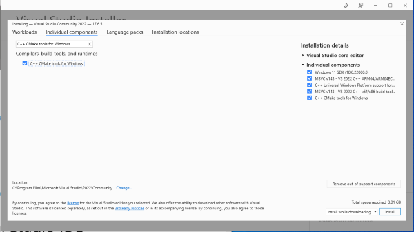
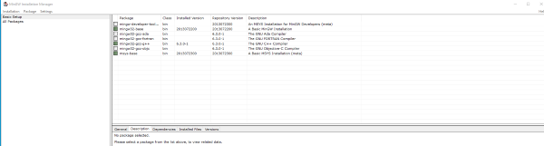
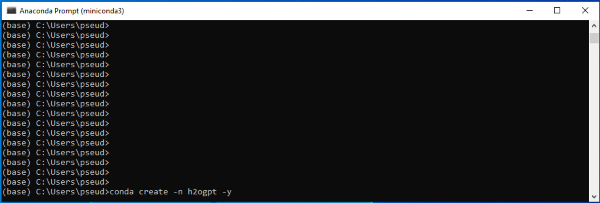
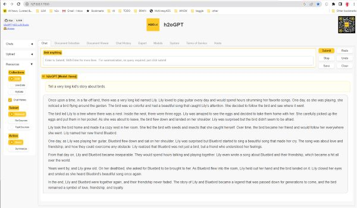

# Windows 10/11

For newer builds of windows versions of 10/11.

## Installation
* Download Visual Studio 2022: [Download Link](https://visualstudio.microsoft.com/vs/community/)
  * Run Installer, click ok to run, click Continue
  * Click on `Individual Components`
  * Search for these in the search bar and click on them:
     * `Windows 11 SDK` (e.g. 10.0.22000.0)
     * `C++ Universal Windows Platform support` (e.g. for v143 build tools)
     * `MSVC VS 2022 C++ x64/x86 build tools` (latest)
     * `C++ CMake tools for Windows`
     * 
  * Click Install, and follow through installation, and do not need to launch VS 2022 at end.
* Download the MinGW installer: [MiniGW](https://sourceforge.net/projects/mingw/)
  * Run Installer, Click Install, Continue, Install/Run to launch installation manager.
  * Select packages to install:
     * minigw32-base
     * mingw32-gcc-g++
     * 
  * Go to installation tab, then apply changes.
* Download and install [Miniconda](https://docs.conda.io/projects/conda/en/latest/user-guide/install/windows.html)
* Run Miniconda shell (not powershell!) as Administrator
* Run: `set path=%path%;c:\MinGW\msys\1.0\bin\` to get C++ in path
* Download latest nvidia driver for windows if one has old drivers before CUDA 11.7 supported
* Confirm can run `nvidia-smi` and see driver version
* Setup Conda Environment:
    * 
   ```bash
    conda create -n h2ogpt -y
    conda activate h2ogpt
    conda install python=3.10 -c conda-forge -y
    python --version  # should say python 3.10.xx
    python -c "import os, sys ; print('hello world')"  # should print "hello world"
    ```
* GPU Only: Install CUDA
   ```bash
    conda install cudatoolkit=11.7 -c conda-forge -y
    set CUDA_HOME=$CONDA_PREFIX
    ```
* Install h2oGPT:
   ```bash
    git clone https://github.com/h2oai/h2ogpt.git
    cd h2ogpt
    ```
* Install primary dependencies.

  * For CPU Only:
      ```bash
      pip install -r requirements.txt --extra-index https://download.pytorch.org/whl/cpu
       ```
  * For GPU:
      ```bash
      pip install -r requirements.txt --extra-index-url https://download.pytorch.org/whl/cu117
       ```
    Optional: for bitsandbytes 4-bit and 8-bit:
       ```bash
       pip uninstall bitsandbytes -y
       pip install https://github.com/jllllll/bitsandbytes-windows-webui/releases/download/wheels/bitsandbytes-0.40.1.post1-py3-none-win_amd64.whl
       ```
* Install document question-answer dependencies:
    ```bash
    # Required for Doc Q/A: LangChain:
    pip install -r reqs_optional/requirements_optional_langchain.txt
    # Required for CPU: LLaMa/GPT4All:
    pip install -r reqs_optional/requirements_optional_gpt4all.txt
    # Optional: PyMuPDF/ArXiv:
    pip install -r reqs_optional/requirements_optional_langchain.gpllike.txt
    # Optional: Selenium/PlayWright:
    pip install -r reqs_optional/requirements_optional_langchain.urls.txt
    # Optional: for supporting unstructured package
    python -m nltk.downloader all
   ```
* GPU Only: For optional AutoGPTQ support:
   ```bash
    pip uninstall -y auto-gptq
    pip install https://github.com/PanQiWei/AutoGPTQ/releases/download/v0.3.0/auto_gptq-0.3.0+cu118-cp310-cp310-win_amd64.whl
* GPU Only: For optional exllama support:
   ```bash
    pip uninstall -y exllama
    pip install https://github.com/jllllll/exllama/releases/download/0.0.8/exllama-0.0.8+cu118-cp310-cp310-win_amd64.whl --no-cache-dir
    ```
* GPU Only: For optional llama-cpp-python CUDA support:
  ```bash
  pip uninstall -y llama-cpp-python
  set LLAMA_CUBLAS=1
  set CMAKE_ARGS=-DLLAMA_CUBLAS=on
  set FORCE_CMAKE=1
  pip install llama-cpp-python==0.1.68 --no-cache-dir --verbose
  ```
   and uncomment `# n_gpu_layers=20` in `.env_gpt4all`.  One can try also `40` instead of `20`.
   If one sees `/usr/bin/nvcc` mentioned in errors, that file needs to be removed as would likely conflict with version installed for conda.
   Note that once `llama-cpp-python` is compiled to support CUDA, it no longer works for CPU mode,
   so one would have to reinstall it without the above options to recovers CPU mode or have a separate h2oGPT env for CPU mode.
* For supporting Word and Excel documents, if you don't have Word/Excel already, then download and install libreoffice: https://www.libreoffice.org/download/download-libreoffice/ .
* To support OCR, download and install [tesseract](https://github.com/UB-Mannheim/tesseract/wiki), see also: [Tesseract Documentation](https://tesseract-ocr.github.io/tessdoc/Installation.html).  Please add the installation directories to your PATH.

---

## Run
* For document Q/A with UI using LLaMa.cpp-based model on CPU or GPU:

  * Click [Download Wizard Model](https://huggingface.co/TheBloke/WizardLM-7B-uncensored-GGML/resolve/main/WizardLM-7B-uncensored.ggmlv3.q8_0.bin) and place file in h2oGPT directory.
       ```bash
       python generate.py --base_model='llama' --prompt_type=wizard2 --score_model=None --langchain_mode='UserData' --user_path=user_path
       ```
      If llama-cpp-python was compiled with CUDA support, you should see in the output:
    ```text
    Starting get_model: llama
    ggml_init_cublas: found 2 CUDA devices:
      Device 0: NVIDIA GeForce RTX 3090 Ti
      Device 1: NVIDIA GeForce RTX 2080
    llama.cpp: loading model from WizardLM-7B-uncensored.ggmlv3.q8_0.bin
    llama_model_load_internal: format     = ggjt v3 (latest)
    llama_model_load_internal: n_vocab    = 32001
    llama_model_load_internal: n_ctx      = 1792
    llama_model_load_internal: n_embd     = 4096
    llama_model_load_internal: n_mult     = 256
    llama_model_load_internal: n_head     = 32
    llama_model_load_internal: n_layer    = 32
    llama_model_load_internal: n_rot      = 128
    llama_model_load_internal: ftype      = 7 (mostly Q8_0)
    llama_model_load_internal: n_ff       = 11008
    llama_model_load_internal: model size = 7B
    llama_model_load_internal: ggml ctx size =    0.08 MB
    llama_model_load_internal: using CUDA for GPU acceleration
    ggml_cuda_set_main_device: using device 0 (NVIDIA GeForce RTX 3090 Ti) as main device
    llama_model_load_internal: mem required  = 4518.85 MB (+ 1026.00 MB per state)
    llama_model_load_internal: allocating batch_size x (512 kB + n_ctx x 128 B) = 368 MB VRAM for the scratch buffer
    llama_model_load_internal: offloading 20 repeating layers to GPU
    llama_model_load_internal: offloaded 20/35 layers to GPU
    llama_model_load_internal: total VRAM used: 4470 MB
    llama_new_context_with_model: kv self size  =  896.00 MB
    AVX = 1 | AVX2 = 1 | AVX512 = 0 | AVX512_VBMI = 0 | AVX512_VNNI = 0 | FMA = 1 | NEON = 0 | ARM_FMA = 0 | F16C = 1 | FP16_VA = 0 | WASM_SIMD = 0 | BLAS = 1 | SSE3 = 1 | VSX = 0 |
    Model {'base_model': 'llama', 'tokenizer_base_model': '', 'lora_weights': '', 'inference_server': '', 'prompt_type': 'wizard2', 'prompt_dict': {'promptA': 'Below is an instruction that describes a task. Write a response that appropriately completes the request.', 'promptB': 'Below is an instruction that describes a task. Write a response that appropriately completes the request.', 'PreInstruct': '\n### Instruction:\n', 'PreInput': None, 'PreResponse': '\n### Response:\n', 'terminate_response': ['\n### Response:\n'], 'chat_sep': '\n', 'chat_turn_sep': '\n', 'humanstr': '\n### Instruction:\n', 'botstr': '\n### Response:\n', 'generates_leading_space': False}}
    Running on local URL:  http://0.0.0.0:7860
  
    To create a public link, set `share=True` in `launch()`.
    ```
  * Go to `http://127.0.0.1:7860` (ignore message above).  Add `--share=True` to get sharable secure link.
  * To just chat with LLM, click `Resources` and click `LLM` in Collections, or start without `--langchain_mode=UserData`.
  * In `nvidia-smi` or some other GPU monitor program you should see `python.exe` using GPUs in `C` (Compute) mode and using GPU resources.
  * If you have multiple GPUs, best to specify to use the fasted GPU by doing (e.g. if device 0 is fastest and largest memory GPU):
    ```bash
    set CUDA_VISIBLE_DEVICES=0
    ```
  * On an i9 with 3090Ti, one gets about 5 tokens/second.

  * 

  * For LLaMa2 70B model, add to `.env_gpt4all`:
    ```.env_gpt4all
    n_gqa=8
    ```
    See [LLaMa.cpp Instructions](https://pypi.org/project/llama-cpp-python/) for more details.
* To use Hugging Face type models (faster on GPU than LLaMa.cpp if one has a powerful GPU with enough memory):
   ```bash
   python generate.py --base_model=h2oai/h2ogpt-gm-oasst1-en-2048-falcon-7b-v3 --langchain_mode=UserData --score_model=None
   ```
  * On an i9 with 3090Ti, one gets about 9 tokens/second.
* To use Hugging Face type models in 8-bit do:
   ```bash
   python generate.py --base_model=h2oai/h2ogpt-gm-oasst1-en-2048-falcon-7b-v3 --langchain_mode=UserData --score_model=None --load_8bit=True
   ```
  When running windows on GPUs with bitsandbytes in 8-bit you should see something like the below in output:
  ```bash
  bin C:\Users\pseud\.conda\envs\h2ogpt\lib\site-packages\bitsandbytes\libbitsandbytes_cuda117.dll
  ```
  * On an i9 with 3090Ti, one gets about 5 tokens/second, so about half 16-bit speed.
  * You can confirm GPU use via `nvidia-smi` showing GPU memory consumed is less than 16-bit, at about 9.2GB when in use.  Also try 13B models in 8-bit for similar memory usage.
  * Note 8-bit inference is about twice slower than 16-bit inference, and the only use of 8-bit is to keep memory profile low.
  * Bitsandbytes can be uninstalled (`pip uninstall bitsandbytes`) and still h2oGPT can be used if one does not pass `--load_8bit=True`.
* To use Hugging Face type models in 4-bit do:
   ```bash
   python generate.py --base_model=h2oai/h2ogpt-gm-oasst1-en-2048-falcon-7b-v3 --langchain_mode=UserData --score_model=None --load_4bit=True
   ```
  * On an i9 with 3090Ti, one gets about 4 tokens/second, so still about half 16-bit speed.  Memory use is about 6.6GB.

See [CPU](README_CPU.md) and [GPU](README_GPU.md) for some other general aspects about using h2oGPT on CPU or GPU, such as which models to try, quantization, etc.

## Issues
* SSL Certification failure when connecting to Hugging Face.
  * Your org may be blocking HF
  * Try: https://stackoverflow.com/a/75111104
  * Or try: https://github.com/huggingface/transformers/issues/17611#issuecomment-1619582900
  * Try using proxy.