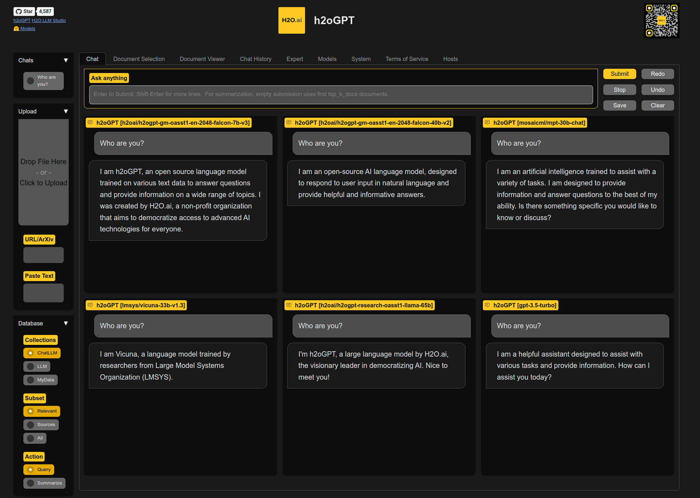
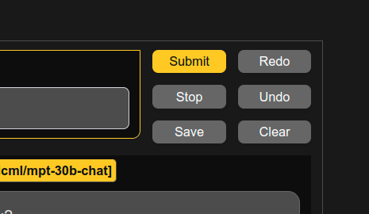
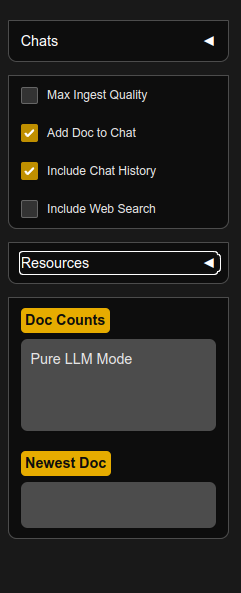
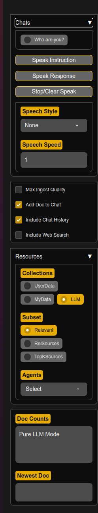
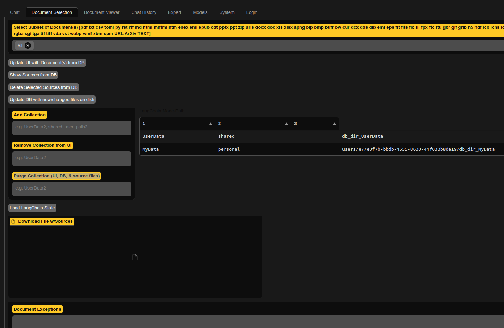
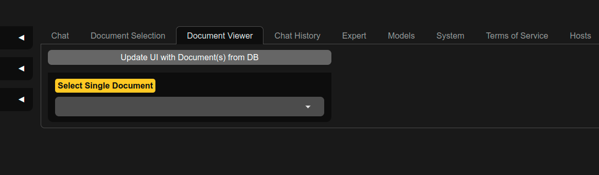
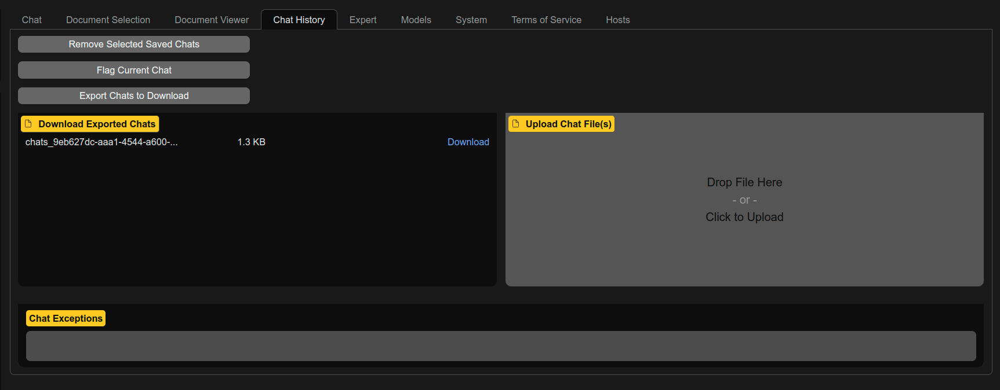
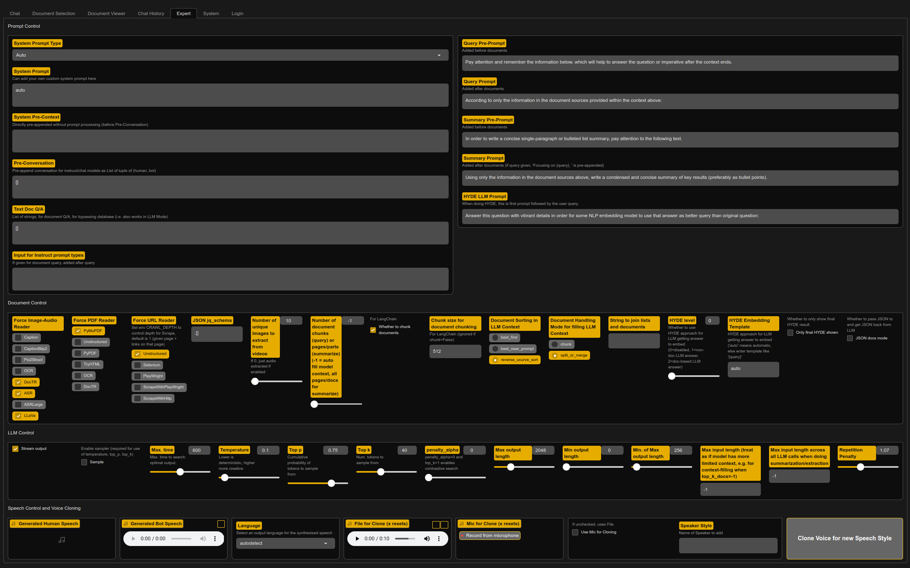
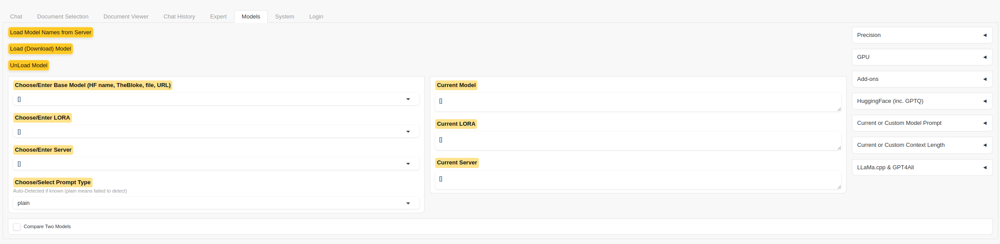
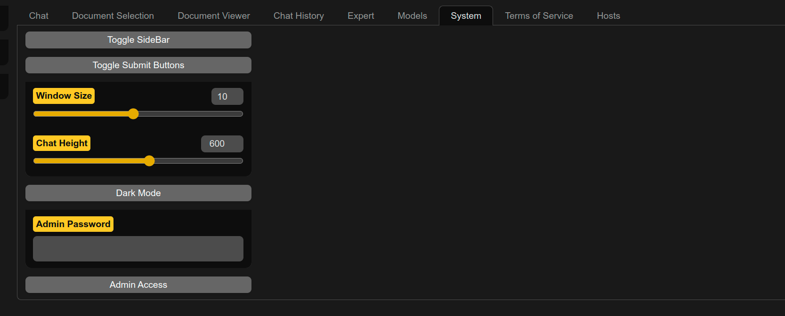

# Explain things in UI

`generate.py` by default runs a gradio server with a UI.  Key benefits of the UI include:
* Save, export, import chat histories and undo or regenerate last query-response pair
* Upload and control documents of various kinds for document Q/A
* Choose which specific collection to query, or just chat with LLM
* Choose specific documents out of collection for asking questions
* Multi-model or side-by-side 2-model comparison view
* RLHF response score evaluation for every query-response

We disable background uploads by disabling telemetry for Hugging Face, gradio, and chroma, and one can additionally avoid downloads (of fonts) by running `generate.py` with `--gradio_offline_level=2`.  See [Offline Documentation](offline.md) for details.

All the buttons are also accessible via gradio client API.

## Chat control buttons

| Button | Purpose                                                                                                                       |
|--------|-------------------------------------------------------------------------------------------------------------------------------|
| Submit | Same as hitting enter (in chat mode) so submit question or imperitive                                                         |
| Stop   | Stop generation, although LLM may continue in background until completed even if chat view stopped                            |
| Save   | Save the chat into left-panel Chats                                                                                           |
| Redo   | Re-run the query with (potentially) new settings or re-sample if sampling is enabled.  Turn on sampling if want new sampling. |
| Undo   | Remove last query-reponse pair                                                                                                |
| Clear  | Clear the chat                                                                                                                |

## Left Accordions

| Accordion           | Purpose                                                                                      |
|---------------------|----------------------------------------------------------------------------------------------|
| Chats               | Saved chats, placed here after clicking "Save" button                                        |
| Upload              | Drag-Drop or select to upload document(s), enter/paste URL or ArXiv, enter/paste raw text    |
| Database Collection | Control Collection uploading to and query                                                    |
| Database Subset     | Control if query uses "Relevant" documents or relevant sources, or All sources in collection |

### Data Collection of Sources
Collections (defaults to value set by `--langchain_mode=` and visible items set by `--visible_langchain_modes`):
* LLM: Single query-response, no chat context or docs used
* UserData: Shared and persistent. Writable if `--allow_upload_to_user_data=True`. Rebuilt from path `--user_path` if set.
* MyData: Private and non-persistent.  Writable if `--allow_upload_to_my_data=True`
* ... Other collections can be added via code, but not currently addable from UI

* Chat History Checkbox: If selected, h2oGPT passes the chat history to the LLM (for LLM and document collections) 

Choose a collection, and uploaded docs go there.  Or choose a collection to query it.  To ignore any docs, select "LLM".  If you add document to, e.g., MyData, if you want to query that document, ensure to select collection MyData before submitting the query.

### Document Subset:
* Relevant: Choose to include all docs in chosen collection when chatting
* RelSources: Ignore the LLM, just return sources the vector database similarity search (i.e. relevant Sources)
* TopKSources: Ignore LLM and similarity search, just show top_k_docs sources from selected (or all) documents (i.e. top_k_docs Sources)

The most normal task is keep it on `Relevant` and just make a query, which will query all documents in the chosen collection.

### Document Action:
* Query: Ask LLM to answer a question (given documents as context if using collection)
* Summarize: Ask LLM to summarize document(s) using top_k_docs

## Document Selection Tab

| Dropdown or Button or panel or text box | Purpose                                                          |
|-----------------------------------------|------------------------------------------------------------------|
| Select Subset of Document(s)            | Select documents to consider for query or summarization actions  |
| Update UI with Document(s) from DB      | Update the drop-down in                                          |
| Show Sources from DB                    | Show HTML links of sources in right panel                        |
| Download File w/Sources                 | Download list of sources after clicking on "Update UI..." button |
| Document Exceptions                     | Location where document ingestion failurse are located           |

A normal task is to subset on just 1-2 documents, and make a query on those.

## Document Viewer Tab

| Dropdown or Button or panel or text box | Purpose                                                 |
|-----------------------------------------|---------------------------------------------------------|
| Update UI with Document(s) from DB      | Update the drop-down list of viewable documents from DB |
| Select Single Document                  | Select document to view                                 |

## Chat History Tab

| Button                      | Purpose                                                                                     |
|-----------------------------|---------------------------------------------------------------------------------------------|
| Remove Selected Saved Chats | Remove the currently-selected Chat item in history in left panel                            |
| Flag Current Chat           | Tell owner of app (you if you ran locally) something is odd by logging chat history to disk |
| Export Chats to Download    | Export chats as file for downloading in Download Exported Chats box                         |
| Download Exported Chats     | Once click export, then can download here                                                   |
| Upload Chat File(s)         | Drag-drop or click to upload previously-exported chats                                      |
| Chat Exceptions             | Any exceptions during chatting go here, due to gradio bug that does not handle them well    |

If one selects nothing, the default of `All_Relevant` is chosen.  Can choose any command with any number of user documents to chat with.

E.g. one can click `Update UI with Document(s) from DB` to ensure subset list is up to date, choose `All`, pick a single PDF, click submit, and one will get back `top_k_docs` first entries in collection for that PDF.

## Expert Tab

Control various LLM and document Q/A options.

* Stream output: Whether to stream output.  Not currently supported for GPT4All/llama.cpp models except via CLI.
* Prompt Type: Prompt format to use, see prompter.py for list of models we automatically choose prompt type for
* Sample: Whether to enable sampling (required for use of temperature, top_p, top_k, beams)
  * Temperature, top_p, top_k: See [HF](https://huggingface.co/docs/transformers/main_classes/text_generation#transformers.GenerationConfig)
  * Beams: Number of beams for beam search.  Currently disabled for HF version of streaming to work.
* Max output length: Maximum number of new tokens in LLM response
* Min output length: Minimum number of new tokens in LLM response
* Early stopping: When doing beam search, whether to stop early
* Max. Time: Maximum number of seconds to run LLM
* Repetition Penalty: See [HF](https://huggingface.co/docs/transformers/main_classes/text_generation#transformers.GenerationConfig)
* Number Returns: Only relevant for non-chat case to see multiple drafts if sampling
* Input: Additional input to LLM, in order of prompt, new line, then input
* System Pre-Context: Additional input to LLM, without any prompt format, pre-appended before prompt or input.
* Chat Mode: Whether to use chat mode or simple single query-response format
  * Count Chat Tokens: Button, to count all tokens in chat, useful for issues regarding long context
  * Chat Token Count: number of tokens after clicking count button
* Number of document chunks: How many chunks of data to pass to LLM when doing chat with docs

## Models Tab

Control model, LORA, or inference server used.

To unload a model, use "Choose Model" and select "[None/Remove]".

**Important**: Unloading only works properly if did not pre-load model with `--base_model` and only selected model and clicked load.

Note: Compare Mode uses memory for both models, and currently streaming is done for each instead of simultaneously.

* Compare Mode: Select to have 2 models in same window for simultaneous comparison of two LLMs.
* Choose Model: Drop-down to select model.
* Choose LORA: Drop-down to select LORA.  Only applicable if trained chosen base model using PEFT LORA
  * Load-Unload Model/LORA: Button to load model (and LORA if selected)
  * Load 8-bit: For some [HF models](https://github.com/huggingface/peft#causal-language-modeling), whether to use bitsandbytes and 8-bit mode.
* Choose Devices: Whether to use GPU ID and place LLM on that GPU, or if not selected try to place LLM on all devices.
  * GPU ID: GPU ID to load LLM onto
* Current Model: Which model is currently loaded
* Current LORA: Which LORA is currently loaded
* New Model HF name/path: Enter text, e.g. HF model name like h2oai/h2ogpt-oig-oasst1-512-6_9b, or local path to model
  * Add new model name: Click to add the new model to list in "Choose Model"
* New LORA name/path
  * Add new LORA name: Click to add the new LORA to list in "Choose LORA"

## System Tab

Control UI size elements and ADMIN access.

Requires admin password if in public mode (i.e. env HUGGINGFACE_SPACES=1 or GPT_H2O_AI=1)

* Get System Info: Show GPU memory usage, etc. in System Info text box.
* Zip: Zip logs and show file name in Zip file name box.  Can download in Zip file to Download box.
* S3UP: If bucket, public, and private keys set up via ENV, then can push button to send logs to S3.  Show result in S3UP result text box.

