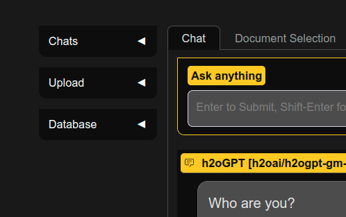
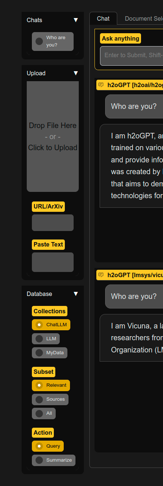
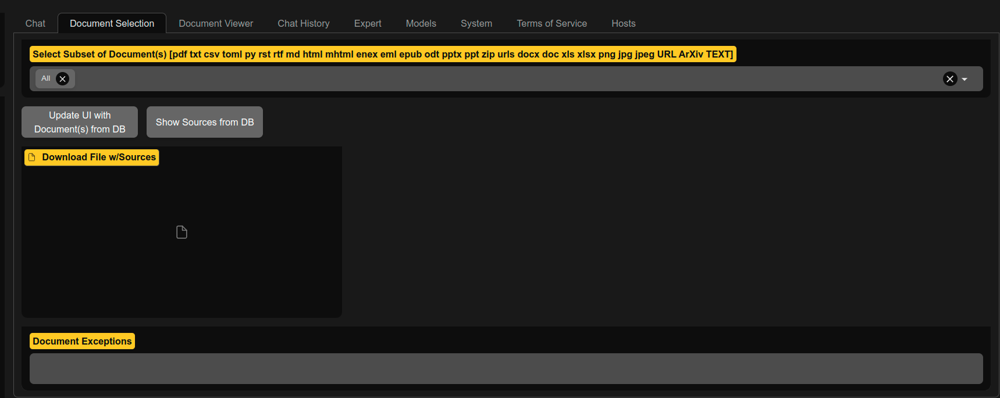
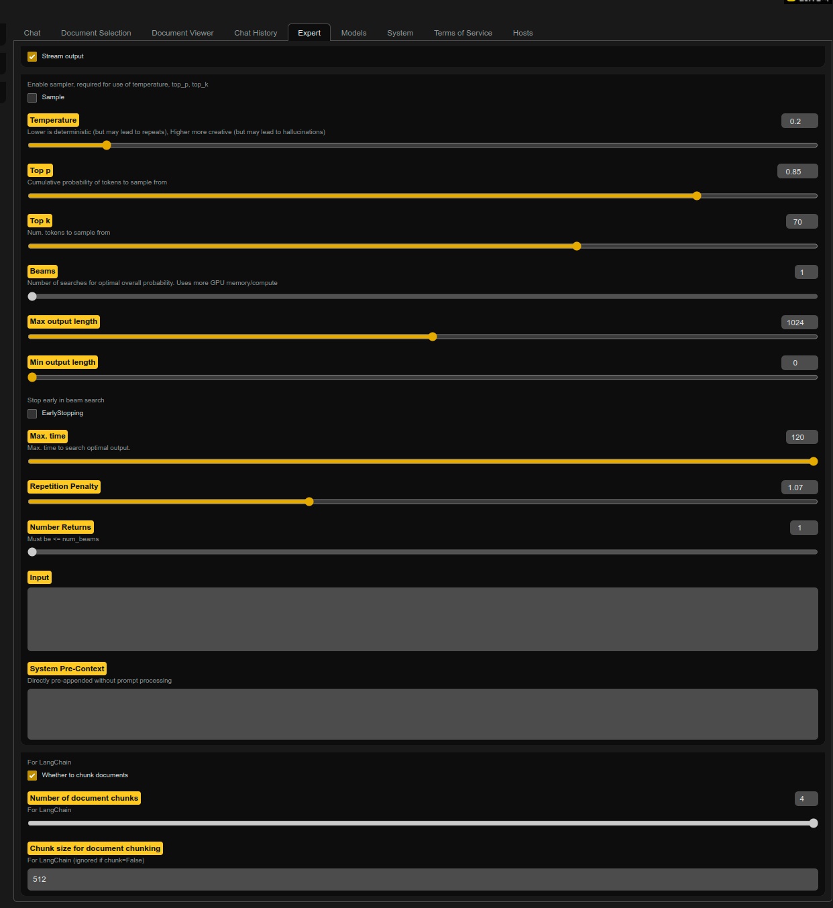
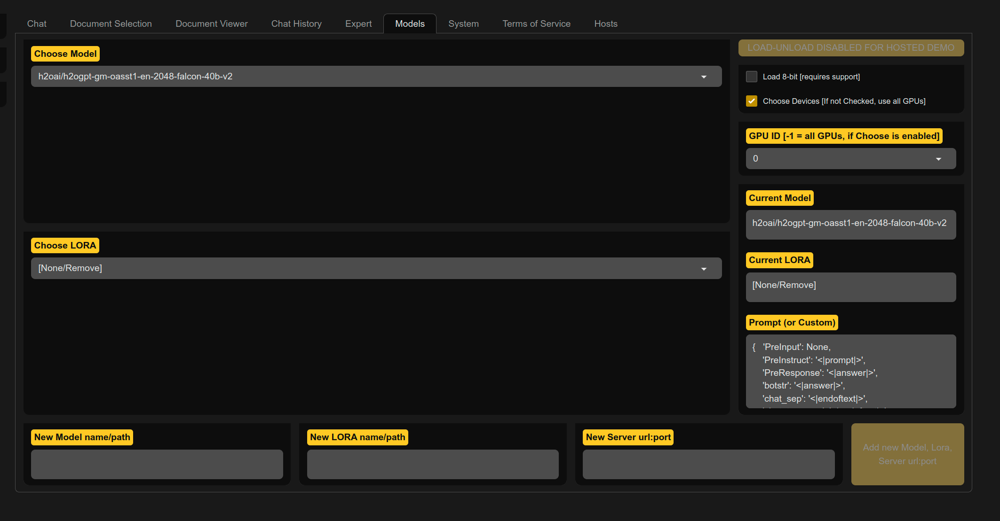

# UI overview

By default, `generate.py` runs a Gradio server with a UI as well as an OpenAI server wrapping the Gradio server.

Key benefits of the UI include:
* Save, export, and import chat histories, and undo or regenerate the last query-response pair.
* Upload and control documents of various kinds for document Q/A.
* Choose which specific collection to query, or just chat with an LLM.
* Choose specific documents out of a collection for asking questions.
* Multi-model or side-by-side 2-model comparison view.
* RLHF response score evaluation for every query-response.

We have deactivated background uploads by disabling telemetry for Hugging Face, Gradio, and Chroma. To prevent font downloads, run `generate.py` with `--gradio_offline_level=2`. For more information, see the [offline mode documentation](README_offline.md).

All of the UI buttons are also accessible through the Gradio client API.

Note the UI is subject to changes that may not always be updated here.  This is also because the UI is easily changed with `visible_` type CLI options, and every permutation is not possible to show here.


## Chat control buttons


| Button | Purpose                                                                                                                       |
|--------|-------------------------------------------------------------------------------------------------------------------------------|
| Submit | Equivalent to pressing enter in chat mode. Submit a question or imperative.                                                         |
| Stop   | Stop generation. Note that the LLM may continue in the background until completed even if the chat view is stopped.                            |
| Save   | Save the chat into left-panel Chats.                                                                                           |
| Redo   | Re-run the query with (potentially) new settings or re-sample if sampling is enabled. Turn on sampling if you want new sampling. |
| Undo   | Remove the last query-reponse pair.                                                                                                |
| Clear  | Clear the chat.                                                                                                                |


## Left Accordions



| Item                 | Purpose                                                                              |
|----------------------|--------------------------------------------------------------------------------------|
| Chats                | Accordion for saved chats, which are placed here after clicking the **Save** button. |
| Max Ingest Quality   | Whether to use all methods to ingest file, url, text                                 |
| Add Doc to Chat      | Whether to add document ingested to chat history                                     |
| Include Chat History | Whether to include chat history in LLM context in current query                      |
| Include Web Search   | Whether to include web search results LLM context in current query                   |
| Resources            | Accordion for Choosing collections, agents, etc.                                     |
| Doc Counts           | Current count of documents and chunks for chosen collection                          |
| Newest Doc           | Last document name to be added to collection                                         |



| Chat Accordion    | Purpose                                                                |
|-------------------|------------------------------------------------------------------------|
| Speak Instruction | If TTS enabled, speak the instruction or any text in input text box    |
| Speak Response    | If TTS enabled, speak the last response (for first model if multi-chat |
| Speech Style      | If TTS enabled, style of speech                                        |
| Speech Speed      | If TTS enabled, speed of speech                                        |

| Resources Accordion | Purpose                                                                                      |
|---------------------|----------------------------------------------------------------------------------------------|
| Collections         | Choose Collection to query or add ingested files, urls, text to                              |
| Database Subset     | Control if query uses "Relevant" documents or relevant sources, or All sources in collection |
| Agents              | (Experimental) Choose agent.  Most well-developed agent is Search or CSV Agent               |

### Data Collection of Sources

Collections (defaults to value set by `--langchain_mode=` and visible items set by `--langchain_modes`):
* LLM: Single query-response, no chat context or docs used
* UserData: Shared and persistent. Writable if `--allow_upload_to_user_data=True`. Rebuilt from path `--user_path` if set.
* MyData: Private and non-persistent.  Writable if `--allow_upload_to_my_data=True`
* ... Other collections can be added via code, but not currently addable from UI

* Chat History Checkbox: If selected, h2oGPT passes the chat history to the LLM (for LLM and document collections) 

Choose a collection, and uploaded docs go there.  Or choose a collection to query it.  To ignore any docs, select "LLM".  If you add document to, e.g., MyData, if you want to query that document, ensure to select collection MyData before submitting the query.

### Document Subset:
* Relevant: Choose to include all docs in chosen collection when chatting
* RelSources: Ignore the LLM, just return sources the vector database similarity search (i.e. relevant Sources)
* TopKSources: Ignore LLM and similarity search, just show top_k_docs sources from selected (or all) documents (i.e. top_k_docs Sources)

The most normal task is keep it on `Relevant` and just make a query, which will query all documents in the chosen collection.

### Document Action:
* Query: Ask LLM to answer a question (given documents as context if using collection)
* Summarize: Ask LLM to summarize document(s) using top_k_docs

## Document Selection Tab



| Dropdown or Button or panel or text box   | Purpose                                                                                                           |
|-------------------------------------------|-------------------------------------------------------------------------------------------------------------------|
| Select Subset of Document(s)              | Select documents to consider for query or summarization actions                                                   |
| Source Substrings                         | Enter string to subsearch source name (filename, url) for, and select operation                                   |
| Content Substrings                        | Enter string to subsearch content for, and select operation                                                       |
| Delete Selected Sources from DB           | Delete documents from DB (uses subset selection dropdown)                                                         |
| Update DB with new/changed files on disk  | Use path of sources and look for new files or changes files and update DB                                         |
| Add Collection                            | Add a new collection. Specify name, shared/personal, user_path.                                                   |
| Remove Collection from UI                 | Remove collection by name (only removes from UI and persisted auth records                                        |
| Purge Collection (UI, DB, & source files) | Remove collection, all source files, and full database on disk                                                    |
| Synhronize DB and UI                      | If did not login or have shared docs and they were updated in background, click to refresh-update-sync UI with DB |
| Download File w/Sources                   | Download list of sources after clicking on "Update UI..." button                                                  |
| Document Exceptions                       | Location where document ingestion failures are located                                                            |
| Document Types Supported                  | Currently allowed file types given packages installed                                                             |

A normal task is to subset on just 1-2 documents, and make a query on those.

## Document Viewer Tab


| Dropdown or Button or panel or text box | Purpose                                                 |
|-----------------------------------------|---------------------------------------------------------|
| Update UI with Document(s) from DB      | Update the drop-down list of viewable documents from DB |
| Select Single Document                  | Select document to view                                 |

## Chat History Tab


| Button                      | Purpose                                                                                     |
|-----------------------------|---------------------------------------------------------------------------------------------|
| Remove Selected Saved Chats | Remove the currently-selected Chat item in history in left panel                            |
| Flag Current Chat           | Tell owner of app (you if you ran locally) something is odd by logging chat history to disk |
| Export Chats to Download    | Export chats as file for downloading in Download Exported Chats box                         |
| Download Exported Chats     | Once click export, then can download here                                                   |
| Upload Chat File(s)         | Drag-drop or click to upload previously-exported chats                                      |
| Chat Exceptions             | Any exceptions during chatting go here, due to gradio bug that does not handle them well    |

If one selects nothing, the default of `All_Relevant` is chosen.  Can choose any command with any number of user documents to chat with.

E.g. one can click `Update UI with Document(s) from DB` to ensure subset list is up to date, choose `All`, pick a single PDF, click submit, and one will get back `top_k_docs` first entries in collection for that PDF.

## Expert Tab

Control prompting, Document QA, LLM, and Speech/Voice.



Instead of explaining every single item, we broadly explain groups if items:

Prompt Control:
* Prompt Type: If not model lock, then pick prompt format to use, see prompter.py for list of models we automatically choose prompt type for
* System Prompt Type and System Prompt: Pick (or enter your own) system prompt text, given to model to steer its behavior or output
* Query pre-prompt, query prompt, summary pre-prompt, summary prompt: Guide DocQA prompting.
* HYDE LLM Prompt: Used for HYDE for very first iteration for what LLM will see to get good embedding for vague user questions
* System Pre-Context: Very expert use of adding arbitrary text to LLM
* Pre-Conversation: List of lists of `[(human, bot), ...]` interactions for chat history
* Text DocQA: List of text to be added as documents
* Input for instruct prompt types: Very expert use for older Alpaca type instruct prompts

Document Control:
* Force xxx: Various controls over which tools used to ingest image, video, audio, PDF, URL, JSON
* Also control context filling, chunking, sorting, splitting, merging
* HYDE Level: How many HYDE iterations to perform, 0 is normal DocQA with single embedding lookup of original user query

LLM Control:
* Stream output: Whether to stream output.  Not currently supported for GPT4All/llama.cpp models except via CLI.
* Sample: Whether to enable sampling (required for use of temperature, top_p, top_k, beams)
  * Temperature, top_p, top_k: See [HF](https://huggingface.co/docs/transformers/main_classes/text_generation#transformers.GenerationConfig)
  * Beams: Number of beams for beam search.  Currently disabled for HF version of streaming to work.
* Max output length: Maximum number of new tokens in LLM response
* Min output length: Minimum number of new tokens in LLM response
* Early stopping: When doing beam search, whether to stop early
* Max. Time: Maximum number of seconds to run LLM
* Repetition Penalty: See [HF](https://huggingface.co/docs/transformers/main_classes/text_generation#transformers.GenerationConfig)

Speech Control and Voice Cloning:
* Generated Human Speech: Clicking speak instruction puts audio here, can be replayed 
* Generated Bot Speech: Clicking speak response or generating speech during chat bot use goes here
* Language: For Coqui TTS models, autodetect looks at text, but if know text then best to choose language 
* File for Clone: For Coqui TTS models, choose file to clone voice from.  Best if clean, i.e. only that voice and representative
* Mic for Clone: For Coqui TTS models, record mic for voice cloning
* Use Mic for Cloning: When picking Speaker Style to add, whether to use mic (checked) or file (not checked)
* Speaker Style: Name of speaker to add
* Clone Voice for new Speech Style: With mic/file and speaker style name, add to speaker list

## Models Tab

Control model, LORA, or inference server used.



To unload a model, click unload or "Choose Model" and select "[None/Remove]".

**Important**: Unloading only works properly if did not pre-load model with `--base_model` and only selected model and clicked load.

Note: Compare Mode uses memory for both models, and currently streaming is done for each instead of simultaneously.

* Choose/Enter Model: Drop-down to select model or enter/copy-paste text of file name or HF link
* Choose/Enter LORA: Drop-down to select LORA.  Only applicable if trained chosen base model using PEFT LORA
* Choose/Enter Server: Which inference server to use
* Current Model: Which model is currently loaded
* Current LORA: Which LORA is currently loaded
* Compare Mode: Select to have 2 models in same window for simultaneous comparison of two LLMs.  Model lock way is better for simultaneous generation.

The right sidebar controls all the aspects of items listed.


## System Tab

Control UI size elements and ADMIN access.


Requires admin password if in public mode (i.e. env HUGGINGFACE_SPACES=1 or GPT_H2O_AI=1)

* Get System Info: Show GPU memory usage, etc. in System Info text box.
* Zip: Zip logs and show file name in Zip file name box.  Can download in Zip file to Download box.
* S3UP: If bucket, public, and private keys set up via ENV, then can push button to send logs to S3.  Show result in S3UP result text box.


## Sidebar, Submit Buttons, and Tab Control

The sidebar and submit buttons can be toggled in UI or CLI.  The tabs can be controlled by CLI options.  If one only wants to see the chat view, do:
```bash
python generate.py --base_model=h2oai/h2ogpt-4096-llama2-13b-chat --visible_submit_buttons=False --visible_side_bar=False --visible_submit_buttons=False --visible_side_bar=False --visible_chat_tab=False --visible_doc_selection_tab=False --visible_doc_view_tab=False --visible_chat_history_tab=False --visible_expert_tab=False --visible_models_tab=False --visible_system_tab=False --visible_tos_tab=False --visible_hosts_tab=False --chat_tabless=True
```
where one can still at least hit enter to submit queries. This looks like:


One can add `--visible_h2ogpt_links=False --visible_h2ogpt_links=False --visible_h2ogpt_qrcode=False` to remove the h2oGPT header, which looks like:


For Windows, one can show only the chat view by doing:
```winbatch
"C:\Program Files\h2oGPT\Python\pythonw.exe" "C:\Program Files\h2oGPT\h2oGPT.launch.pyw" --base_model='llama' --prompt_type=llama2 --visible_side_bar=False --visible_chat_tab=True --visible_doc_selection_tab=False --visible_doc_view_tab=False --visible_chat_history_tab=False --visible_expert_tab=False --visible_models_tab=False --visible_system_tab=False --visible_tos_tab=False --visible_hosts_tab=False --visible_h2ogpt_links=False --visible_login_tab=False
```

which looks like:


## Login Tab


To remove the login tab, you can add `--visible_login_tab=False`.


